# 第一章

## 运动的描述

在我们周围，到处可以看到物体在运动：汽车在公路上行驶，巨轮在海上航行，飞机在天空中飞行，树叶在摇动，鸟儿在飞翔……就连我们脚下的地球，也在不停地自转、公转。

**物体的空间位置随时间的变化，是自然界中最简单、最基本的运动形态，叫作机械运动（mechanical motion）**。在物理学中，研究物体做机械运动规律的分支叫作力学（mechanics）。人们在力学的研究中，不仅认识了物体做机械运动的规律，而且还创立了科学研究的基本方法。

这一章，**我们学习机械运动的描述**。

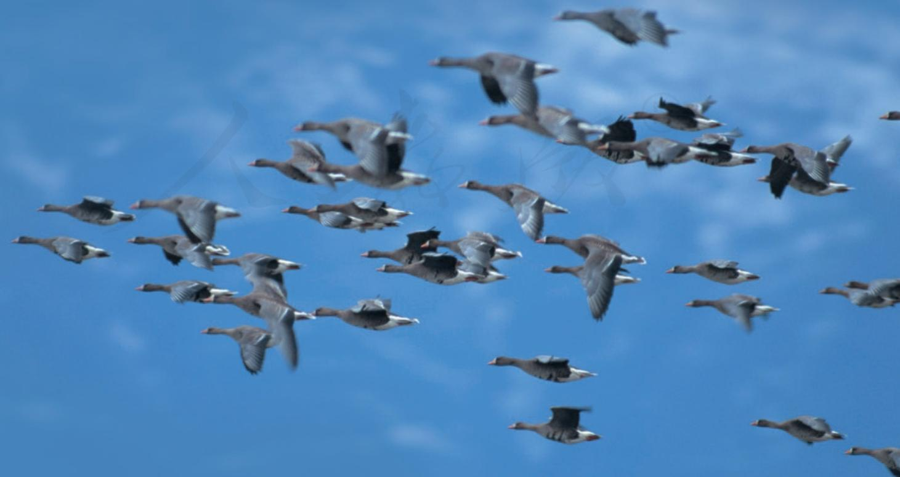

## 质点 参考系

### 问题

生活中随处可见运动的物体，例如玩耍的孩童、行驶的汽车、翱翔的雄鹰……对于这些运动的物体，我们如何准确地描述它们的运动呢？

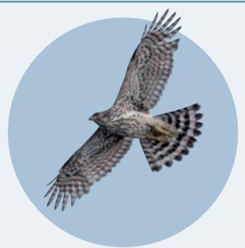

### 物体和质点

雄鹰拍打着翅膀在空中翱翔时，身体在向前运动，但它的翅膀在向前运动的同时还在上下运动；足球在绿茵场上滚动时，它在向前运动的同时还在转动……可见，要准确地描述物体的运动，并不是一件容易的事。

困难和麻烦出在哪里？稍加分析就可以知道，这是因为任何物体都有一定的大小和形状，物体各部分的运动情况一般说来并不一样。不过，我们有时关注物体各部分的运动，有时关注物体整体的运动。所以，如何描述物体的运动要看我们关注的问题是什么。例如，要研究雄鹰是如何飞行的，它的翅膀的运动方式很重要；但是，如果我们只关注雄鹰从哪里移动到了哪里，就不必太在意它的形状，把它看成一个点来描述它的运动就容易了。

下面我们来分析一些具体的实例，看看什么样的问题

我们生活的客观世界是物质的，物质由分子、原子等组成，我们所看到的物体是物质的聚集状态。研究机械运动，需要描述物体位置随时间变化的规律。

可以把物体看成一个点，什么样的问题不能把物体看成一个点。

人类居住的地球在绕太阳公转，同时又在自转。因此，地球各部分离太阳的距离不断变化。但是，如果考虑到地球的直径（约 $1.3 \times 10^{4} \mathrm{~km}$ ）还不到地日距离（约 $1.5 \times 10^{8} \mathrm{~km}$ ）的万分之一，在研究地球公转引起的位置变化问题时，由地球的大小引起的运动差异很小，因此，可以忽略地球的大小和形状而把它视为点。

有些物体上各点的运动差异虽然不小，但如果我们不研究各点的运动差异，而只关注物体整体的运动时，同样可以把物体看作一个点。例如，列车在平直轨道上行驶（图1.1-1），尽管它的传动机构及车轮的运动很复杂，但是，当我们只关心列车整体的运动情况时，就可以不考虑上述各部分的运动差异，而用一个点的运动代替整列列车的运动。

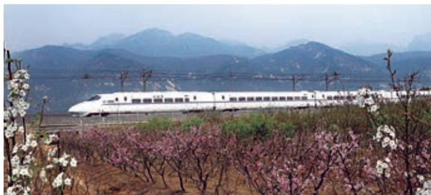  
图1.1-1 什么情况下列车可以视为一个点？

在物理学中，突出问题的主要因素，忽略次要因素，建立理想化的物理模型，并将其作为研究对象，是经常采用的一种科学研究方法。质点这一理想化模型就是这种方法的具体应用。

看来，在某些情况下，确实可以忽略物体的大小和形状，把它简化为一个具有质量的点，这样的点叫作质点（mass point）。还有一种情况，虽然不能忽略物体的大小和形状，但是，物体上各点的运动情况完全相同。从描述运动的角度看，物体上任意一点的运动完全能反映整个物体的运动，于是，整个物体的运动也可以简化为一个点的运动，把物体的质量赋予这个点，它也就成了一个质点。

从前面的讨论可以看出，一个物体能否看成质点是由所要研究的问题决定的。同一个物体，由于所要研究的问题不同，有时可以看成质点，有时不能看成质点。

### 思考与讨论

运动员踢足球的不同部位，会使球产生不同的运动。足球运动中常说的“香蕉球”是球在空中旋转、整体运动径迹为类似香蕉形弧线的一种运动（图1.1-2）。在研究如何才能踢出“香蕉球”时，能把足球看作质点吗？研究什么样的问题可以把足球看作质点？

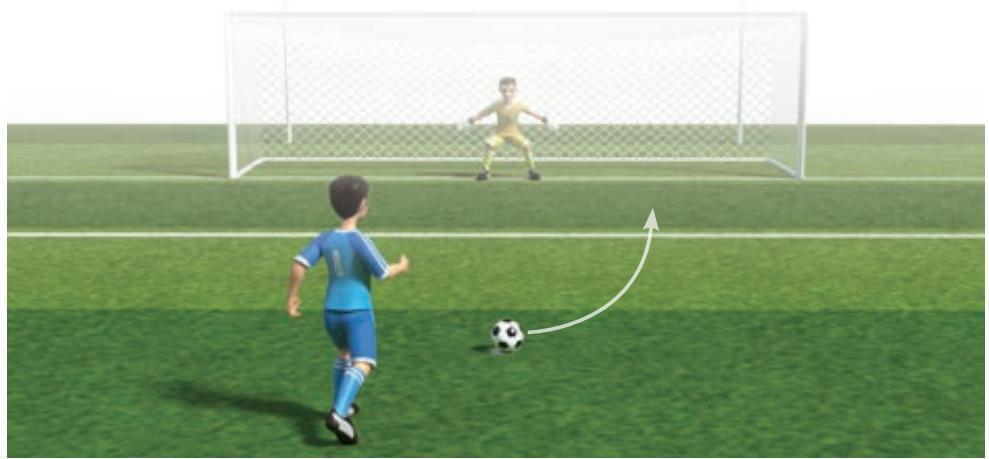  
图1.1-2 “香蕉球”示意图

### 参考系

要描述物体的运动，通常要先判断它是运动的还是静止的；如果物体是运动的，再根据需要来说明它是怎样运动的。我们说房屋、树木是静止的，这大概是不会错的。但是，房屋、树木在随着地球一起运动，这也是事实。再比如，行驶的列车中的乘务员与旅客在交流，列车外的人认为他们随列车一起运动，但他们彼此看对方却是静止的。为什么人们的看法会不一样呢？

自然界的一切物体都处于永恒的运动中，绝对静止的物体是不存在的。就此意义而言，我们说运动是绝对的。但是，描述某个物体的位置随时间的变化，却又总是相对于其他物体而言的。**这便是运动的相对性**。

可见，要描述一个物体的运动，首先要选定某个其他物体作为参考，观察物体的位置相对于这个“其他物体”是否随时间变化，以及怎样变化。这种用来作为参考的物体叫作参考系（reference frame）。

在描述一个物体的运动时，参考系可以任意选择。但是，选择不同的参考系来观察同一物体的运动，其结果会有所不同。参考系选取得当，会使问题的研究变得简洁、方便。当然，凡是提到运动，都应该弄清楚是相对于哪个参考系而言的。通常情况下，在讨论地面上物体的运动时，都以地面为参考系。

### 练习与应用

1. 两个运动的物体：一个是被球拍击出的乒乓球，另一个是正在飞行的歼-20隐形战斗机。  
请你为乒乓球和战斗机各创设两个问题，一个问题中可以把它（乒乓球或战斗机）看成质点；另一个问题中不能把它看成质点。  
2. 平常说的“一江春水向东流”“地球的公转”“钟表的时针在转动”“太阳东升西落”等，分别是说什么物体相对什么参考系在运动？  
3. 将近 1000 年前，宋代诗人陈与义乘着小船在风和日丽的春日出游时曾经作了一首

诗：飞花两岸照船红，百里榆堤半日风。卧看满天云不动，不知云与我俱东（图1.1-3）。诗人艺术性地表达了他对运动相对性的理解。诗中描述了什么物体的运动？它们分别是以什么物体为参考系的？你对诗人关于“榆堤”“云”“我”运动与静止的说法有没有不认识？

  
图1.1-3

##  时间 位移

### 问题 

要讨论物体位置随时间的变化，就要涉及位置、时间等概念。如果要准确地描述一辆行驶在北京长安街上的汽车所处的位置，你认为应该采用什么方法？你对时间是怎样认识的？

###  时刻和时间间隔

要描述物体位置随时间的变化，首先要清楚“时间”一词的含义。说到时间，不能不说时刻和时间间隔。时刻和时间间隔既有联系又有区别。

上午8时上课、8时45分下课，这里的“8时”“8时45分”是指这节课开始和结束的时刻，而这两个时刻之间的 $45\mathrm{min}$ ，则是这两个时刻之间的时间间隔（图1.2-1）。

在表示时间的数轴上，时刻用点表示，时间间隔用线段表示。我们平时说的“时间”，有时指的是时刻，有时指的是时间间隔，要根据上下文认清它的含义。

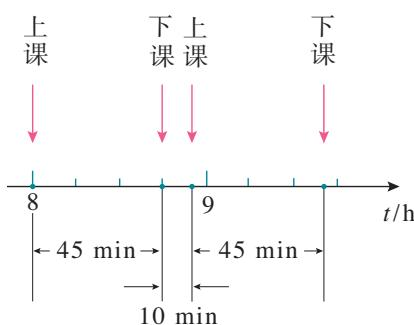  
图1.2-1 时刻和时间间隔

### 位置和位移

为了定量地描述物体的位置，需要在参考系上建立适当的坐标系（coordinate system）。例如，若想说明地面上某人所处的位置，可以采用平面直角坐标系来描述；如果物体做直线运动，可以用一维坐标系来描述。

物体做直线运动时，通常选取这条直线为 $x$ 轴，在 $x$ 轴上任选一点作为原点，规定好坐标轴的正方向和单位长度，物体的位置就可以用它的位置坐标来描述。例如，我

们要确定一辆行驶在北京长安街上汽车的位置，可以沿东西方向建立一维坐标系， $x$ 轴的正方向指东，选取路上的某交通岗亭作为坐标原点 $O$ ，汽车的位置就可以用它的坐标准确地描述出来。如果汽车的坐标是 $30\mathrm{m}$ ，表示它在岗亭以东 $30\mathrm{m}$ 处；如果汽车的坐标是 $-20\mathrm{m}$ ，表示它在岗亭以西 $20\mathrm{m}$ 处（图1.2-2）。

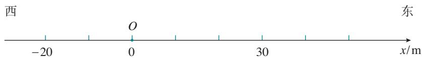  
图1.2-2 物体位置的表示

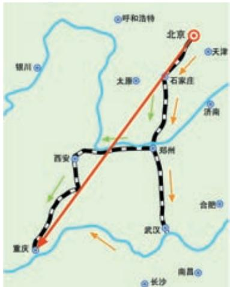  
图1.2-3 北京至重庆的不同路线及其位置变化

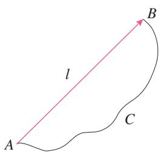  
图1.2-4 从初位置到末位置的有向线段表示位移

物体位置的描述我们清楚了，那么，物体位置的变化该怎样描述呢？

如图1.2-3，某人从北京去重庆，可以选择不同的交通方式。既可以乘火车，也可以乘飞机，还可以先乘火车到武汉，然后乘轮船沿长江而上。图中的几种情况表明，旅行者所经过的线路不同。我们在初中已经知道，路程（path）是物体运动轨迹的长度。因此，这个人旅行的路程也不同。但是，就位置的变动来说，无论使用什么交通工具、走过了怎样不同的路径，他总是从北京到达了西南方向、直线距离约 $1300\mathrm{km}$ 的重庆，即位置的变化是相同的。从图中可以看出，由初位置指向末位置的有向线段能准确地描述旅行者位置的变化。只要物体的初、末位置确定，这个有向线段就是确定的，它不因路径的不同而改变。物理学中用位移（displacement）来描述物体位置的变化，并用 $l$ 表示（图1.2-4）。

在物理学中，像位移这样的物理量叫作矢量，它既有大小又有方向；像温度、路程这样的物理量叫作标量，它们只有大小，没有方向。

### 直线运动的位移

前面学习了用一维坐标系描述物体的位置，那么，在一维坐标系中位移应该如何表示呢？

如图1.2-5，做直线运动的物体，它的初位置为 $x_{1}$ ，末位置为 $x_{2}$ ，则物体的位移应该是由 $x_{1}$ 指向 $x_{2}$ 的红色有向线段，其大小等于末位置与初位置坐标之差 $x_{2} - x_{1}$ 。

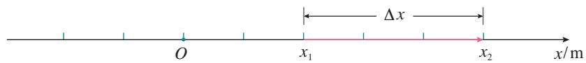  
图1.2-5 位置坐标的变化量表示位移

由于常用 $\Delta x$ 表示坐标之差，所以在研究直线运动时，常用 $\Delta x$ 表示位移，记为

$$
\Delta x = x _ {2} - x _ {1}
$$

若两坐标之差为正，则位移的方向指向 $x$ 轴的正方向；  
若两坐标之差为负，则位移的方向指向 $x$ 轴的负方向。

### 思考与讨论

某物体从 $A$ 点运动到 $B$ 点，坐标 $x_{A}$ 为 $5\mathrm{m}$ ， $x_{B}$ 为 $2\mathrm{m}$ ，物体的位移大小等于多少？方向如何？

### 位移一时间图像

物体在每一时刻的位置或每一时间间隔的位移可以用图像直观地表示。

如图1.2-6，在直角坐标系中选时刻 $t$ 为横轴，选位置 $x$ 为纵轴，其上的图线就是位置一时间图像，通过它能直观地看出物体在任意时刻的位置。如果将物体运动的初始位置选作位置坐标原点 $O$ ，则位置与位移大小相等（ $x = \Delta x$ ），位置一时间图像就成为位移一时间图像，又称 $x - t$ 图像。从 $x - t$ 图像可以直观地看出物体在不同时间内的位移。

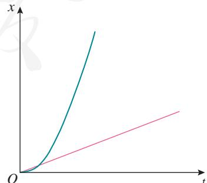  
图1.2-6 $x - t$ 图像

### 位移和时间的测量

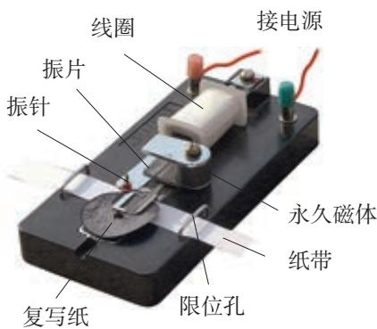  
图1.2-7 电磁打点计时器

生活中，人们可以用多种方法记录某一时刻物体运动的位置，从而推断出它在一段时间内的位移。例如，可以用照相的方法记录物体的位置，用钟表记录物体运动的时刻，也可以用频闪照相的方法同时记录物体运动的时刻和位置。学校实验室中常用打点计时器来记录时间和位移。

电磁打点计时器是一种使用交变电源的计时仪器（图1.2-7），工作电压约为 $8\mathrm{V}$ ，能够按照相同的时间间隔，在纸带上连续打点。当电源频率是 $50\mathrm{Hz}$ 时，每隔 $0.02\mathrm{s}$ 打一次点。如果把纸带和运动的物体连在一起，纸带上各点之间的距离就表示相应时间间隔中物体的位移大小。由这些点的位置，我们可以了解物体运动的情况。

还有一种打点计时器叫作电火花计时器，它的计时原理与电磁打点计时器相同，不过，在纸带上打点的不是振针和复写纸，而是电火花和墨粉。

### 实验

#### 练习使用打点计时器

1. 了解打点计时器的构造，然后把它固定好。  
2. 安装纸带。  
3. 启动电源，用手水平拉动纸带（图1.2-8），纸带上就打出一行小点。随后关闭电源。  
4. 取下纸带，从能够看清的某个点开始（起始点），往后数出若干个点。例如数出 $n$ 个点，算出纸带从起始点到第 $n$ 个点的运动时间 $t$ 。  
5. 用刻度尺测量出从起始点到第 $n$ 个点的位移 $x$ 。

测量之前，自己先设计一个表格，用来记录时间及位移。

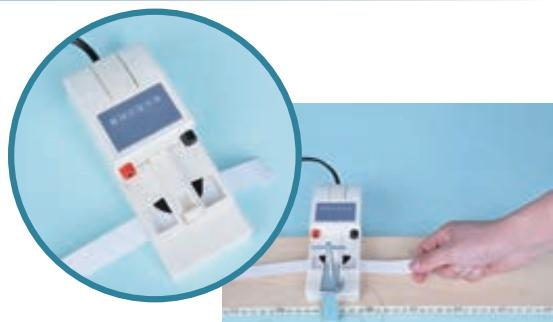  
图1.2-8 使用电火花计时器

通过测量仪器直接读取的数据是原始数据。它是宝贵的实验资料，要如实记录、妥善保存。

### 全球卫星导航系统

全球卫星导航系统是目前广泛应用的新一代导航定位系统，利用近地空间的卫星为各类用户提供可靠和高精度的定位、导航和授时服务（图1.2-9）。

全球卫星导航系统一般分为空间段、地面段和用户段三大部分。空间段即卫星导航系统，一般由数十颗卫星组成，每颗卫星可以发送卫星导航信号，编织成细密的网络，使得地球上任意地点任意时刻都能观测到4颗以上的导航卫星。地面段则负责操控系统和向卫星注入导航电文等。用户段通过接收机能够接收导航卫星发送的信号，并精准地进行定位、授时和测速。

全球卫星导航系统能够在全球范围内实时、全天候和全天时地提供服务，也就是说不受地域和天气影响，全球任何时刻都能得到持续可靠的定位服务。因此，从身边的车载导航、手机定位，到机场调度、海事救援和地质测绘等，都有广泛的应用。感兴

趣的同学可以上网查一查全球卫星导航系统在有关方面的具体应用。

常用的全球卫星导航系统有我国的北斗卫星导航系统、美国的全球定位系统、俄罗斯的格洛纳斯系统和欧盟的伽利略系统。2012年我国的北斗卫星导航系统开始为亚太地区提供定位、导航和授时服务，2020年该系统已实现在全球范围内提供服务。

  
图1.2-9 全球卫星导航系统（示意图）

### 练习与应用

1. 以下各种说法中，哪些指时间间隔？哪些指时刻？

（1）列车员说：“火车8时42分到站，停车8分。”  
（2）“您这么早就来啦，抱歉！让您等了这么久。”  
（3）“前 $3\mathrm{s}$ ”“最后 $3\mathrm{s}$ ”“第 $3\mathrm{s}$ 末”“第 $3\mathrm{s}$ 内”。

2. 某市出租汽车的收费标准有 $1.20$ 元 $/ \mathrm{km}$ 、 $1.60$ 元 $/ \mathrm{km}$ 、 $2.00$ 元 $/ \mathrm{km}$ ，其中的千米说的是路程还是位移？  
3. 田径运动场跑道周长是 $400 \mathrm{~m}$ 。

（1）百米赛跑选用跑道的直道部分，运动员跑完全程的路程是多少？位移大小是多少？  
(2) $800 \mathrm{~m}$ 跑比赛中, 不同跑道的运动员跑完全程的路程相同吗? 跑完全程的位移相同吗? 请结合田径比赛的规则想一想。

4. 如图1.2-10，一个物体从 $P$ 点运动到 $Q$ 点，坐标 $x_{P}$ 为 $3\mathrm{m}$ ， $x_{Q}$ 为 $-2\mathrm{m}$ ，它的位移大小是多少？方向如何？请你画出它的位置坐标和位移矢量。

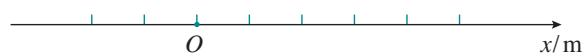  
图1.2-10

5. 一辆汽车在教练场上沿平直道路行驶，以 $x$ 表示它相对于出发点的位移。图1.2-11近似描写了汽车在0时刻到40s这段时间的 $x - t$ 图像。通过分析回答以下问题。

（1）汽车最远位置距离出发点约为多少米？  
（2）汽车在哪段时间没有行驶？  
(3) 汽车在哪段时间驶离出发点，在哪段

时间驶向出发点？

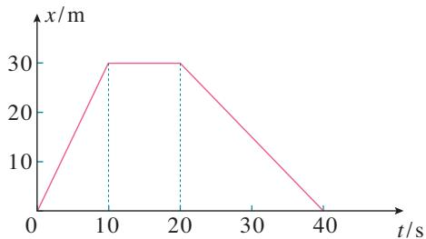  
图1.2-11

6. 从高出地面 $3 \mathrm{~m}$ 的位置竖直向上抛出一个小球，它上升 $5 \mathrm{~m}$ 后回落，最后到达地面（图1.2-12）。分别以地面和抛出点为原点建立一维坐标系，方向均以向上为正，填写以下表格。

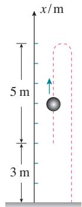  
图1.2-12

表 竖直向上抛出小球的坐标和位移

<table><tr><td>坐标原点</td><td>抛出点的坐标</td><td>最高点的坐标</td><td>落地点的坐标</td><td>从抛出点到最高点的位移</td><td>从最高点到落地点的位移</td><td>从抛出点到落地点的位移</td></tr><tr><td>地面</td><td></td><td></td><td></td><td></td><td></td><td></td></tr><tr><td>抛出点</td><td></td><td></td><td></td><td></td><td></td><td></td></tr></table>

## 位置变化快慢的描述——速度

### 问题

生活和科学研究中经常需要知道物体运动的快慢和方向，你还记得初中是怎样描述物体运动快慢的吗？运动员在比赛中的不同时段，运动的快慢一样吗？

### 速度

不同的运动，位置变化的快慢往往不同，也就是说，运动的快慢不同。我们已经用位移来表示位置的变化，那么，怎样比较物体运动的快慢呢？物理学中用位移与发生这段位移所用时间之比表示物体运动的快慢，这就是速度（velocity）。

速度通常用字母 $v$ 表示，如果在时间 $\Delta t$ 内物体的位移是 $\Delta x$ ，它的速度就可以表示为

$$
v = \frac {\Delta x}{\Delta t}
$$

在国际单位制中，速度的单位是米每秒，符号是 $\mathrm{m} / \mathrm{s}$ 或 $\mathrm{m} \cdot \mathrm{s}^{-1}$ 。常用的单位还有千米每时（ $\mathrm{km} / \mathrm{h}$ 或 $\mathrm{km} \cdot \mathrm{h}^{-1}$ ）、厘米每秒（ $\mathrm{cm} / \mathrm{s}$ 或 $\mathrm{cm} \cdot \mathrm{s}^{-1}$ ）等。

速度是矢量，它既有大小，又有方向。速度 $v$ 的方向与时间 $\Delta t$ 内的位移 $\Delta x$ 的方向相同。

###  平均速度和瞬时速度

一般来说，物体在某一段时间内，运动的快慢通常是变化的。所以，由 $\frac{\Delta x}{\Delta t}$ 求得的速度 $v$ ，表示的只是物体在

$\triangleright$ 这里的速度和初中所学的速度含义不完全相同。

### 思考与讨论

平均速度描述物体在一段时间内运动的平均快慢程度及方向。那么，怎样描述物体在某一时刻运动的快慢和方向呢？

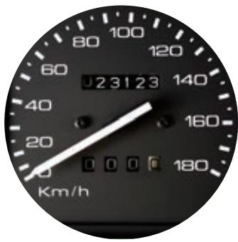  
图1.3-1 汽车速度计

可以设想，用由时刻 $t$ 到 $t + \Delta t$ 一小段时间内的平均速度来代替时刻 $t$ 物体的速度，如果 $\Delta t$ 取得小一些，物体在 $\Delta t$ 这样一个较小的时间内，运动快慢的差异就不会太大。 $\Delta t$ 越小，运动快慢的差异就越小。当 $\Delta t$ 非常非常小时，运动快慢的差异可以忽略不计，此时，我们就把 $\frac{\Delta x}{\Delta t}$ 叫作物体在时刻 $t$ 的瞬时速度（instantaneous velocity）。

匀速直线运动是瞬时速度保持不变的运动。在匀速直线运动中，平均速度与瞬时速度相等。

瞬时速度的大小通常叫作速率（speed）。汽车速度计不能显示车辆运动的方向，它的示数实际是汽车的速率（图1.3-1）。日常生活中说到的“速度”，有时是指速率，要根据上下文判断。

### 实验

#### 测量纸带的平均速度和瞬时速度

测量平均速度 我们知道，用手拉通过打点计时器的纸带时，确定时间内纸带运动的位移信息就被记录下来，据此可以计算纸带的运动速度。

图1.3-2是打点计时器打出的一条纸带示意图。若想计算实验时运动的纸带在 $D$ 、 $G$ 两点间的平均速度 $v$ ，只需测出 $D$ 、 $G$ 间的位移 $\Delta x$ 和所用的时间 $\Delta t$ ，就可以算出平均速度

$$
v = \frac {\Delta x}{\Delta t}
$$

请根据上述方法，计算上节实验中运动的纸带某些点间的平均速度。

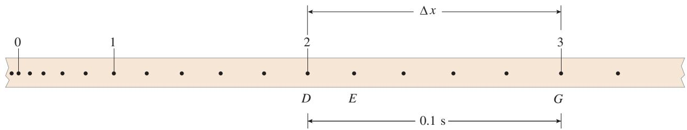  
图1.3-2 计算每隔 $0.1\mathrm{s}$ 的平均速度纸带示意图

每隔 $0.1 \mathrm{~s}$ （或更短）计算一次平均速度。

1. 在图 1.3-2 中选取纸带上一点为起始点 0 , 后面每 5 个点取一个计数点, 分别用数字 1, 2, 3, … 标出这些计数点;  
2. 测量各计数点到起始点0的距离 $x$ ，记录在表1中；  
3. 计算两相邻计数点间的位移 $\Delta x$ ，同时记录对应的时间 $\Delta t$ ；  
4. 根据 $\Delta x$ 和 $\Delta t$ 计算纸带在相邻计数点间的平均速度 $v$ 。

表 1 手拉纸带的位移和平均速度  

<table><tr><td>位置</td><td>0</td><td>1</td><td>2</td><td>3</td><td>4</td><td>...</td></tr><tr><td>x/m</td><td></td><td></td><td></td><td></td><td></td><td></td></tr><tr><td>Δx/m</td><td></td><td></td><td></td><td></td><td></td><td></td></tr><tr><td>Δt/s</td><td></td><td></td><td></td><td></td><td></td><td></td></tr><tr><td>v/(m·s-1)</td><td></td><td></td><td></td><td></td><td></td><td></td></tr></table>

测量瞬时速度 如何测量运动物体在某一时刻或某一位置（例如图1.3-2中 $E$ 点）的瞬时速度？

我们可以这样考虑： $E$ 点在 $D$ 、 $G$ 两点之间， $D$ 、 $G$ 两点间的平均速度我们可以求出。如果不要求很精确，用这个平均速度粗略地代表 $E$ 点的瞬时速度，也未尝不可。不过，如果把包含 $E$ 点在内的间隔取得小一些，例如取图1.3-3中的 $DF$ 线段，那么经过 $D$ 、 $F$ 两点所用的时间 $\Delta t$ 就会变短，用两点间的位移 $\Delta x$ 和时间 $\Delta t$ 算出的平均速度代表纸带在 $E$ 点的瞬时速度，就会精确一些。 $D$ 、 $F$ 两点离 $E$ 点越近，算出的平均速度越接近 $E$ 点的瞬时速度。

D、F两点间距离过小，测量误差会增大。所以，实际测量中要根据需要及所用仪器的情况，在要测量的点附近选取合适的位移和时间。请考虑此实验中产生误差的原因。

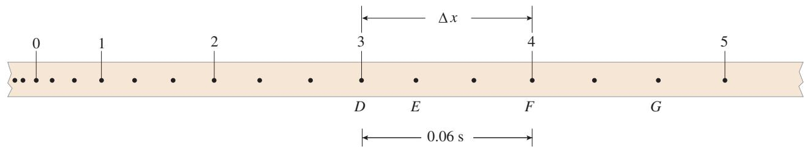  
图1.3-3 计算每隔0.06s的平均速度纸带示意图

请根据上述测量瞬时速度的方法，计算上节实验中纸带上各计数点的瞬时速度。

每隔 $0.06 \mathrm{~s}$ 计算一次速度。

1. 从纸带起始点0算起，后面每3个点取一个计数点。  
2. 测量各计数点到起始点0的距离 $x$ ，记录在表2中。  
3. 计算两相邻计数点间的位移 $\Delta x$ ，同时记录对应的时间 $\Delta t$ 。  
4. 根据 $\Delta x$ 和 $\Delta t$ 算出的速度值就可以代表在 $\Delta x$ 这一区间内任意一点的瞬时速度。将算出的各计数点的速度值记录在表2中。

表2 手拉纸带的瞬时速度  

<table><tr><td>位置</td><td>0</td><td>1</td><td>2</td><td>3</td><td>4</td><td>5</td><td>6</td><td>...</td></tr><tr><td>x/m</td><td></td><td></td><td></td><td></td><td></td><td></td><td></td><td></td></tr><tr><td>Δx/m</td><td></td><td></td><td></td><td></td><td></td><td></td><td></td><td></td></tr><tr><td>Δt/s</td><td></td><td></td><td></td><td></td><td></td><td></td><td></td><td></td></tr><tr><td>v/(m·s-1)</td><td></td><td></td><td></td><td></td><td></td><td></td><td></td><td></td></tr></table>

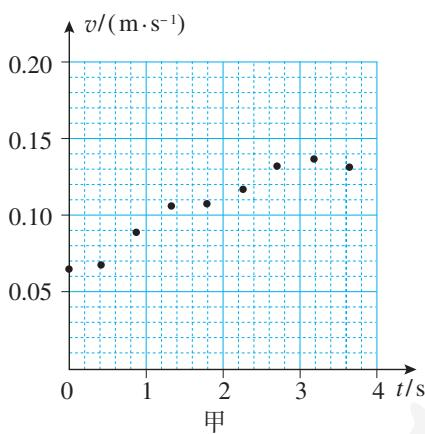

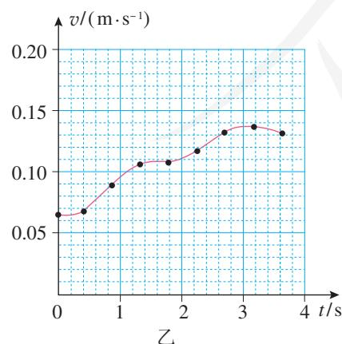  
图1.3-4 某同学手拉纸带运动的 $v - t$ 图像

### 速度一时间图像

物体运动的速度随时间变化的情况可以用图像来直观表示。以时间 $t$ 为横轴, 速度 $v$ 为纵轴, 坐标系中的图像即为速度一时间图像或 $v - t$ 图像。

在方格纸上建立直角坐标系，根据自己算出的手拉纸带的 $v$ 、 $t$ 数据，在坐标系中描点，练习画 $v - t$ 图像。

图1.3-4甲是根据某同学的实测数据所描的点，从这些点的走向能够大致看出纸带运动速度的变化规律。如果用一条平滑的曲线来描出这些点，曲线所反映的情况就会与实际比较接近（图1.3-4乙）。

### 借助传感器与计算机测速度

随着信息技术的发展，中学物理的实验手段也在不断进步。用“位移传感器”把物体运动的位移、时间转换成电信号，经过计算机的处理，可以立刻在屏幕上显示物体运动的速度，自动绘制出物体运动的 $v - t$ 图像（图1.3-5）。这样，同学们就可以用更多的时间和精力对物理过程进行分析。

图1.3-6是利用位移传感器测量速度的示意图。这个系统由发射器A与接收器B组成，发射器A能够发射红外线和超声波信号，接收器B可以接收红外线和超声波信号。发射器A固定在被测的运动物体上，接收器B固定在桌面上或滑轨上。测量时A向B同时发射一个红外线脉冲和一个超声波脉冲（即持续时间很短的一束红外线和一束超声波）。B接收到红外线脉冲开始计时，接收到超声波脉冲时停

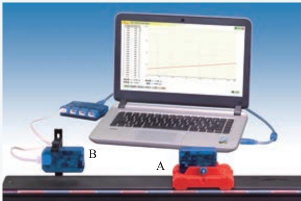  
图1.3-5 实验室用位移传感器测速度的装置

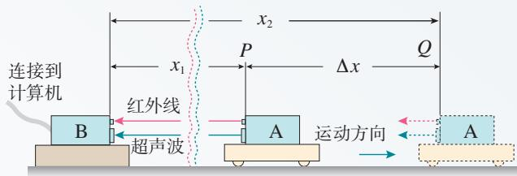  
图1.3-6 位移传感器测速度的原理

止计时。根据两者的时差和空气中的声速，计算机自动算出A与B的距离（红外线的传播时间可以忽略）。

经过短暂的时间 $\Delta t$ 后，传感器和计算机系统自动进行第二次测量，得到物体的新位置。算出两个位置差，即物体运动的位移 $\Delta x$ ，系统按照

$$
v = \frac {\Delta x}{\Delta t}
$$

算出速度 $v$ ，显示在屏幕上。所有这些操作都可以在不到1s的时间内自动完成。

这样测出的速度是发射器A在时间 $\Delta t$ 内的平均速度。然而 $\Delta t$ 很短，通常设置为 $0.02\mathrm{s}$ ，所以 $\Delta x$ 与 $\Delta t$ 之比可以代表此刻发射器A（即运动物体）的瞬时速度。

还有另外一种位移传感器，如图1.3-7所示。这个系统只有一个不动的小盒C，工作时小盒C向被测物体D发出短暂的超声波脉冲，脉冲被运动物体反射后又被小盒C接收。根据发射与接收超声波脉冲的时间差和空气中的声速，可以得到小盒C与运动物体D的距离 $x_{1}$ 、 $x_{2}$ 以及 $\Delta x$ 和 $\Delta t$ ，从而系统也能算出运动物体D的速度 $v$ 。

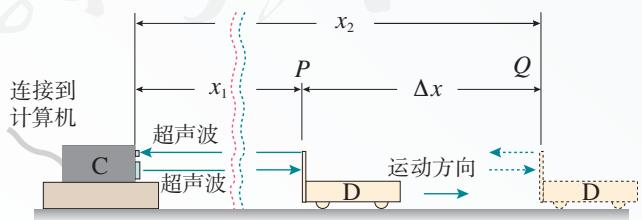  
图1.3-7 另一种位移传感器测速度的原理

1. 把纸带的下端固定在重物上，纸带穿过打点计时器，上端用手提着。接通电源后将纸带释放，重物便拉着纸带下落，纸带被打出一系列点，其中有一段如图1.3-8所示。

  
图1.3-8

（3）运动的方向是否变化？

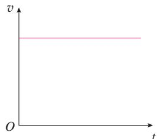  
甲

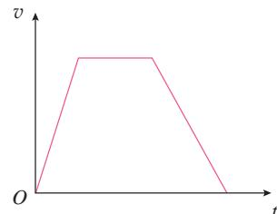  
乙  
图1.3-9

（1）图中所示的纸带，哪端与重物相连？  
（2）怎样计算在纸带上打 $A$ 点时重物的瞬时速度？说出你的理由。

2. 图1.3-9是甲、乙两物体沿某一直线运动的 $v - t$ 图像，至少从以下三个方面分别说明它们的速度是怎样变化的。  
（1）物体是从静止开始运动还是具有一定的初速度？  
(2) 速度的大小变化吗? 是加速还是减速?

3. 汽车从制动到停止共用了 $5 \mathrm{~s}$ 。这段时间内，汽车每 $1 \mathrm{~s}$ 前进的距离分别是 $9 \mathrm{~m} 、 7 \mathrm{~m} 、 5 \mathrm{~m} 、 3 \mathrm{~m} 、 1 \mathrm{~m}$ （图1.3-10）。

（1）求汽车前1s、前2s、前3s、前4s和全程的平均速度。在这五个平均速度中，哪一个最接近汽车刚制动时的瞬时速度？它比这个瞬时速度略大些，还是略小些？  
（2）汽车运动的最后 $2s$ 的平均速度是多少？

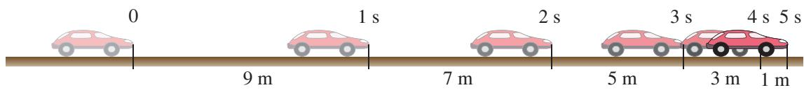  
图1.3-10

## 速度变化快慢的描述——加速度

### 问题

一辆小汽车在 $10 \mathrm{~s}$ 内速度从 0 达到 $100 \mathrm{~km} / \mathrm{h}$ , 一列火车在 $300 \mathrm{~s}$ 内速度也从 0 达到 $100 \mathrm{~km} / \mathrm{h}$ 。虽然汽车和火车速度都从 0 达到 $100 \mathrm{~km} / \mathrm{h}$ , 但是它们的运动情况显然不同。你觉得用 “速度大” 或 “速度变化大” 能描述这种不同吗? 如果不能, 应该怎样描述呢?

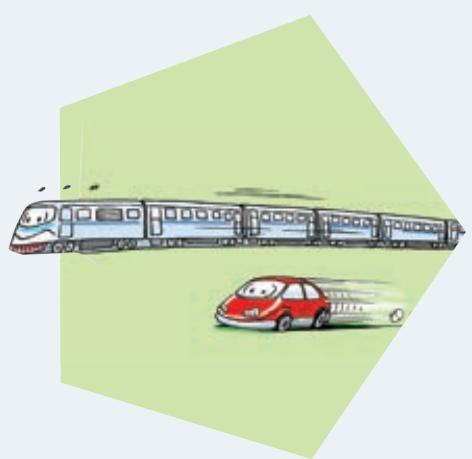

### 加速度

小汽车和火车的速度都在增加，或者说两者都在做变速运动，并且它们的“速度变化”相同，但所用的时间不同。这两种情形的本质区别是“速度变化的快慢”不同。看来“速度变化的快慢”是一个不同于“速度”的概念。

两个物体速度变化相同，所用时间短的当然速度变化得快。如果两个物体速度变化不同，所用时间也不同，怎样比较它们速度变化的快慢呢？

在学习速度时我们知道，位移表示的是位置的变化。要比较位置变化的快慢，可以用位移除以时间。同理，要比较速度变化的快慢，可以用速度的变化量除以时间。

物理学中把速度的变化量与发生这一变化所用时间之比，叫作加速度（acceleration）。通常用 $a$ 表示。若用 $\Delta v$ 表示速度在时间 $\Delta t$ 内的变化量，则有

$$
a = \frac {\Delta v}{\Delta t}
$$

在国际单位制中，加速度的单位是米每二次方秒，符

在这里，我们用两个物理量（速度的变化量和时间）之比定义了一个新的物理量——加速度，它的物理意义与原来的两个物理量不同。用物理量之比定义新的物理量是物理学中常用的方法。

号是 $\mathrm{m} / \mathrm{s}^{2}$ 或 $\mathrm{m} \cdot \mathrm{s}^{-2}$ 。加速度是矢量，它既有大小，又有方向。现在讨论做直线运动的物体加速度的方向。

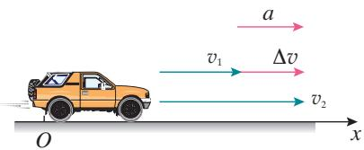  
甲 速度增加时的情况

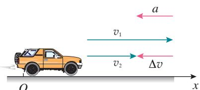  
乙 速度减小时的情况  
图1.4-1 加速度方向与速度方向的关系示意图

### 加速度的方向

如图1.4-1，汽车原来的速度是 $v_{1}$ ，经过一小段时间 $\Delta t$ 之后，速度变为 $v_{2}$ 。为了在图中表示加速度，我们以原来的速度 $v_{1}$ 的箭头端为起点，以后来的速度 $v_{2}$ 的箭头端为终点，作出一个新的有向线段，它就表示速度的变化量 $\Delta v$ 。由于加速度 $a = \frac{\Delta v}{\Delta t}$ ，所以加速度 $a$ 的方向与速度的变化量 $\Delta v$ 的方向相同。确定了 $\Delta v$ 的方向，也就确定了加速度 $a$ 的方向。

从图中可以看出，汽车在直线运动中，如果速度增加，即加速运动，加速度的方向与初速度的方向相同；如果速度减小，即减速运动，加速度的方向与初速度的方向相反。

### 思考与讨论

对运动的物体而言，可以问“它运动了多远”，这是路程或位移的概念；也可以问“它运动得多快”，这是速度的概念。然而，在生活用语中，却没有与加速度对应的词语。

日常生活中一般只有笼统的“快”和“慢”，这里有时指的是速度，有时模模糊糊地指的是加速度。你能分别举出这样的例子吗？

### 从 $v - t$ 图像看加速度

$v - t$ 图像反映的是物体的速度随时间变化的情况。你认为由 $v - t$ 图像能知道物体的加速度吗？

图1.4-2中的两条直线 $a$ 、 $b$ 分别是两个物体A和B运动的 $v - t$ 图像。 $E$ 、 $F$ 两点所表示的时刻和速度分别为 $t_{1}$ 、 $t_{2}$

和 $v_{1} 、 v_{2}$ 。从图中可以看出，小三角形的一条直角边代表时间间隔 $\Delta t$ ，另一条直角边代表速度的变化量 $\Delta v$ ， $\Delta v$ 与 $\Delta t$ 之比为加速度，其比值为该直线的斜率。因此，由 $v - t$ 图像中图线的倾斜程度可以判断加速度的大小。物体A的加速度比物体B的大。

生活中做变速运动的物体很多，它们加速度的大小也各不相同，有时差异还很大。下表为一些运动物体的加速度。

表 一些运动物体的加速度 (近似值)  

<table><tr><td>运动物体</td><td>a/(m·s-2)</td><td>运动物体</td><td>a/(m·s-2)</td></tr><tr><td>子弹在枪筒中</td><td>5×104</td><td>赛车起步</td><td>4.5</td></tr><tr><td>伞兵着陆</td><td>-25</td><td>汽车起步</td><td>2</td></tr><tr><td>汽车急刹车</td><td>-5</td><td>高铁起步</td><td>0.35</td></tr></table>

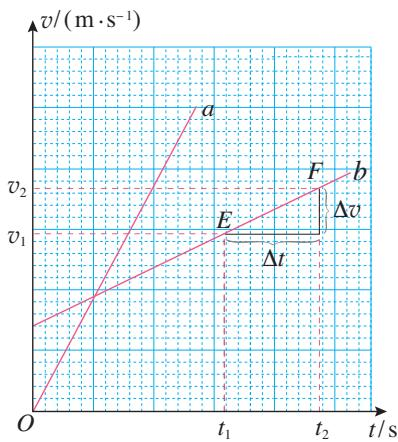  
图1.4-2 从 $v - t$ 图像看物体的加速度

  
图1.4-3 在同一底片上相隔同样时间多次曝光“拍摄”的飞机起飞时的照片（合成照片）

### 科学漫步

#### 变化率

番茄在成熟的过程中，它的大小、含糖量等会随时间变化；树木在成长过程中，它的高度、树干的直径会随时间变化；河流、湖泊的水位会随时间变化；某种商品的价格会随时间变化；我国的人口生育量也会随时间变化……这些变化，有时快、有时慢。描述变化快慢的量就是变化率。

自然界中某量 $D$ 的变化可以记为 $\Delta D$ , 发生这个变化所用的时间间隔可以记为 $\Delta t$ , 变化量 $\Delta D$ 与 $\Delta t$ 之比就是这个量对时间的变化率, 简称变化率。显然, 变化率在描述各种变化过程时起着非常重要的作用, 速度和加速度就是两个很好的例子。

生活中还有哪些实例与变化率相关？例如飞机起飞时，在同样的时间间隔内，飞机的位移不断增大（图1.4-3）。

某个量大，不表示它的变化率大。速度大，加速度不一定大。例如匀速飞行的高空侦察机，尽管它的速度可能接近 $1000 \mathrm{~m} / \mathrm{s}$ ，但它的加速度为 0。相反，速度小，加速度也可以很大。例如枪筒里的子弹，在开始运动时，尽管子弹的速度接近 0，但它的加速度可以达到 $5 \times 10^{4} \mathrm{~m} / \mathrm{s}^{2}$ 。

#### 交通工具与社会发展

人类自发明木轮车（图1.4-4）直到制成速度 $500\mathrm{km / h}$ 的磁悬浮列车，以及超音速飞机，为了获得高速交通工具，奋斗了几千年。从某种意义上说，在人类发明的各种机械中，交通工具最深刻地改变了我们的生活。我们所用的物品，几乎没有一件不是由铁路或公路运输而来的。不难想象，如果没有了火车和汽车，现代社会将会瘫痪。

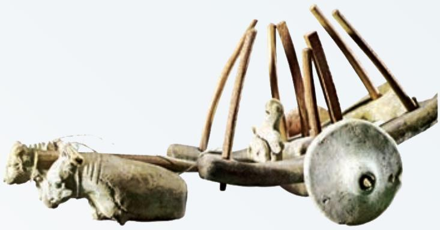  
图1.4-4 公元前2000年印度河谷哈拉巴人所用的车辆的泥塑模型

从世界各国的城市发展史上看，大城市规模的大小与车速的提高密切相关。大城市的直径一般就是当时的城市交通工具在 $1 \mathrm{~h}$ 内行走的距离。以北京为例，清朝末年北京的“内城”大约是一个边长为 $5 \mathrm{~km}$ 的正方形，马车的速度大约就是 $5 \mathrm{~km} / \mathrm{h}$ ；今天，有了发达的公路系统，有了快速轨道交通，汽车、地铁的速度大约是几十千米每时，北京城区的直径也扩大到了几十千米。

城市中的车速不能无限提高，城市的规模也就不能无限扩大。“摊大饼”式的城市规划可能带来以交通问题为主的许多矛盾。目前许多人认为，合理的发展模式是建立中心市区与卫星城组成的城市群。

运兵工具和武器运载工具的发展改变了战争的面貌。现代战争的“战场”已经与过去的意义完全不同。相距几千千米、几万千米的敌对力量之间在很短时间内就能爆发大规模战争。空中打击的力量大大加强，过去的一些战术方法已经不再适用。由于车辆的使用，部队的机动性大大提高，速战速决的战争理论有所发展。

交通网络的形成大大缩短了不同地域的时空距离，促进了国与国、民族与民族之间的物资交流和人员往来。贸易上的互补，可以优化物质资源和人力资源的配置，促进世界经济的发展。不同文化的交融进一步促进了社会的进步。

然而，大量汽车带来了交通堵塞、频繁的事故、能源的过度消耗、尾气与噪声污染等一系列社会问题。这些不仅妨碍了人们的工作和生活，而且制约着社会经济的进一步发展。

如何处理这些矛盾，一直是人们努力探索的课题。随着可持续发展战略的实施，人们对发展交通的意义有了新的认识，采取了许多有效的措施。例如，研制各种绿色汽车（使用压缩天然气或液化石油气的汽车、太阳能车、电动车……），对现有汽车的使用在时间和道路上进行限制，根据城市规模发展地上、地下快速的立体化交通和轨道交通。

讨论：交通工具的速度是不是越快越好？

1. 小型轿车从静止开始加速到 $100 \mathrm{~km} / \mathrm{h}$ 所用的最短时间，是反映汽车性能的重要参数。  
A、B、C三种型号的轿车实测的结果分别为 $11.3 \mathrm{~s}$ 、 $13.2 \mathrm{~s}$ 、 $15.5 \mathrm{~s}$ ，分别计算它们在测试时的加速度有多大。  
2. 有没有符合下列说法的实例？若有，请举例。

A. 物体运动的加速度等于0，而速度却不等于0；  
B. 两物体相比, 一个物体的速度变化量比较大, 而加速度却比较小;  
C. 物体具有向东的加速度, 而速度的方向却向西;  
D. 物体做直线运动, 后一阶段的加速度比前一阶段小, 但速度却比前一阶段大。

3. 以下描述了四个不同的运动过程。

A. 一架超音速飞机以 $500 \mathrm{~m} / \mathrm{s}$ 的速度在天空沿直线匀速飞行了 $10 \mathrm{~s}$ 。  
B. 一辆自行车以 $3 \mathrm{~m} / \mathrm{s}$ 的速度从某一陡坡的顶端加速冲下, 经过 $3 \mathrm{~s}$ 到达坡路底端时, 速度变为 $12 \mathrm{~m} / \mathrm{s}$ 。  
C. 一只蜗牛由静止开始爬行，经过 $0.2 \mathrm{~s}$ ，获得了 $0.002 \mathrm{~m} / \mathrm{s}$ 的速度（图1.4-5）。  
D. 一列动车在离开车站加速行驶中, 用了 $100 \mathrm{~s}$ 使速度由 $72 \mathrm{~km} / \mathrm{h}$ 增加到 $144 \mathrm{~km} / \mathrm{h}$ 。

（1）以上四个运动过程，哪个过程速度最大？请按速度的数值把它们由大到小排列。  
（2）以上四个运动过程，哪个过程速度的变化量最大？请按速度变化量的数值把它们由大到小排列。  
(3) 以上四个运动过程, 哪个过程加速度最大? 请按加速度的数值把它们由大到小排列。  
4. 一个物体在水平面上向东运动，某时刻速度大小为 $20 \mathrm{~m} / \mathrm{s}$ ，然后开始减速， $2 \mathrm{~min}$ 后该物体的速度减小为 0。求物体的加速度大小及方向。  
5. 图 1.4-6 中的三条直线 $a 、 b 、 c$ 描述了 A、B、C三个物体的运动。先初步判断一下哪个物体的加速度最大，再根据图中的数据计算它们的加速度，并说明加速度的方向。

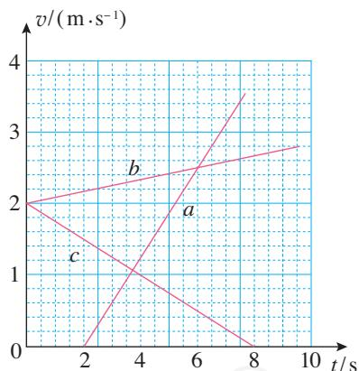  
图1.4-6

### 章小结示例

学习是一个不断探究、积累和总结的过程。学习的每一阶段都应该适时地总结，把学到的知识、方法、过程和体会等及时地加以梳理，以便更好地理解和把握。

总结会有不同的方法，比如，语言归纳、框图和概念图等方法。下面给出了某位同学在学习过本章后作出的小结，请根据自己的体会，把你认为不够完整以及没有完成的地方加以完善。

以后每学习完一章，请你用自己擅长的方法对这一章进行小结，写出自己的学习心得。

### 概念梳理

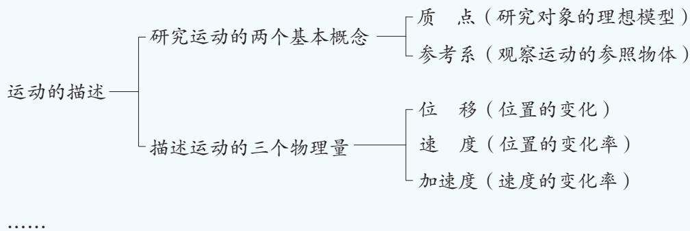

#### $\bullet$ 研究方法

知道了质点模型的抽象条件及意义。如果物体的形状和体积对问题的研究不影响或影响可忽略时，可以把物体看成质点。质点是一种理想模型，建立物理模型的思想对解决实际问题非常重要。

了解了极限思维方法。能体会在极短的时间或位移中，质点的平均速度可以看成它在此时刻或此位置的瞬时速度的思维方法。

学会了用图像描述运动。图像可以描述质点的运动。 $v - t$ 图像可以反映速度的变化规律，图像的斜率反映加速度的大小和方向。

#### $\bullet$ 实验工具

可用打点计时器研究物体的运动。打点计时器在纸带上打出的点迹，不仅记录了时间信息，而且记录了打点时间间隔内与纸带连接物体的运动位移。用打点计时器可以测量物体的平均速度和瞬时速度。

#### $\bullet$ 态度责任

认识到物理研究需要对物理现象（如运动）进行客观描述；体会到只有如实记录实验数据，才能真实反映现象，得到有价值的研究结果；通过小组实验，感受到科学研究需要团队合作。

···

### A组

1. 以下情景中，哪些带下划线的物体可看成质点，哪些不能看成质点？将结果填入括号内。

(1) 小敏观察蚂蚁拖动饭粒时, 蚂蚁的肢体是如何分工的。  
（2）小英测算蚂蚁拖动饭粒时，蚂蚁 $1\mathrm{min}$ 爬行的路程。 （ ）  
（3）在跳水比赛中，裁判员给跳水运动员评分。 （）  
（4）教练在训练中观察跳高运动员的跳高过程。 （ ）

2. 图1-1是特技跳伞运动员的空中造型图。当运动员们保持该造型向下落时，若其中某一位运动员以对面的运动员为参考系，则他自己的运动情况怎样？当他俯视大地时，看到大地迎面而来，他是以什么物体为参考系的？

  
图1-1

3. 以下对话，其含义是指时刻还是指时间间隔？写在括号内。

问：这车什么时候开？ （）

答：过一会儿就要开了。 （）

问：我离开一下， $10\mathrm{min}$ 就赶回来，行不？（）

答：你不能晚过车票上的开车时间。（）

4. 关于位移和路程，下列四位同学的说法是否正确？如果不正确，错在哪里？

同学甲：位移和路程在大小上总相等，只是位移有方向，是矢量，路程无方向，是标量。

同学乙：位移用来描述直线运动，路程用来描述曲线运动。

同学丙：位移是矢量，它取决于物体的始末位置；路程是标量，它取决于物体实际通过的路线。

同学丁：其实，位移和路程是一回事。

5. 一辆汽车沿直线从甲地开往乙地，前一半位移内的平均速度为 $30 \mathrm{~km} / \mathrm{h}$ ，后一半位移内的平均速度是 $60 \mathrm{~km} / \mathrm{h}$ ，这辆汽车全程的平均速度是多少？  
6. 在台球比赛中，某球以 $1.5 \mathrm{~m} / \mathrm{s}$ 的速度垂直撞击边框后，以 $1.3 \mathrm{~m} / \mathrm{s}$ 的速度反向弹回，球与边框接触的时间 $\Delta t$ 为 $0.08 \mathrm{~s}$ ，求该撞击过程中球的加速度。  
7. 以下是三种交通工具在某段时间中的运动记录。

表 三种交通工具的运动记录  

<table><tr><td>交通工具</td><td>初速度 /(m·s-1)</td><td>经过时间/s</td><td>末速度 /(m·s-1)</td></tr><tr><td>自行车下坡</td><td>2</td><td>2</td><td>6</td></tr><tr><td>火车出站</td><td>0</td><td>100</td><td>20</td></tr><tr><td>飞机飞行</td><td>200</td><td>10</td><td>200</td></tr></table>

（1）以上有没有速度大而加速度小的情况？如果有，请列举。  
（2）以上有没有速度变化量大而加速度小的情况？

### B组

1. 小李讲了龟兔沿直线赛道赛跑的故事，故事情节中兔子和乌龟运动的 $x - t$ 图像如图1-2所示。请你依照图像中的坐标，并结合物理学的术语来讲述这个故事。在讲故事之前，先回答下列问题：

（1）故事中的兔子和乌龟是否在同一地点同时出发？  
（2）乌龟做的是什么运动？  
(3) 兔子和乌龟在比赛途中相遇过几次?   
（4）哪一个先通过预定位移到达终点？

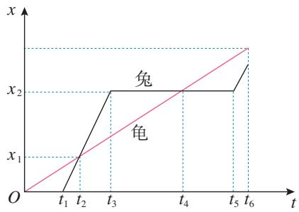  
图1-2

2. 图1-3是某物体做直线运动的 $x - t$ 图像，请说明 $x - t$ 图像中每段运动过程的速度大小和方向，并作出 $v - t$ 图像，描述相应过程。

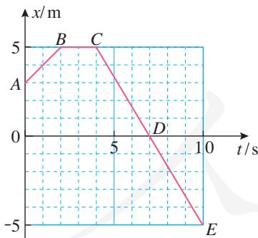  
图1-3

3. 某物体做直线运动，它的 $v - t$ 图像如图1-4所示。设向东为速度 $v$ 坐标轴的正方向。

（1）请说出物体在第 $1\mathrm{s}$ 、第 $2\mathrm{s}$ 、第 $3\mathrm{s}$ 时

间内的运动方向。在3s时间内的速度大小怎样变化？

（2）请说出物体在第1s、第2s、第3s时间内的加速度大小和方向。

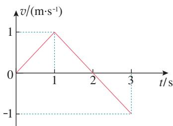  
图1-4

4. 为了测定气垫导轨上滑块的加速度，滑块上安装了宽度为 $2.0 \mathrm{~cm}$ 的遮光条。如图1-5，滑块在牵引力作用下先后通过两个光电门，配套的数字计时器记录了遮光条通过第一个光电门的时间 $\Delta t_{1}$ 为 $0.20 \mathrm{~s}$ ，通过第二个光电门的时间 $\Delta t_{2}$ 为 $0.05 \mathrm{~s}$ ，遮光条从开始遮住第一个光电门到开始遮住第二个光电门的时间 $t$ 为 $2.50 \mathrm{~s}$ ，试估算滑块的加速度。

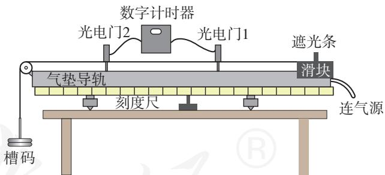  
图1-5

5. 某电梯从3楼出发，下降至2楼略停后继续下降到1楼，随后又载人上升至2楼停下。请大致绘出该电梯在这段时间内的 $v - t$ 图像。设向下为速度 $v$ 坐标轴的正方向。

