# 第三章

## 相互作用——力

自然界的物体不是孤立存在的，它们之间具有多种多样的相互作用。正是由于这些相互作用，物体在形状、运动状态等许多方面会发生变化。如何来研究这些相互作用呢？在力学中，物体间的相互作用抽象为一个概念——力（force）。

在研究物体做机械运动时，最常见的力有重力、弹力和摩擦力，本章研究这几种常见力的特点和规律。

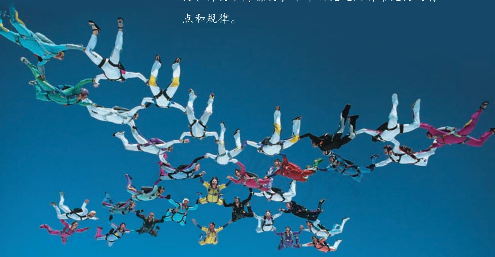

相互作用是我们从现今自然科学的观点出发在整体上考察运动着的物质时首先遇到的东西。……相互作用是事物的真正的终极原因。

——恩格斯①

## 1 重力与弹力

### 问题

力是一个物体对另一个物体的作用。认识一个力，需要弄清以下几个问题：

1. 谁受到的力，谁施加的力？  
2. 怎样量度它的大小？  
3. 它的方向如何？作用点在哪里？

分析空中人所受的重力。关于上述问题，你知道哪些？

### 重力

由于地球的吸引而使物体受到的力叫作重力（gravity），单位是牛顿，简称牛，符号用N表示。重力的施力物体是地球，方向竖直向下。初中我们学过，物体受到的重力 $G$ 与物体质量 $m$ 的关系是

$$
G = m g
$$

其中 $g$ 是自由落体加速度。通过第二章的学习我们知道，在没有空气阻力时，由静止下落的物体做自由落体运动。做自由落体运动的物体只受到重力的作用。

$\triangleright g$ 的单位既可以是 $\mathrm{N} / \mathrm{kg}$ , 又可以是 $\mathrm{m} / \mathrm{s}^{2}$ , 而且

$$
1 \mathrm {N} / \mathrm {k g} = 1 \mathrm {m} / \mathrm {s} ^ {2}
$$

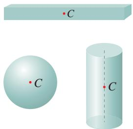  
图3.1-1 形状规则的均匀物体的重心

一个物体的各部分都受到重力的作用，从效果上看，可以认为各部分受到的重力作用集中于一点，这一点叫作物体的重心（center of gravity）。因此，重心可以看作物体所受重力的作用点。质量均匀分布的物体，重心的位置只跟物体的形状有关。形状规则的均匀物体，它的重心比较容易确定。例如，均匀细直棒的重心在棒的中点，均匀球体的重心在球心，均匀圆柱体的重心在轴线的中点（图3.1-1）。质量分布不均匀的物体，重心的位置除了跟物体的形状有关外，还跟物体内质量的分布有关。载重汽车的重心随着装货多少和装载位置而变化（图3.1-2）。

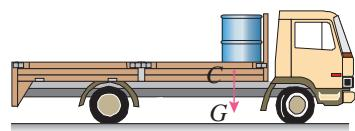  
甲

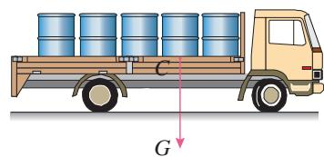  
乙  
图3.1-2 载重汽车的重心

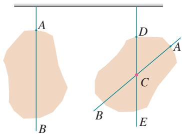  
图3.1-3 确定薄板的重心

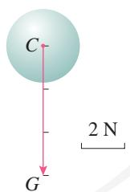  
图3.1-4 力的图示

我们还可以应用二力平衡的知识通过实验来确定形状不规则物体的重心位置。例如，要确定图3.1-3中薄板的重心位置，可以先在 $A$ 点把物体悬挂起来，通过 $A$ 点画一条竖直线 $AB$ ，由于 $A$ 点悬线的拉力跟薄板的重力平衡，薄板的重心必定在 $AB$ 连线上；然后，再选另一处 $D$ 点把物体悬挂起来，过 $D$ 点画一条竖直线 $DE$ ，薄板的重心必定在 $DE$ 连线上。因此， $AB$ 和 $DE$ 的交点 $C$ ，就是薄板的重心。

力可以用有向线段表示。有向线段的长短表示力的大小，箭头表示力的方向，箭尾（或箭头）表示力的作用点。如图3.1-4，球所受的重力大小为 $6 \mathrm{~N}$ ，方向竖直向下。这种表示力的方法，叫作力的图示。在不需要准确标度力的大小时，通常只需画出力的作用点和方向，即只需画出力的示意图。

### 弹力

日常生活中的很多相互作用，无论是对物体推、拉、提、举，还是牵引列车、锻打工件、击球、弯弓射箭等，

都是在物体与物体接触时发生的，这种相互作用可以称为接触力。我们通常所说的拉力、压力、支持力等都是接触力。接触力按其性质可以分为弹力和摩擦力，下面我们先研究弹力。

物体在力的作用下形状或体积会发生改变，这种变化叫作形变（deformation）。

有时物体的形变很小，不易被觉察。在图3.1-5中，一块剖面为三角形的有机玻璃压在另一块有机玻璃上，发生的形变肉眼不能看出。但是形变后，当特殊的光通过有机玻璃不同部位时，产生的花纹会发生变化，利用仪器可以看到这种差异。在工程设计时，常用这种方法研究按比例缩小的有机玻璃模型的形变，进而推测实际工程中物体各部位的受力情况。

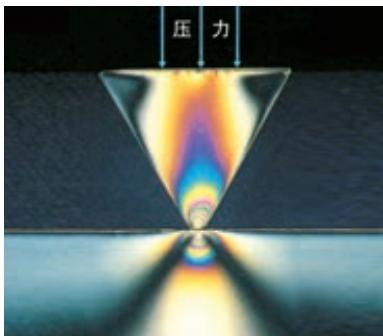  
图3.1-5 有机玻璃的形变

### 演示

#### 通过平面镜观察桌面的微小形变

如图3.1-6，在一张大桌子上放两个平面镜M和N，让一束光依次被这两个镜子反射，最后射到墙上，形成一个光点。按压两镜之间的桌面，观察墙上光点位置的变化。这个现象说明了什么？

被拉长的弹簧，要恢复原状，对相连接的小车产生了拉力 $F$ （图3.1-7）；被跳水运动员压弯的跳板，要恢复原状，对上面的人产生了支持力。发生形变的物体，要恢复原状，对与它接触的物体会产生力的作用，这种力叫作弹力（elastic force）。

放在地板上的物体，它对地板的压力以及地板对它的支持力，都是弹力，其方向是跟接触面垂直的；绳子的拉力，也是弹力，其方向是沿着绳子而指向绳子收缩的方向。

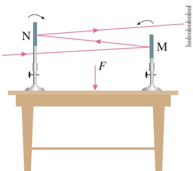  
图3.1-6 观察微小形变示意图

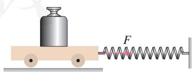  
图3.1-7 弹簧拉力示意图

### 胡克定律

物体在发生形变后，如果撤去作用力能够恢复原状，这种形变叫作弹性形变（elastic deformation）。如果形变过大，超过一定的限度，撤去作用力后物体不能完全恢复原来的形状，这个限度叫作弹性限度（elastic limit）。

弹簧在形变时产生的弹力与弹簧的伸长量是有关系的。那么，弹簧在弹性限度内，弹力大小与其伸长量有什么关系呢？

### 实验

#### 探究弹簧弹力与形变量的关系

#### ■实验思路

探究弹簧弹力与形变量的关系，需要测量多组弹簧弹力和形变量的数据，如何测量？说出你的想法。

#### 进行实验

要完成这个实验探究，我们可以通过如图3.1-8甲所示的装置进行实验。把弹簧上端固定在铁架台的横杆上，观察弹簧自由下垂时下端在刻度尺的位置。

在弹簧下端悬挂不同质量的钩码，记录弹簧在不同弹力下伸长的长度（弹簧弹力等于钩码的重力）。

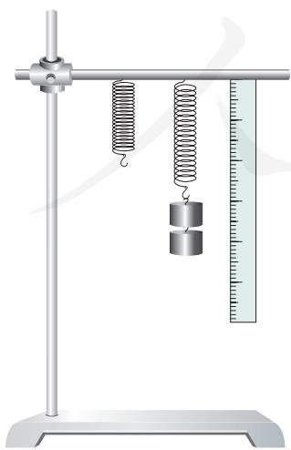  
甲 实验装置

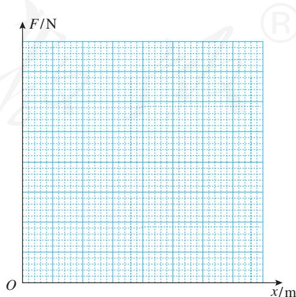  
乙 作出 $F - x$ 图像  
图3.1-8 弹簧弹力与形变量的关系

#### 数据处理

为了找出弹簧弹力与形变量的关系，我们以弹簧的弹力 $F$ 为纵轴、弹簧伸长的长度 $x$ 为横轴建立直角坐标系。根据表格中的实验数据，在坐标纸上描点（图3.1-8乙），作出 $F - x$ 图像。

由 $F - x$ 图像，你得出了什么结论？

英国科学家胡克经过研究发现，在弹性限度内，弹簧发生弹性形变时，弹力 $F$ 的大小跟弹簧伸长（或缩短）的长度 $x$ 成正比，即

$$
F = k x
$$

这个规律叫作胡克定律（Hooke's law）。式中弹力 $F$ 、弹簧伸长（或缩短）的长度 $x$ 的单位分别是牛顿（N）、米（m）， $k$ 叫作弹簧的劲度系数（coefficient of stiffness），单位是牛顿每米，符号是 $\mathrm{N} / \mathrm{m}$ 。

生活中说有的弹簧“硬”，有的弹簧“软”，指的就是它们的劲度系数不同。

### 练习与应用

1. 举出具体的实例来说明：

（1）力能够改变物体的运动状态或使物体产生形变。  
(2) 每一个力, 都有一个施力物体和一个受力物体。

2. 画出下面几个力的图示，并指出受力物体和施力物体。

（1）竖直向上飞行的火箭受到的重力，火箭质量为 $2 \times 10^{3} \mathrm{~kg}$ 。 $g$ 取 $10 \mathrm{~N} / \mathrm{kg}$ 。  
（2）人对车施加的水平向右 $250\mathrm{N}$ 的推力。  
(3) 用一根细绳竖直悬挂一件工艺品, 工艺品对细绳的拉力为 $0.5 \mathrm{~N}$ 。  
3. 几何学中把三角形三条中线的交点叫作重心。物理学中也有重心的概念。均匀的三角形薄板的重心是不是与几何学上的重心位于同

一点上？请你通过以下实验作出判断。

首先作图把均匀等厚三角形纸板的三条中线的交点 $C$ 找出来，然后用细线悬吊三角形纸板的任意位置，看悬线的延长线是否通过 $C$ 点。

4. 质量均匀的钢管，一端支在光滑的水平地面上，另一端被竖直绳悬挂着（图3.1-9），钢管受到几个力的作用？各力的施力物体是什么？画出钢管受力的示意图。

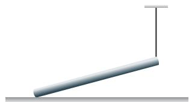  
图3.1-9

5. 物体在力的作用下产生的形变有时不容易被觉察，教科书列举了两个观察微小形变的

实例，你还能想到用什么方法来观察力作用下的微小形变？请画示意图说明你的方法。  
6. 某同学在竖直悬挂的弹簧下加挂钩码，做实验研究弹力与弹簧伸长量的关系。他将实验数据记录在表格中。实验时弹力始终未超过弹性限度， $g$ 取 $10 \mathrm{~N} / \mathrm{kg}$

表 钓码质量与弹簧总长度  

<table><tr><td>钩码质量m/g</td><td>0</td><td>30</td><td>60</td><td>90</td><td>120</td><td>150</td></tr><tr><td>弹簧总长度l/cm</td><td>6.0</td><td>7.2</td><td>8.3</td><td>9.5</td><td>10.6</td><td>11.8</td></tr></table>

（1）根据实验数据在坐标纸上作出弹力 $F$ 跟弹簧伸长量 $x$ 关系的 $F - x$ 图像（图3.1-10）。  
（2）根据 $F - x$ 图像计算弹簧的劲度系数。

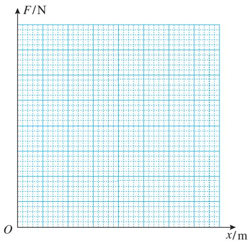  
图3.1-10

7. 小发明——设计一个自动冲水装置。

有一个排污沟，需要每隔十多分钟用水冲洗一次。为此，请你应用重心的知识设计一个自动冲水装置。设计的思路是：用一个可以转动的容器接住从水龙头细细流出的水，容器中的水装到一定体积时，由于重心位置的变化，容器失去平衡而翻倒，容器中的水被全部倒出冲洗排污沟，倒完水的容器又能自动恢复到原来的位置重新接水，如此往复。调节水龙头的流量，还可以控制两次冲水的时间间隔。请你在图3.1-11的圆圈中画出你构思的这个装置的图示。

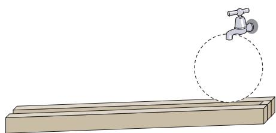  
图3.1-11

## 摩擦力

### 问题

用弹簧测力计拖动水平固定木板上的木块，使它做匀速运动，测力计的示数等于木块所受摩擦力的大小。改变木块和木板之间的压力，摩擦力的大小也随之改变。

如果摩擦力的大小跟压力的大小存在某种定量关系的话，它们可能是怎样的关系呢？

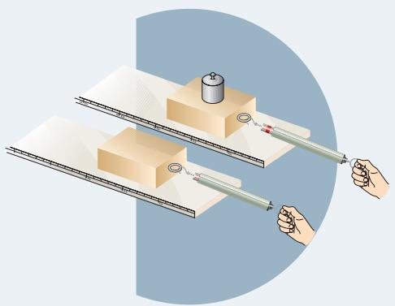

### 滑动摩擦力

我们知道，两个相互接触的物体，当它们相对滑动时，在接触面上会产生一种阻碍相对运动的力，这种力叫作滑动摩擦力（sliding frictional force）。滑动摩擦力的方向总是沿着接触面，并且跟物体相对运动的方向相反。

我们还知道，滑动摩擦力的大小跟接触面上压力的大小有关，对同一接触面来说，压力越大，滑动摩擦力越大；滑动摩擦力的大小还跟接触面的粗糙程度、材质等有关，在相同压力下，不同接触面间的滑动摩擦力的大小一般不同。

通过进一步的定量实验，测量同一接触面不同压力下的滑动摩擦力大小，结果表明：滑动摩擦力的大小跟压力的大小成正比。如果用 $F_{\mathrm{f}}$ 表示滑动摩擦力的大小，用 $F_{\text {压}}$ 表示压力的大小，则有

$$
F _ {\mathrm {f}} = \mu F _ {\text {压}}
$$

其中， $\mu$ 是比例常数，叫作动摩擦因数（dynamic friction factor）。它的值跟接触面有关，接触面材料不同、粗糙程度不同，动摩擦因数也不同。

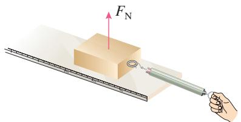  
图3.2-1

在图3.2-1中，以木块在水平木板上滑动为例，木块所受的支持力为 $F_{\mathrm{N}}$ 。由于木块对木板的压力大小等于 $F_{\mathrm{N}}$ ，所以动摩擦因数 $\mu$ 也可以表示为

$$
\mu = \frac {F _ {\mathrm {f}}}{F _ {\mathrm {N}}}
$$

$F_{\mathrm{f}}$ 和 $F_{\mathrm{N}}$ 是接触面上木块所受的两个力, $F_{\mathrm{f}}$ 在接触面内且与相对运动方向相反, $F_{\mathrm{N}}$ 与接触面垂直。

表 几种材料间的动摩擦因数  

<table><tr><td>材料</td><td>动摩擦因数</td><td>材料</td><td>动摩擦因数</td></tr><tr><td>钢-钢</td><td>0.25</td><td>钢-冰</td><td>0.02</td></tr><tr><td>木-木</td><td>0.30</td><td>木-冰</td><td>0.03</td></tr><tr><td>木-金属</td><td>0.20</td><td>橡胶轮胎-路面（干）</td><td>0.71</td></tr><tr><td>皮革-铸铁</td><td>0.28</td><td>木-皮带</td><td>0.40</td></tr></table>

### 【例题】

在我国东北寒冷的冬季，有些地方用雪橇作为运输工具。一个有钢制滑板的雪橇，连同车上木料的总质量为 $4.9 \times 10^{3} \mathrm{~kg}$ 。在水平的冰道上，马要在水平方向用多大的力，才能够拉着雪橇匀速前进？ $g$ 取 $10 \mathrm{~N} / \mathrm{kg}$ 。

分析 将雪橇抽象为一个物体，如图3.2-2，雪橇在重力 $mg$ 、支持力 $F_{\mathrm{N}}$ 、马的拉力 $F$ 和滑动摩擦力 $F_{\mathrm{f}}$ 四个力的作用下，沿水平面匀速前进。根据二力平衡条件，拉力 $F$ 与滑动摩擦力 $F_{\mathrm{f}}$ 的大小相等，而 $F_{\mathrm{f}}$ 与 $F_{\mathrm{N}}$ 有关， $F_{\mathrm{N}}$ 的大小又等于 $mg$ ，故可以求得拉力 $F$ 。

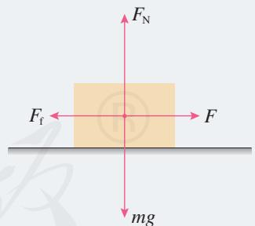  
图3.2-2

解 雪橇所受重力 $mg = 4.9 \times 10^{4} \mathrm{~N}$ , 查表得 $\mu = 0.02$ 。

雪橇匀速运动，拉力 $F$ 与滑动摩擦力 $F_{\mathrm{f}}$ 大小相等，即

$$
F = F _ {\mathrm {f}}
$$

由于 $F_{\mathrm{N}} = mg$

$$
F _ {\mathrm {f}} = \mu F _ {\mathrm {N}} = \mu m g
$$

故

$$
F = \mu m g = 0. 0 2 \times 4. 9 \times 1 0 ^ {3} \times 1 0 \mathrm {N} = 9 8 0 \mathrm {N}
$$

马要在水平方向用 $980 \mathrm{~N}$ 的力，才能够拉着雪橇匀速前进。

### 静摩擦力

相互接触的物体处于相对静止时，是不是也可能存在摩擦力？

如图3.2-3，人用平行于地面的力推沙发，沙发有相对地面运动的趋势，但它没有被推动，沙发与地面仍然保持相对静止。根据二力平衡的知识可知，这时一定有一个力与推力平衡。这个力与人对沙发的推力大小相等、方向相反。这个力就是沙发与地面之间的摩擦力。

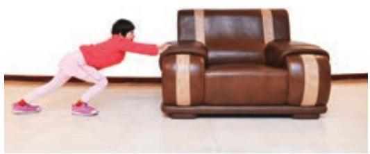  
图3.2-3 推沙发

由于这时相互接触的两个物体之间只有相对运动的趋势，而没有相对运动，所以这时的摩擦力叫作静摩擦力（static frictional force）。静摩擦力的方向总是跟物体相对运动趋势的方向相反。只要沙发与地面间没有产生相对运动，静摩擦力的大小就随着推力的增大而增大，并与推力保持大小相等。

### 演示

#### 静摩擦力的大小随拉力的变化

把木块放在水平长木板上，用弹簧测力计沿水平方向拉木块。在拉力 $F$ 增大到一定值之前，木块不会运动，此种情况下静摩擦力的大小等于拉力的大小。

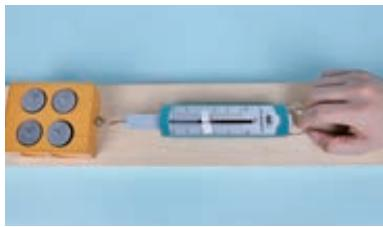  
图3.2-4 测量静摩擦力的实验装置

在弹簧测力计的指针下轻塞一个小纸团，它可以随指针移动，并作为指针到达最大位置的标记（图3.2-4）。继续用力，当拉力达到某一数值时木块开始移动，此时拉力会突然变小。

如果用力传感器代替弹簧测力计做这个实验，能够在计算机屏幕上直接得到拉力随时间变化的 $F - t$ 图像（图3.2-5）。

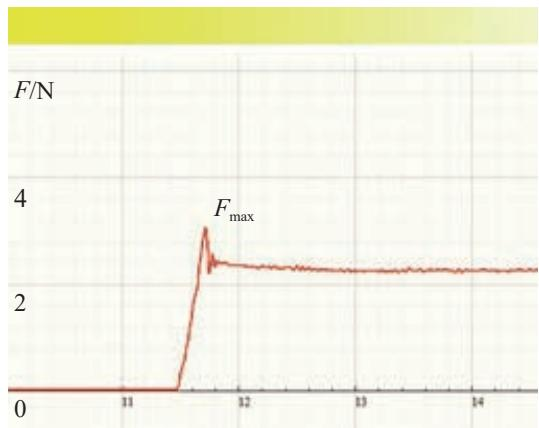  
图3.2-5 $F - t$ 图像

静摩擦力的增大有一个限度。图3.2-5中木块所受静摩擦力的最大值 $F_{\mathrm{max}}$ 在数值上等于物体即将开始运动时的拉力。两物体之间实际产生的静摩擦力 $F$ 在0与最大静摩擦力 $F_{\mathrm{max}}$ 之间，即

$$
0 <   F \leqslant F _ {\max }
$$

瓶子可以拿在手中，靠的是静摩擦力的作用。皮带运输机能把货物送往高处，也是静摩擦力作用的结果。

### 科学漫步

#### 流体的阻力

气体和液体都具有流动性，统称为流体。物体在流体中运动时，要受到流体的阻力，阻力的方向与物体相对于流体运动的方向相反。汽车、火车和飞机等在空气中运动，要受到空气的阻力。轮船、潜艇在水面或水下航行，要受到水的阻力。

流体的阻力跟物体相对于流体的速度有关，速度越大，阻力越大。雨滴在空气中下落，速度越来越大，所受空气阻力也越来越大。当阻力增加到跟雨滴所受的重力相等时，二力平衡，雨滴匀速下落。

流体的阻力还跟物体的横截面积有关，横截面积越大，阻力越大。跳伞运动员、飞船返回舱

在空中张开降落伞，凭借降落伞较大的横截面积获得较大的空气阻力，安全落地。

流体的阻力还跟物体的形状有关系。头圆尾尖的物体所受的流体阻力较小，这种形状通常叫作流线型。为了减小阻力，轮船的水下部分采用了流线型（图3.2-6）。

一般来说，空气阻力比液体阻力、固体间的摩擦力都要小。气垫船靠船下喷出的气体，浮在水面航行，受到的阻力小。磁浮列车靠电磁力使列车悬浮在轨道上，速度可达 $500\mathrm{km / h}$

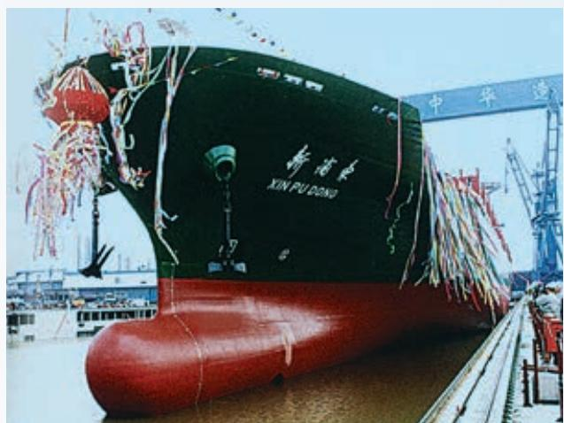  
图3.2-6 水下流线型船体

### 练习与应用

1. 手压着桌面向前移动，会明显地感觉到有阻力阻碍手的移动。手对桌面的压力越大，阻力越大。试一试，并说明道理。  
2. 一只玻璃瓶，在下列情况下是否受到摩擦力？如果受到摩擦力，摩擦力朝什么方向？

（1）瓶子静止在粗糙水平桌面上。  
（2）瓶子静止在倾斜的桌面上。  
（3）瓶子被瓶口朝上握在手中静止。  
(4) 瓶子压着一张纸条, 扶住瓶子把纸条抽出。  
3. 所受重力为 $100 \mathrm{~N}$ 的木箱放在水平地板上, 至少要用 $35 \mathrm{~N}$ 的水平推力, 才能使它从原

地开始运动。木箱从原地移动以后，用 $30 \mathrm{~N}$ 的水平推力，就可以使木箱继续做匀速直线运动。

由此可知：木箱与地板之间的最大静摩擦力 $F_{\mathrm{max}} =$ ；木箱所受的滑动摩擦力 $F_{\mathrm{f}} =$ ，木箱与地板之间的动摩擦因数 $\mu =$ ；如果用20N的水平推力推这个静止的木箱，木箱所受的摩擦力大小为

4. 所受重力为 $500 \mathrm{~N}$ 的雪橇，在平坦的雪地上用 $10 \mathrm{~N}$ 的水平拉力恰好可以拉着空雪橇做匀速直线运动。如果雪橇再载重 $500 \mathrm{~N}$ 的货物，那么，雪橇在该雪地上滑行时受到的摩擦力是多少？

## 牛顿第三定律

### 问题

力的作用是相互的。相互作用的力其大小有什么关系？例如，大人跟小孩掰手腕，很容易就把小孩的手压在桌面上。那么，他们施加给对方的力，大小相等吗？

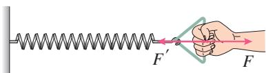  
图3.3-1 弹簧和手受力示意图

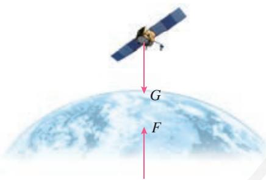  
图3.3-2 地球和人造卫星受力示意图

### 作用力和反作用力

力是物体对物体的作用。只要谈到力，就一定存在着受力物体和施力物体。用手拉弹簧，弹簧受到手的拉力 $F$ ，同时弹簧发生形变，手也就受到弹簧的拉力 $F^{\prime}$ （图3.3-1）。坐在椅子上用力推桌子，会感到桌子也在推我们，我们的身体要向后仰。我们常说，地面上及地球附近的物体受到地球的吸引（重力）。其实，地球也受到它们的吸引，地球和物体之间的作用也是相互的（图3.3-2）。如此等等，不胜枚举。

观察和实验的结果表明，两个物体之间的作用总是相互的。当一个物体对另一个物体施加了力，后一个物体一定同时对前一个物体也施加了力。物体间相互作用的这一对力，通常叫作作用力（acting force）和反作用力（reacting force）。作用力和反作用力总是互相依赖、同时存在的。我们可以把其中任何一个力叫作作用力，另一个力叫作反作用力。

### 牛顿第三定律

作用力和反作用力的大小之间、方向之间有什么样的关系？这又是一个定量的问题，而定量的问题通常只靠观察和经验是解决不了的，它需要通过实验测量来回答。

#### 用弹簧测力计探究作用力和反作用力的关系

探究作用力和反作用力的关系，要同时测量这两个力，你认为应该如何测量？

我们可以通过图3.3-3所示的装置进行实验。把A、B两个弹簧测力计连接在一起，B的一端固定，用手拉测力计A。可以看到两个测力计的指针同时移动。这时测力计B受到A的拉力 $F$ ，测力计A则受到B的拉力 $F^{\prime}$ 。 $F$ 与 $F^{\prime}$ 有什么关系？

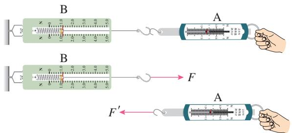  
图3.3-3 实验装置

从实验中可以发现，两个弹簧测力计的示数是相等的，方向相反。上面是通过弹力进行的实验，摩擦力满足上面的关系吗？如果是不相互接触的力呢？

牛顿经过研究指出: 两个物体之间的作用力和反作用力总是大小相等, 方向相反, 作用在同一条直线上。这就是牛顿第三定律 (Newton's third law)。

在生活和生产中应用牛顿第三定律的例子是很多的。

人在划船时，桨向后推水，水就向前推桨，将船向前推进（图3.3-4）。与此类似，轮船的螺旋桨旋转时也是向后推水，水同时给螺旋桨一个反作用力，推动轮船前进。

汽车的发动机驱动车轮转动，由于轮胎和地面之间的摩擦，车轮向后推地面，地面给车轮一个向前的反作用力，使汽车前进（图3.3-5）。汽车受到的驱动力就是这样产生的。若把驱动轮架空，不让它跟地面接触，这时车轮虽然转动，但车轮不推地面，地面也就不会产生向前推车的力，汽车就不会前进。陷在泥泞中的汽车，尽管车轮飞转，但是如果泥和车轮之间太滑，车轮得不到足够的摩擦力，车也是出不来的。许多越野车可以按需要分别由前轮或后轮驱动，必要时甚至可以四轮同时驱动，以便根据车轮与地面接触的不同情况来获得足够的驱动力。

  
图3.3-4 划龙舟

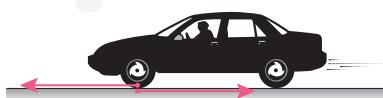  
车轮受到的力 地面受到的力  
图3.3-5 汽车受驱动力的示意图

#### 用力传感器探究作用力和反作用力的关系

力传感器可以把它所受力的大小、方向随时间变化的情况，由计算机屏幕显示出来。

把两个互相钩着的力传感器，同时连在计算机上，其中，一个系在墙壁上固定，另一个握在手中（图3.3-6甲）。图3.3-6乙中上下两条图线分别表示两个力传感器受力的大小。用手拉一个力传感器，可以看到在一个力传感器受力的同时，

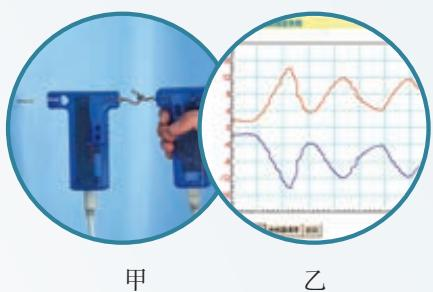  
图3.3-6 作用力和反作用力的关系

另一个力传感器也同时受到力的作用。从而可以知道在任何时刻两个力的大小相等、方向相反。

两位同学各持一个力传感器，互相钩着。一人用力拉力传感器朝自己的方向运动。可以发现，在运动的过程中，尽管力的大小随运动时间不断变化，但在运动中的任何时刻，作用力和反作用力总是大小相等、方向相反的。

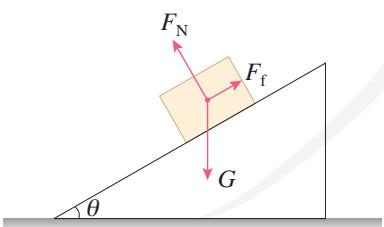  
图3.3-7 斜面上物体受力示意图

### 物体受力的初步分析

分析物体的受力，有两条思路。一是根据物体运动状态的变化来分析和判断其受力情况，这是下一章学习的内容；二是根据各种力的特点，从相互作用的角度来分析物体的受力。下面我们先从后一思路来分析物体的受力情况，为力与运动关系的分析奠定必要的基础。在高中物理的力学部分，我们遇到的力主要是重力、弹力和摩擦力。

例如，一个木块静止在粗糙斜面上，我们按重力、弹力和摩擦力的顺序来分析它的受力情况。木块受到重力 $G$ ，方向竖直向下；木块和斜面接触并相互挤压，木块受到垂直于斜面向上的弹力 $F_{\mathrm{N}}$ ；假设木块和斜面之间没有摩擦，木块就会向下滑动，由此可以判断，静止的木块相对斜面有向下滑动的趋势，所受的静摩擦力 $F_{\mathrm{f}}$ 是沿斜面向上的（图3.3-7）。

需要强调的是，必须明确我们是在分析哪个物体所受的力。在上面的例子中，涉及木块的作用力和反作用力共有三对：重力 $G$ 和木块对地球的引力、弹力 $F_{\mathrm{N}}$ 和木块对斜面的压力、静摩擦力 $F_{\mathrm{f}}$ 和木块对斜面的静摩擦力。由于我们是在对木块的受力情况进行分析，所以只把这六个力中木块所受的三个力画出来了。

在分析物体的受力情况时，不要把某个力的反作用力跟这个力的平衡力混淆。

例如，在图3.3-8甲中，猴子吊在空中，我们分析猴子所受的力。猴子受到重力 $G$ ，还受到树枝对它的拉力 $F$ 。由于猴子是静止的，而且不再受到其他力的作用，所以拉力 $F$ 和重力 $G$ 这两个力是一对相互平衡的力，它们“大小相等、方向相反，作用在同一条直线上”。应该注意，这两个力作用在同一物体（猴子）上。

另一方面，树枝在以拉力 $F$ 向上拉着猴子，猴子同时也在以向下的拉力 $F^{\prime}$ 拉着树枝，这是一对作用力和反作用力，它们的关系也是“大小相等、方向相反，作用在同一条直线上”（图3.3-8乙）。但不同的是，它们分别作用在两个物体（猴子和树枝）上。

这两种情况，很容易混淆，因此要注意区分。

“一对相互平衡的力”和“一对作用力和反作用力”还有一个区别：后者一定是同一种类的力（例如 $F$ 和 $F'$ 都是弹力），而前者则不一定是同一种类的力（例如 $F$ 是弹力，而 $G$ 是重力）。

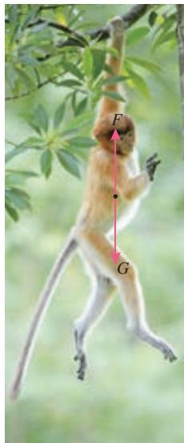  
甲

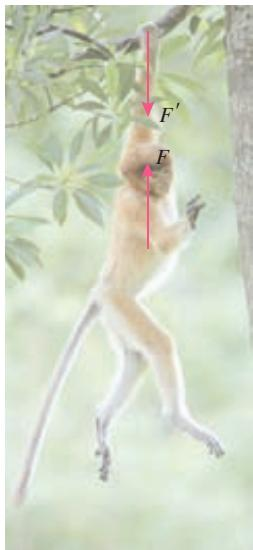  
乙  
图3.3-8 平衡力与作用力、反作用力的区别

##### 练习与应用

1. 一个物体静止地放在台式弹簧秤上（图3.3-9），试证明物体对弹簧秤的压力大小等于物体所受的重力大小。证明时，请在图上标出所涉及的力。

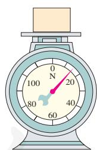  
图3.3-9

2. 小强说：“我记得在初中学过，如果两个力的大小相等、方向相反，这两个力就会互相平衡，看不到作用的效果了。既然作用力和反作用力也是大小相等、方向相反的，它们也应该互相平衡呀！”

应该怎么解答小强的疑问？

3. 如图 3.3-10，油桶放在汽车上，汽车停于水平地面。涉及油桶、汽车、地球三个物体之间的作用力和反作用力一共有几对？这几对

力中，油桶受哪几个力？汽车受哪几个力？地球受哪几个力？

  
图3.3-10

4. 如图3.3-11，粗糙的长方体木块A、B叠在一起，放在水平桌面上，B木块受到一个水平方向的力的牵引，但仍然保持静止。问B木块受到哪几个力的作用？

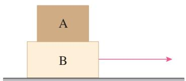  
图3.3-11

## 4 力的合成和分解

### 问题

一个静止的物体，在某平面上受到5个力作用，你能判断它将向哪个方向运动吗？如果我们能找到一种方法，即“用一个力的单独作用替代两个力的共同作用，而效果不变”，上述问题就迎刃而解了。你觉得这个力和被替代的两个力会有怎样的关系呢？

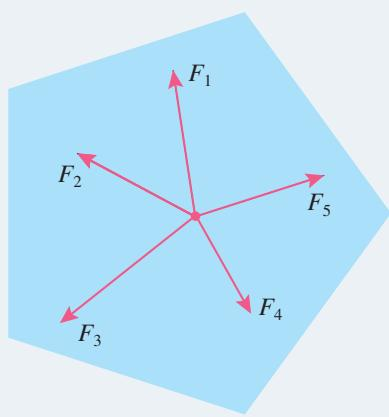

几个力如果都作用在物体的同一点，或者它们的作用线相交于一点，这几个力叫作共点力。下面我们先研究共点力的合成。

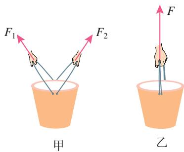  
图3.4-1 水桶所受拉力示意图

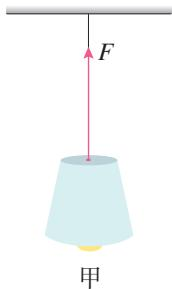

  
图3.4-2 吊灯所受拉力示意图

### 合力和分力

生活中常见到这样的事例：一个力的单独作用与两个或者更多力的共同作用，其效果相同。

例如，两个小孩分别用力 $F_{1} 、 F_{2}$ 共同提着一桶水，水桶静止（图3.4-1甲）；一个大人单独向上用力 $F$ 也能提着这桶水，让水桶保持静止（图3.4-1乙）。

一盏吊灯悬吊在天花板上保持静止，悬线对吊灯的拉力是 $F$ （图3.4-2甲），若用两根线共同悬挂吊灯，悬线上端分别固定在天花板的左右两处，线的拉力是 $F_{1}$ 和 $F_{2}$ ，也能产生使吊灯保持静止的效果（图3.4-2乙）。

假设一个力单独作用的效果跟某几个力共同作用的效果相同，这个力就叫作那几个力的合力（resultant force）。假设几个力共同作用的效果跟某个力单独作用的效果相同，这几个力就叫作那个力的分力（component force）。图3.4-1中的 $F$ 等于 $F_{1}$ 和 $F_{2}$ 的合力，图3.4-2中的 $F_{1}$ 和 $F_{2}$ 可以看成 $F$ 的分力。

### 力的合成和分解

在物理学中，我们把求几个力的合力的过程叫作力的合成（composition of forces），把求一个力的分力的过程叫作力的分解（resolution of force）。

### 实验

#### 探究两个互成角度的力的合成规律

如图3.4-3甲，橡皮条的一端连接轻质小圆环，另一端固定，橡皮条的长度为 $GE$ 。在图3.4-3乙中，用手通过两个弹簧测力计共同拉动小圆环。小圆环受到拉力 $F_{1}$ 、 $F_{2}$ 的共同作用，处于 $O$ 点，橡皮条伸长的长度为 $EO$ 。撤去 $F_{1} 、 F_{2}$ ，改用一个力 $F$ 单独拉住小圆环，仍使它处于 $O$ 点（图3.4-3丙）。力 $F$ 单独作用，与 $F_{1} 、 F_{2}$ 共同作用的效果是一样的，都能使小

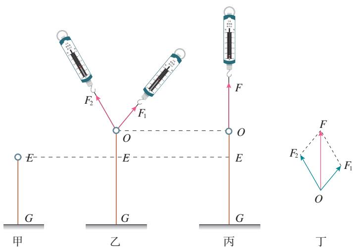  
图3.4-3 探究二力合成规律实验示意图

圆环保持静止，由于两次橡皮条伸长的长度相同，即橡皮条对小圆环的拉力相同，所以 $F$ 等于 $F_{1} 、 F_{2}$ 的合力。

我们要探究的是：合力 $F$ 与 $F_{1} 、 F_{2}$ 有什么关系？

$F_{1}$ 和 $F_{2}$ 的大小和方向都会对合力 $F$ 产生影响，力的图示法能同时描述力的大小和方向，画出 $F$ 、 $F_{1}$ 和 $F_{2}$ （图3.4-3丁），看看三者间是什么关系？说出你的猜想。

怎样检验你的猜想，说出你的方法。

通过多次的实验探究我们会发现，两个力合成时，如果以表示这两个力的有向线段为邻边作平行四边形，这两个邻边之间的对角线就代表合力的大小和方向（图3.4-4）。这个规律叫作平行四边形定则（parallelogram rule）。

在上述实验中，如果把图3.4-3乙和图3.4-3丙的操作顺序对调，即先用拉力 $F$ 把小圆环拉到 $O$ 点，再用拉力 $F_{1}$ 和 $F_{2}$ 共同拉小圆环产生相同效果，则 $F_{1}$ 和 $F_{2}$ 可以看成 $F$ 的分力，

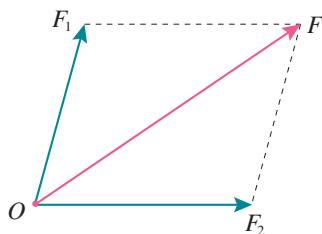  
图3.4-4 两个力的合成

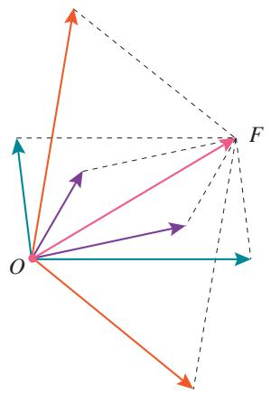  
图3.4-5 力的分解

这就变成了“探究力的分解规律”的实验。由于各个力的数据都没有改变，因此，力的分解也遵从平行四边形定则。

需要指出的是，如果没有限制，对于同一条对角线，可以作出无数个不同的平行四边形（图3.4-5）。也就是说，同一个力 $F$ 可以分解为无数对大小、方向不同的分力。一个已知力究竟应该怎样分解，要根据具体问题来确定。

如果两个以上的共点力作用在一个物体上，也可以应用平行四边形定则求出它们的合力。先求出任意两个力的合力，再求出这个合力跟第三个力的合力，直到把所有的力都合成进去，最后得到的结果就是这些力的合力。

### 【例题】

某物体受到一个大小为 $32\mathrm{N}$ 的力，方向水平向右，还受到另一个大小为 $44\mathrm{N}$ 的力，方向竖直向上。通过作图求出这两个力的合力的大小和方向。

解 选择某一标度，例如用 $1\mathrm{cm}$ 长的线段表示 $10\mathrm{N}$ 的力。

根据题意，作出二力合成的平行四边形（图3.4-6）。表示 $F_{1}$ 的有向线段长 $3.20\mathrm{cm}$ ，表示 $F_{2}$ 的有向线段长 $4.40\mathrm{cm}$ 。用刻度尺测量后得知，表示合力 $F$ 的对角线长为 $5.44\mathrm{cm}$ ，则

$$
F = 5. 4 4 \mathrm {c m} \times 1 0 \mathrm {N} / \mathrm {c m} = 5 4. 4 \mathrm {N}
$$

用量角器测得合力 $F$ 与力 $F_{1}$ 的夹角为 $54^{\circ}$ 。

合力的大小为 $54.4 \mathrm{~N}$ , 方向与力 $F_{1}$ 的夹角为 $54^{\circ}$ 。

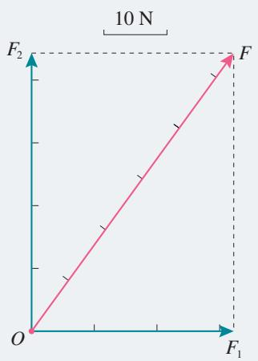  
图3.4-7 人的足迹

图3.4-6

### 矢量和标量

力的合成，可以认为是力的相加。二力相加时，不能简单地把两个力的大小相加，而要按平行四边形定则来确定合力的大小和方向。

我们曾经学过位移。一个人从 $A$ 走到 $B$ ，发生的位移是 $AB$ ，又从 $B$ 走到 $C$ （图3.4-7），发生的位移是 $BC$ 。在整个运动过程中，这个人的位移是 $AC$ ， $AC$ 是合位移。

如果平行地移动矢量 $BC$ ，使它的始端 $B$ 与第一次位移

的始端 $A$ 重合，于是我们看到，两次表示位移的线段构成了一个平行四边形的一组邻边，而表示合位移的正是它们所夹的对角线 $AC$ （图3.4-8）。所以说，位移合成时也遵从平行四边形定则。

既有大小又有方向，相加时遵从平行四边形定则的物理量叫作矢量（vector）。只有大小，没有方向，相加时遵从算术法则的物理量叫作标量（scalar）。

除了力和位移以外，速度、加速度都是矢量。在我们学过的物理量中，质量、路程、功、电流等都是标量。

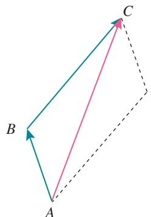  
图3.4-8 人的位移

### 练习与应用

1. 有两个力，一个是 $10\mathrm{N}$ ，一个是 $2\mathrm{N}$ ，它们的合力有可能等于 $5\mathrm{N}$ 、 $10\mathrm{N}$ 、 $15\mathrm{N}$ 吗？合力的最大值是多少？最小值是多少？  
2. 有两个力，它们的合力为0。现把其中一个向东的6N的力改为向南（大小不变），它们合力的大小、方向如何？  
3. 两个力互成 $30^{\circ}$ 角，大小分别是 $90 \mathrm{~N}$ 和 $120 \mathrm{~N}$ 。通过作图求出合力的大小和方向。如果这两个力的大小不变，两个力之间的夹角变为 $150^{\circ}$ ，通过作图求出合力的大小和方向。  
4. 一个竖直向下的 $180 \mathrm{~N}$ 的力分解为两个分力，一个分力在水平方向上并等于 $240 \mathrm{~N}$ （图3.4-9），求另一个分力的大小和方向。

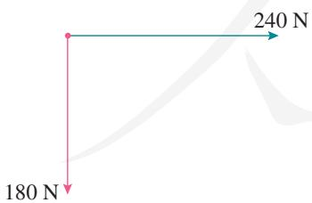  
图3.4-9

5. 两个力 $F_{1}$ 和 $F_{2}$ 之间的夹角为 $\theta$ ，其合力为 $F$ 。请判断以下说法是否正确，并简述理由。

（1）合力 $F$ 总比力 $F_{1}$ 和 $F_{2}$ 中的任何一个都大。  
（2）若力 $F_{1}$ 和 $F_{2}$ 大小不变， $\theta$ 角越小，则合力 $F$ 就越大。

（3）若夹角 $\theta$ 不变，力 $F_{1}$ 大小不变， $F_{2}$ 增大，则合力 $F$ 一定增大。  
6. 如图3.4-10，倾角为 $15^{\circ}$ 的斜面上放着一个木箱，用 $100\mathrm{N}$ 的拉力 $F$ 斜向上拉着木箱， $F$ 与水平方向成 $45^{\circ}$ 角。分别以平行于斜面和垂直于斜面的方向为 $x$ 轴和 $y$ 轴建立直角坐标系，把 $F$ 分解为沿着两个坐标轴的分力。试在图中作出分力 $F_{x}$ 和 $F_{y}$ ，并计算它们的大小。

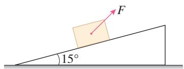  
图3.4-10

7. 如图3.4-11，把一个物体放在倾角为 $\theta$ 的斜面上，物体受重力 $G$ （物体还受到其他力的作用，图中没有画出）。现在需要沿平行于斜面方向和垂直于斜面方向对物体的运动分别进行研究，把重力 $G$ 沿平行于斜面和垂直于斜面方向分解，求两个分力的大小。

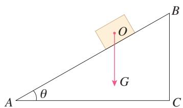  
图3.4-11

### 问题

图甲、乙、丙、丁分别画出了重力为 $G$ 的木棒在力 $F_{1}$ 和 $F_{2}$ 的共同作用下处于平衡状态的情况，这些力都位于同一平面内。根据每幅图中各个力作用线的几何关系，可以把上述四种情况的受力分成两类，你认为哪些情况属于同一类？你是根据什么来划分的？

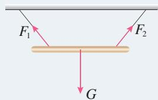  
甲

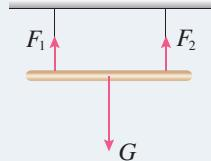  
丙

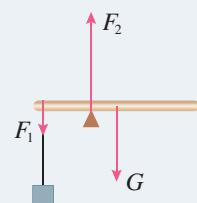  
乙

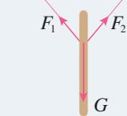  
丁

由“问题”栏目中的图示可以看出，图甲和图丁中木棒所受的力是共点力。图乙和图丙中木棒所受的力不是共点力。下面我们来研究物体受共点力平衡的情况。

### 共点力平衡的条件

物体受到几个力作用时，如果保持静止或匀速直线运动状态，我们就说这个物体处于平衡状态。桌上的书、屋顶的灯、随传送带匀速运送的物体、沿直线公路匀速前进的汽车，都处于平衡状态。

想一想，受共点力作用的物体，在什么条件下才能保持平衡呢？

作用在同一物体上的两个力，如果大小相等、方向相反，并且在同一条直线上，这两个力平衡。二力平衡时物体所受的合力为0。

如果物体受到多个共点力作用，我们可以逐步通过力的合成，最终等效为两个力的作用。如果这两个力的合力为0，则意味着所有力的合力等于0，物体将处于平衡状态。因此，在共点力作用下物体平衡的条件是合力为0，我们把它称为共点力平衡的条件。

### 【例题1】

某幼儿园要在空地上做一个滑梯（图3.5-1甲），根据空地的大小，滑梯的水平跨度确定为 $6\mathrm{m}$ 。设计时，滑板和儿童裤料之间的动摩擦因数取0.4，为使儿童在滑梯游戏时能在滑板上滑下，滑梯至少要多高？

分析 将滑梯抽象为一个斜面的模型（图3.5-1乙），以正在匀速滑下的小孩为研究对象。

小孩受到三个力的作用：重力 $G$ 、斜面的支持力 $F_{\mathrm{N}}$ 和滑动摩擦力 $F_{\mathrm{f}}$ 。

当这三个力的合力为 0 时, 小孩能在滑板上获得一定速度后匀速滑下, 则斜面的高度即为所要求的滑梯的高度。

解 在图3.5-1中，沿平行和垂直于斜面的两个方向建立直角坐标系。把重力 $G$ 沿两个坐标轴的方向分解为 $G_{x}$ 和 $G_{y}$ ，这样的分解称为正交分解。

设斜面倾角为 $\theta$ ，由于 $G_{y}$ 垂直于 $AB$ 、 $G$ 垂直于 $AC$ ，故 $G_{y}$ 和 $G$ 的夹角也等于 $\theta$ 。用 $l$ 、 $b$ 和 $h$ 分别表示 $AB$ 、 $AC$ 和 $BC$ 的长度。

根据共点力平衡的条件和直角三角形中三角函数关系可知：

在 $x$ 轴方向上

$$
G _ {x} - F _ {\mathrm {f}} = 0
$$

$$
F _ {\mathrm {f}} = G _ {x} = G \sin \theta = G \frac {h}{l} \tag {1}
$$

在 $y$ 轴方向上

$$
G _ {y} - F _ {\mathrm {N}} = 0
$$

$$
F _ {\mathrm {N}} = G _ {y} = G \cos \theta = G \frac {b}{l} \tag {2}
$$

由于 $F_{\mathrm{f}} = \mu F_{\mathrm{N}}$ (3)

把（1）（2）式代入（3）式有

$$
G \frac {h}{l} = \mu G \frac {b}{l}
$$

可求得

$$
h = \mu b = 0. 4 \times 6 \mathrm {m} = 2. 4 \mathrm {m}
$$

滑梯至少要 $2.4 \mathrm{~m}$ 高，儿童才能从滑梯上滑下。

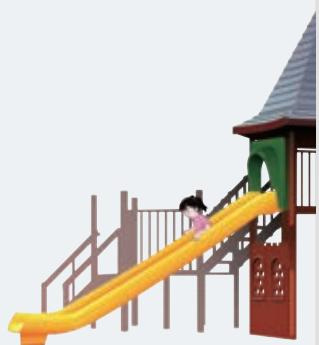

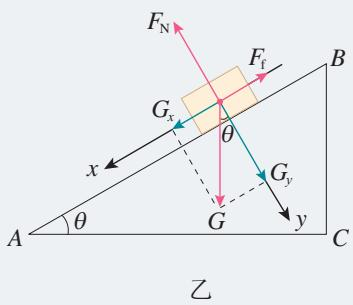  
甲  
图3.5-1

### 【例题2】

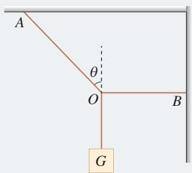  
图3.5-2

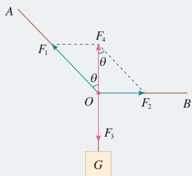  
图3.5-3 绳索连接点受力示意图

  
图3.5-4 正交分解法

生活中常用一根水平绳拉着悬吊重物的绳索来改变或固定悬吊物的位置。如图3.5-2，悬吊重物的细绳，其 $O$ 点被一水平绳 $BO$ 牵引，使悬绳 $AO$ 段和竖直方向成 $\theta$ 角。若悬吊物所受的重力为 $G$ ，则悬绳 $AO$ 和水平绳 $BO$ 所受的拉力各等于多少？

分析 选取两根绳索连接的 $O$ 点为研究对象, 它受到三个力的作用: 绳 $AO$ 对它的拉力 $F_{1} 、$ 绳 $BO$ 对它的拉力 $F_{2}$ 和 $O$ 点下方悬绳对它的拉力 $F_{3}$ (图 3.5-3)。

在平衡状态下， $O$ 点所受三个力的合力为0。由于 $F_{3}$ 的大小与悬挂物所受的重力相等，且三个力的方向均已知，由此可以求出 $F_{1} 、 F_{2}$ 的大小。

解 方法1 用两个力的合力和第三个力平衡的方法求解。

如图3.5-3， $F_{4}$ 为 $F_{1}$ 和 $F_{2}$ 的合力，则 $F_{4}$ 与 $F_{3}$ 平衡，即

$$
F _ {4} = F _ {3} = G
$$

由图可知， $F_{1} = \frac{F_{4}}{\cos\theta} = \frac{G}{\cos\theta}$

$$
F _ {2} = F _ {4} \tan \theta = G \tan \theta
$$

方法2 用正交分解的方法求解。

如图3.5-4，以 $O$ 为原点建立直角坐标系。 $F_{2}$ 方向为 $x$ 轴正方向，向上为 $y$ 轴正方向。 $F_{1}$ 在两个坐标轴方向的分矢量分别为 $F_{1x}$ 和 $F_{1y}$ 。因 $x$ 、 $y$ 两个方向的合力都等于0，可列方程

$$
F _ {2} - F _ {1 x} = 0
$$

$$
F _ {1 y} - F _ {3} = 0
$$

即 $F_{2} - F_{1}\sin \theta = 0$ (1)

$$
F _ {1} \cos \theta - G = 0 \tag {2}
$$

由（1）（2）式解得 $F_{1} = \frac{G}{\cos\theta}$ ， $F_{2} = G\tan \theta$ 。

根据牛顿第三定律，绳 $AO$ 和绳 $BO$ 所受的拉力大小分别为 $\frac{G}{\cos \theta}$ 和 $G \tan \theta$ 。

1. 如图3.5-5，物体在五个共点力的作用下保持平衡。如果撤去力 $F_{1}$ ，而保持其余四个力不变，请在图上画出这四个力的合力的大小和方向。

  
图3.5-5

2. 在光滑墙壁上用网兜把足球挂在 $A$ 点，足球与墙壁的接触点为 $B$ （图3.5-6）。足球的质量为 $m$ ，悬绳与墙壁的夹角为 $\alpha$ ，网兜的质量不计。求悬绳对足球的拉力和墙壁对足球的支持力。

  
图3.5-6

3. 如图 3.5-7，物体所受重力为 $40 \mathrm{~N}$ ，用细绳 $OC$ 悬于 $O$ 点，绳 $OC$ 所能承受的最大拉力为 $50 \mathrm{~N}$ 。现用细绳 $AB$ 绑住绳 $OC$ 的 $A$ 点，再用缓慢增大的水平力牵引 $A$ 点，当 $OA$ 段刚被拉断时，绳 $AB$ 的拉力为多少？

  
图3.5-7

4. 一个质量为 $500 \mathrm{~kg}$ 的箱子，在平行于斜面的拉力 $F$ 作用下，沿倾角为 $30^{\circ}$ 的斜面匀速上滑（图3.5-8）。已知箱子与斜面间的动摩擦因数为0.3，拉力 $F$ 是多少？

  
图3.5-8

5. 将一个质量为 $4 \mathrm{~kg}$ 的铅球放在倾角为 $45^{\circ}$ 的斜面上，并用竖直挡板挡住，铅球处于静止状态（图3.5-9）。不考虑铅球受到的摩擦力，铅球对挡板的压力和对斜面的压力分别是多少？

  
图3.5-9

### A组

1. 指出下列说法中的错误：

（1）因为物体本身就有重力，所以重力没有施力物体。  
（2）重力的方向总是垂直于接触面向下的。  
（3）放在水平桌面上的两个球，靠在一起但并不互相挤压，两球之间存在弹力。  
（4）两物体间如果有相互作用的弹力，就一定存在摩擦力。  
(5) 根据 $\mu = \frac{F_{\mathrm{f}}}{F_{\mathrm{N}}}$ 可知, 动摩擦因数 $\mu$ 跟滑动摩擦力 $F_{\mathrm{f}}$ 成正比, 跟支持力 $F_{\mathrm{N}}$ 成反比。

2. 如图3-1，一架直梯斜靠在光滑的竖直墙壁上，下端放在粗糙的水平地面上，直梯处于静止状态。请画出从侧面观察时直梯的受力示意图。

  
图3-1

3. 请设计一个测量纸跟桌面之间动摩擦因数的方法，画出示意图，说明测量方法，写出测量的计算式。

4. 如图3-2，两人用同样大小的力共提一

桶水，两人手臂间的夹角是大些省力，还是小些省力？请通过推导得出你的结论。

  
图3-2

  
图3-3

5. 生活中经常用刀来劈开物体。图3-3是刀刃的横截面， $F$ 是作用在刀背上的力，若刀刃的横截面是等腰三角形，刀刃两侧面的夹角为 $\theta$ ，求刀劈物体时对物体侧向推力 $F_{\mathrm{N}}$ 的大小。  
6. 如图3-4，用一根轻质细绳将一幅重力

为 $10\mathrm{N}$ 的画框对称悬挂在墙壁上，画框上两个挂钉间的距离为 $0.5\mathrm{m}$ 已知细绳能承受的最大拉力为 $10\mathrm{N}$ ，要使细绳不会被拉断，细绳最短要多长？

  
图3-4

### B组

1. 如图3-5，光滑斜面上有一个重力为 $100\mathrm{N}$ 的小球被轻绳拴住悬挂在天花板上，已知轻绳与竖直方向的夹角为 $45^{\circ}$ ，斜面倾角为 $37^{\circ}$ ，整个装置处于静止状态。求轻绳对小球拉力的大小和斜面对小球支持力的大小。 $(\sin 37^{\circ} = 0.6)$

  
图3-5

2. 一台空调外机用两个三角形支架固定在外墙上（图3-6），空调外机的重心恰好在支架横梁和斜梁的连接点 $O$ 的上方，重力大小为 $200\mathrm{N}$ 。横梁 $AO$ 水平，斜梁 $BO$ 跟横梁的夹角为 $37^{\circ}$ ， $\sin 37^{\circ} = 0.6$

  
图3-6

(1) 横梁对 $O$ 点的拉力沿 $OA$ 方向, 斜梁对 $O$ 点的压力沿 $BO$ 方向, 这两个力各有多大?

（2）如果把斜梁加长一点，仍保持连接点 $O$ 的位置不变，横梁仍然水平，这时横梁和斜梁对 $O$ 点的作用力大小将如何变化？

3. 木块A、B分别重 $50 \mathrm{~N}$ 和 $60 \mathrm{~N}$ , 它们与水平地面之间的动摩擦因数均为0.25, 夹在A、B之间的轻弹簧被压缩了 $2 \mathrm{~cm}$ , 弹簧的劲度系数为 $400 \mathrm{~N} / \mathrm{m}$ , 系统置于水平地面上静止不动。现用 $1 \mathrm{~N}$ 的水平拉力 $F$ 作用在木块B上, 如图3-7所示, 求力 $F$ 作用后木块A、B所受摩擦力的大小。

  
图3-7

4. 如图3-8，重力为 $G$ 的木块，恰好能沿倾角为 $\theta$ 的斜面匀速下滑，那么要将木块沿斜面匀速向上推，必须加多大的水平推力 $F$ ？

  
图3-8

5. 一根细线系着一个小球，细线上端固定在横梁上。给小球施加力 $F$ ，小球平衡后细线跟

竖直方向的夹角为 $\theta$ ，如图3-9所示。现改变 $F$ 的方向，但仍然要使小球在图中位置保持平衡，即保持 $\theta$ 不变，问： $F$ 可能的方向有哪些？请在图中标明 $F$ 方向的范围，并简述理由。以上 $F$ 的大小可以任意调节。

  
图3-9

6. 用三根细线a、b、c将重力均为 $G$ 的两个小球1和2连接并悬挂，如图3-10所示。两小球处于静止状态，细线a与竖直方向的夹角为 $30^{\circ}$ ，细线c水平。

（1）求细线a、c分别对小球1和2的拉力大小。

（2）求细线b对小球2的拉力大小。

  
图3-10

7. 国际拔河比赛中每个队由8名运动员组成。比赛规定，每个队按8名运动员体重的总和分成若干重量级别，同等级别的两个队进行比赛。还规定，运动员必须穿“拔河鞋”或没有鞋跟等突出物的平底鞋，不能戴手套。

（1）竞赛为什么要作出上述规定？试从物理学的角度进行说明。

（2）专业的拔河运动员在拔河时身体向后倾倒，跟地面的夹角很小，为什么要这样做？请从物理原理上分析说明。