# 第二章

## 匀变速直线运动的研究

世界上第一条商业运行的磁悬浮列车——“上海磁浮”，已于2003年10月1日正式运营。据报道，上海磁浮线路总长 $33 \mathrm{~km}$ ，一次试车时全程行驶了约 $7 \mathrm{~min} 30 \mathrm{~s}$ ，其中以 $430 \mathrm{~km} / \mathrm{h}$ 的最高速度行驶约 $30 \mathrm{~s}$ 。磁悬浮列车的行驶速度比汽车快得多，是不是它的加速度也会很大？

学过这一章后请你根据报纸上的数据，再按照实际情况给出一些简化的假设，自己尝试着估算它的加速度。

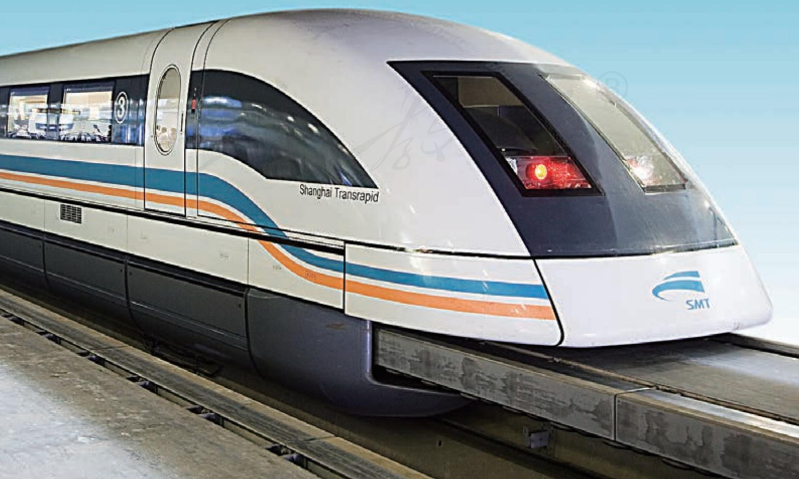

## 1 实验：探究小车速度随时间变化的规律

寻求一种运动的特点和规律，一般要从某个具体事例开始。这一节我们研究小车在重物牵引下的运动，看看小车的速度是怎样随时间变化的。

### ■ 实验思路

要研究小车在重物牵引下速度随时间变化的规律，你认为如何设计此实验？需要测量哪些物理量？选用什么器材？请你把自己研究的方案写出来，并和同学交流。

要研究小车速度随时间变化的规律，就要想办法测量小车在不同时刻的瞬时速度，而打点计时器具有此功能。如果用打点计时器测量速度，就可以如图2.1-1所示，把一端带有滑轮的长木板平放在实验桌上，木板上放一个可以左右移动的小车，小车一端连接穿过打点计时器的纸带，另一端连接绕过滑轮系有槽码的细绳。小车在槽码的牵引下运动，通过研究纸带上的信息，就可以知道小车运动的速度是怎样随时间变化的。

### 进行实验

把小车停在靠近打点计时器的位置。启动计时器，然后放开小车，让它拖着纸带运动。于是，打点计时器在纸带上打下一行小点。随后，立即关闭电源。

增减所挂的槽码（或在小车上放置重物），更换纸带，再做两次实验。

### 数据记录

为了便于测量，舍掉纸带开头一些过于密集的点，找一个适当的点作为计时起点。

可选择相隔 $0.1 \mathrm{~s}$ （或更短）的若干计数点进行测量，记入自己设计的表格，利用第一章第3节所学的方法得出各计数点的瞬时速度，填入表1中标有“ $v_{1}$ ”的一行。

同理，计算增减槽码后两次实验的速度，分别填入表1中标有“ $v_{2}$ ”和“ $v_{3}$ ”的两行。

表 1 小车在几个时刻的瞬时速度  

<table><tr><td>位置编号</td><td>0</td><td>1</td><td>2</td><td>3</td><td>4</td><td>5</td><td>6</td><td>...</td></tr><tr><td>时间t/s</td><td>0</td><td>0.1</td><td>0.2</td><td>0.3</td><td>0.4</td><td>0.5</td><td>0.6</td><td></td></tr><tr><td>v1/(m·s-1)</td><td></td><td></td><td></td><td></td><td></td><td></td><td></td><td></td></tr><tr><td>v2/(m·s-1)</td><td></td><td></td><td></td><td></td><td></td><td></td><td></td><td></td></tr><tr><td>v3/(m·s-1)</td><td></td><td></td><td></td><td></td><td></td><td></td><td></td><td></td></tr><tr><td>...</td><td></td><td></td><td></td><td></td><td></td><td></td><td></td><td></td></tr></table>

### 数据分析

你能否从表格中的数据看出小车速度随时间变化的定量关系？如果不能，怎么办？

可以考虑用 $v - t$ 图像分析速度 $v$ 与时间 $t$ 的定量关系。以时间 $t$ 为横轴、速度 $v$ 为纵轴建立直角坐标系。根据表1中的 $v, t$ 数据，在坐标系中描点作出 $v - t$ 图像。如何根据描出的点找出速度随时间变化的规律？

如果有些点难以落在曲线上，应该使它们大致均匀地分布在曲线两侧。这样曲线就更符合实际的规律。

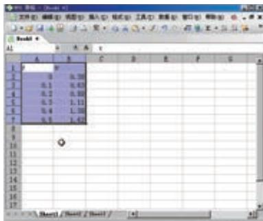

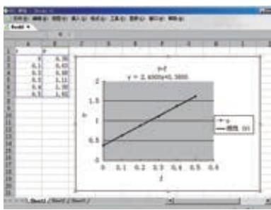  
图2.1-2  
图2.1-3

### 用计算机绘制 $v - t$ 图像

借助常用的数表软件，可以迅速、准确地根据表中的数据作出 $v - t$ 图像，甚至能够写出图像所代表的公式。下面以WPS表格软件为例作简要说明，有兴趣的同学可以试一试。

在WPS表格软件工作簿的某一列的单元格中依次输入测量时间，在相邻的一列输入对应的速度值（图2.1-2）。用鼠标选中这些数据，按照“插入”中的“图表”的提示就能一步步地得到所画的图像（图2.1-3）。

操作过程中WPS会要求确定“图表类型”，这时可以选择“平滑散点图”；还会出现“添加趋势线”的对话框，里面也有一个“类型”标签，其中有几种可选择的函数。由于我们这个实验的数据几乎分布在一条直线上，所以应该选择“线性”类型。

### 练习与应用

1. 为研究实验小车沿斜面向下运动的规律，把打点计时器纸带的一端固定在小车上，小车拖动纸带运动时，纸带上打出的点如图2.1-4所示。

（1）某同学用以下方法绘制了小车运动的 $v - t$ 图像。先把纸带每隔0.1s剪断，得到若干短纸条。再把这些纸条并排贴在一张纸上，使这些纸条下端对齐，作为时间坐标轴，标出时间。最后将纸条上端中心连起来，于是得到 $v - t$ 图像。请你按以上办法（用一张薄纸压在图2.1-4上，复制得到纸带）绘制这个 $v - t$ 图像。

（2）这样做有道理吗？说说你的看法。

  
图2.1-4 一次实验的纸带

2. 列车沿长直坡路向下行驶。开始时速度表上的示数是 $54 \mathrm{~km} / \mathrm{h}$ , 以后每 $5 \mathrm{~s}$ 读取一次数据, 见表 2。

（1）在表2中填写以 $\mathrm{m}\cdot \mathrm{s}^{-1}$ 为单位表示的速度值。  
（2）作出列车速度与时间关系的 $v - t$ 图像。

表2 列车速度表  

<table><tr><td>时间t/s</td><td>0</td><td>5</td><td>10</td><td>15</td><td>20</td><td>25</td><td>30</td></tr><tr><td>速度v/(km·h-1)</td><td>54</td><td>59</td><td>65</td><td>70</td><td>76</td><td>81</td><td>86</td></tr><tr><td>速度v/(m·s-1)</td><td></td><td></td><td></td><td></td><td></td><td></td><td></td></tr></table>

## 2 匀变速直线运动的速度与时间的关系

### 问题

如果C919飞机沿直线做匀速运动，它的 $v - t$ 图像是一条平行于时间轴的直线。在上节课的实验中，小车在重物牵引下运动的 $v - t$ 图像是一条倾斜的直线，它表示小车在做什么样的运动？

### 匀变速直线运动

由上节课的实验我们看到，小车运动的 $v - t$ 图像类似于图2.2-1所示的 $v - t$ 图像，是一条倾斜的直线。无论 $\Delta t$ 选在什么区间，对应的速度的变化量 $\Delta v$ 与时间的变化量 $\Delta t$ 之比都是一样的，即物体运动的加速度保持不变。所以，实验中小车的运动是加速度不变的运动。沿着一条直线，且加速度不变的运动，叫作匀变速直线运动（uniform variable rectilinear motion）。匀变速直线运动的 $v - t$ 图像是一条倾斜的直线。

在匀变速直线运动中，如果物体的速度随时间均匀增加，这种运动叫作匀加速直线运动；如果物体的速度随时间均匀减小，这种运动叫作匀减速直线运动。

### 速度与时间的关系

除 $v - t$ 图像外，我们还可以用公式描述物体运动的速度与时间的关系。

对于匀变速直线运动来说，我们可以把运动开始时刻取作0时刻，则由0时刻到 $t$ 时刻的时间间隔 $\Delta t$ 为 $t$ ，而 $t$ 时刻的速度 $v$ 与开始时刻的速度 $v_{0}$ （叫作初速度）之差就是速度的变化量，即

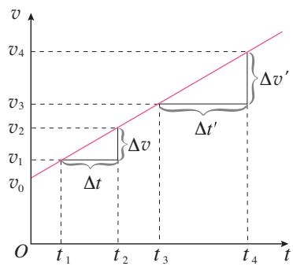  
图2.2-1 匀变速直线运动的 $v - t$ 图像

由于加速度 $a$ 在数值上等于单位时间内速度的变化量, 所以 $a t$ 就是 $t$ 时间内速度的变化量, 再加上运动开始时物体的速度,就得到 $t$ 时刻物体的速度。

$$
\Delta v = v - v _ {0}
$$

代入 $a = \frac{\Delta v}{\Delta t}$ 中，得到

$$
v = v _ {0} + a t
$$

这就是匀变速直线运动的速度与时间的关系式。

### 【例题】

一辆汽车以 $36 \mathrm{~km} / \mathrm{h}$ 的速度在平直公路上匀速行驶。从某时刻起，它以 $0.6 \mathrm{~m} / \mathrm{s}^{2}$ 的加速度加速， $10 \mathrm{~s}$ 末因故突然紧急刹车，随后汽车停了下来。刹车时做匀减速运动的加速度大小是 $6 \mathrm{~m} / \mathrm{s}^{2}$ 。

(1) 汽车在 $10 \mathrm{~s}$ 末的速度是多少?  
(2) 汽车从刹车到停下来用了多长时间?

分析 依题意，汽车加速和减速过程都是在做匀变速直线运动。

第（1）问是已知加速的时间求末速度。

第（2）问是已知末速度求减速的时间。两个问题都需要用匀变速直线运动的速度与时间关系式来求解。其中，第（2）问汽车加速度的方向跟速度、位移的方向相反，需要建立坐标系处理物理量之间的正负号问题。

解（1）汽车做匀加速直线运动。

初速度 $v_{0} = 36 \mathrm{~km} / \mathrm{h} = 10 \mathrm{~m} / \mathrm{s}$ , 加速度 $a = 0.6 \mathrm{~m} / \mathrm{s}^{2}$ , 时间 $t = 10 \mathrm{~s}$ 。

根据匀变速直线运动速度与时间的关系式，有

$$
v = v _ {0} + a t = 1 0 \mathrm {m / s} + 0. 6 \mathrm {m / s} ^ {2} \times 1 0 \mathrm {s} = 1 6 \mathrm {m / s}
$$

（2）以汽车运动方向为正方向建立一维坐标系（图2.2-2），与正方向一致的量取正号，相反的取负号。

汽车从第 $10 \mathrm{~s}$ 末开始做匀减速直线运动, 因此初速度 $v_{0} = 16 \mathrm{~m} / \mathrm{s}$ , 末速度 $v = 0$ , 加速度 $a = -6 \mathrm{~m} / \mathrm{s}^{2}$ 。

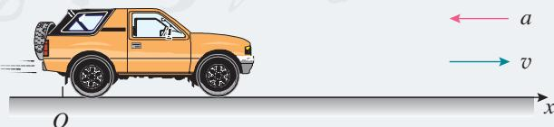  
图2.2-2

根据 $v = v_{0} + at$ 得

$$
t = \frac {v - v _ {0}}{a} = \frac {0 - 1 6 \mathrm {m} / \mathrm {s}}{- 6 \mathrm {m} / \mathrm {s} ^ {2}} = 2. 6 7 \mathrm {s}
$$

汽车 $10 \mathrm{~s}$ 末的速度为 $16 \mathrm{~m} / \mathrm{s}$ ，从刹车到停下来要用 $2.67 \mathrm{~s}$ 。

### 思考与讨论

图2.2-3 是一个物体运动的 $v - t$ 图像。它的速度怎样变化？在相等的时间间隔内，即 $\Delta t' = \Delta t$ 时，速度的变化量 $\Delta v'$ 和 $\Delta v$ 总是相等的吗？物体在做匀变速运动吗？

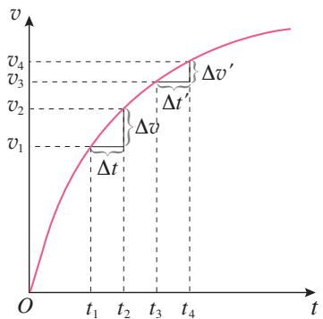  
图2.2-3

### 练习与应用

1. 列车原来的速度是 $36 \mathrm{~km} / \mathrm{h}$ , 在一段下坡路上加速度为 $0.2 \mathrm{~m} / \mathrm{s}^{2}$ 。列车行驶到下坡路末端时, 速度增加到 $54 \mathrm{~km} / \mathrm{h}$ 。求列车通过这段下坡路所用的时间。  
2. 以 $72 \mathrm{~km} / \mathrm{h}$ 的速度行驶的列车在驶近一座石拱桥时做匀减速直线运动（图2.2-4），加速度的大小是 $0.1 \mathrm{~m} / \mathrm{s}^{2}$ ，列车减速行驶 $2 \mathrm{~min}$ 后的速度是多少？

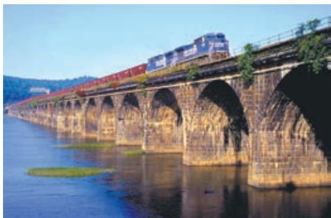  
图2.2-4

3. 2013年12月14日，嫦娥三号登月探测器平稳落月（图2.2-5），中国首次地外天体软着陆成功。当它靠近月球后，先悬停在月面上方一定高度，之后关闭发动机，以 $1.6 \mathrm{~m} / \mathrm{s}^{2}$ 的加速度下落，经过 $2.25 \mathrm{~s}$ 到达月面，此时探测器的速度是多少？  
4. 一个物体沿着直线运动，其 $v - t$ 图像如图2.2-6所示。

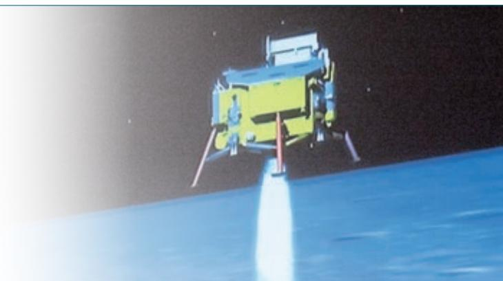  
图2.2-5

（1）它在 $1 \mathrm{~s}$ 末、 $4 \mathrm{~s}$ 末、 $7 \mathrm{~s}$ 末三个时刻的速度，哪个最大？哪个最小？  
（2）它在1s末、4s末、7s末三个时刻的速度方向是否相同？  
(3) 它在 $1 \mathrm{~s}$ 末、 $4 \mathrm{~s}$ 末、 $7 \mathrm{~s}$ 末三个时刻的加速度, 哪个最大? 哪个最小?  
（4）它在1s末和7s末的加速度方向是否相同？

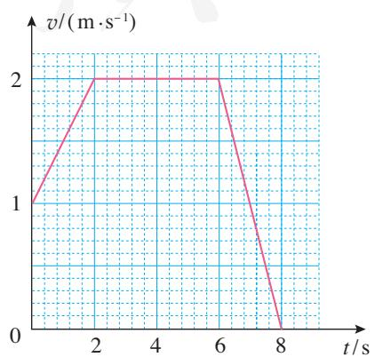  
图2.2-6

## 3 匀变速直线运动的位移与时间的关系

### 问题

由做匀速直线运动物体的 $v - t$ 图像可以看出，在时间 $t$ 内的位移 $x$ 对应图中着色部分的矩形面积。

那么，做匀变速直线运动的物体，在时间 $t$ 内的位移与时间会有怎样的关系？

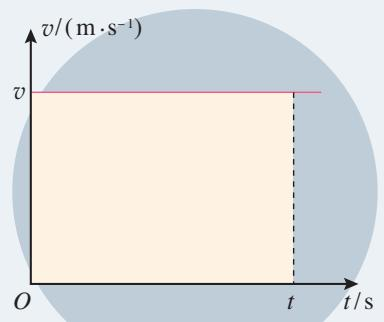

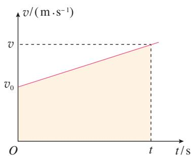  
图2.3-1 利用 $v - t$ 图像求位移

### 匀变速直线运动的位移

做匀速直线运动物体的位移可以通过它的 $v - t$ 图像求解。这个方法，对分析匀变速直线运动的位移问题有很好的启示。

图2.3-1是某物体做匀变速直线运动的 $v - t$ 图像，初速度为 $v_{0}$ ，加速度为 $a$ 。做匀变速直线运动的物体，其位移大小可以用 $v - t$ 图像中着色部分的梯形面积来表示（证明见本节“拓展学习”栏目）。

根据图中着色梯形各线段所代表的物理含义以及梯形的面积公式，可以求得位移

$$
x = \frac {1}{2} (v _ {0} + v) t
$$

将 $v = v_{0} + a t$ 代入上式, 有

$$
x = v _ {0} t + \frac {1}{2} a t ^ {2}
$$

这就是匀变速直线运动的位移与时间的关系式①。如果初速度为0，这个公式可以简化为 $x = \frac{1}{2} at^2$

### 【例题1】

航空母舰的舰载机既要在航母上起飞，也要在航母上降落。

(1) 某舰载机起飞时, 采用弹射装置使飞机获得 $10 \mathrm{~m} / \mathrm{s}$ 的速度后, 由机上发动机使飞机获得 $25 \mathrm{~m} / \mathrm{s}^{2}$ 的加速度在航母跑道上匀加速前进, $2.4 \mathrm{~s}$ 后离舰升空。飞机匀加速滑行的距离是多少?  
(2) 飞机在航母上降落时, 需用阻拦索使飞机迅速停下来。若某次飞机着舰时的速度为 $80 \mathrm{~m} / \mathrm{s}$ , 飞机钩住阻拦索后经过 $2.5 \mathrm{~s}$ 停下来。将这段运动视为匀减速直线运动, 此过程中飞机加速度的大小及滑行的距离各是多少?

分析 两个问题都是已知匀变速直线运动的时间来计算位移。第（1）问需要用匀变速直线运动的位移与时间的关系式计算。第（2）问中，飞机着舰做匀减速直线运动的加速度需要根据速度与时间的关系式计算。匀减速运动各矢量的方向较为复杂，因此需要建立一维坐标系来确定它们的正负。

解（1）根据匀变速直线运动的位移与时间的关系式，有

$$
x = v _ {0} t + \frac {1}{2} a t ^ {2} = 1 0 \mathrm {m} / \mathrm {s} \times 2. 4 \mathrm {s} + \frac {1}{2} \times 2 5 \mathrm {m} / \mathrm {s} ^ {2} \times (2. 4 \mathrm {s}) ^ {2} = 9 6 \mathrm {m}
$$

(2) 沿飞机滑行方向建立一维坐标系（图2.3-2），飞机初速度 $v_{0} = 80 \mathrm{~m} / \mathrm{s}$ ，末速度 $v = 0$ ，根据匀变速直线运动的速度与时间的关系式，有

$$
a = \frac {v - v _ {0}}{t} = - \frac {v _ {0}}{t} = - \frac {8 0 \mathrm {m / s}}{2 . 5 \mathrm {s}} = - 3 2 \mathrm {m / s ^ {2}}
$$

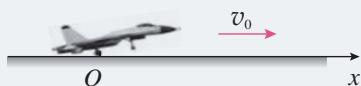  
图2.3-2

加速度为负值表示方向与 $x$ 轴正方向相反。

再根据匀变速直线运动的位移与时间的关系式，有

$$
x = v _ {0} t + \frac {1}{2} a t ^ {2} = v _ {0} t + \frac {1}{2} \times \left(- \frac {v _ {0}}{t}\right) t ^ {2} = \frac {1}{2} v _ {0} t = \frac {1}{2} \times 8 0 \mathrm {m / s} \times 2. 5 \mathrm {s} = 1 0 0 \mathrm {m}
$$

飞机起飞时滑行距离为 $96 \mathrm{~m}$ 。着舰过程中加速度的大小为 $32 \mathrm{~m} / \mathrm{s}^{2}$ ，滑行距离为 $100 \mathrm{~m}$ 。

### 速度与位移的关系

这节我们学习了匀变速直线运动的位移与时间的关系式 $x = v_{0}t + \frac{1}{2} at^{2}$ ，上一节我们还学习了匀变速直线运动的速度与时间的关系式 $v = v_{0} + at$ 。

将上述两个公式联立求解，消去时间 $t$ 可得到

$$
\boxed {v ^ {2} - v _ {0} ^ {2} = 2 a x}
$$

这就是匀变速直线运动的速度与位移的关系式。如果在所研究的问题中，已知量和未知量都不涉及时间，利用这个公式求解，往往会更简便。

### 【例题2】

动车铁轨旁两相邻里程碑之间的距离是 $1 \mathrm{~km}$ 。某同学乘坐动车时，通过观察里程碑和车厢内电子屏上显示的动车速度来估算动车减速进站时的加速度大小。当他身边的窗户经过某一里程碑时，屏幕显示的动车速度是 $126 \mathrm{~km} / \mathrm{h}$ （图2.3-3）。动车又前进了3个里程碑时，速度变为 $54 \mathrm{~km} / \mathrm{h}$ 。把动车进站过程视为匀减速直线运动，那么动车进站的加速度是多少？它还要行驶多远才能停下来？

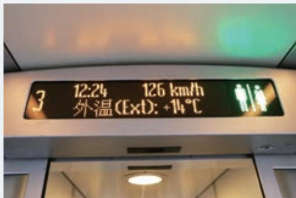  
图2.3-3

分析 由于把动车进站过程视为匀减速直线运动，因此可以应用匀变速直线运动的速度与位移的关系式计算动车的加速度。本题加速度方向跟速度方向相反，因此需要建立一维坐标系来处理相关物理量的正负号。

解 沿动车运动方向为正方向建立一维坐标系。把动车通过 $3000\mathrm{m}$ 的运动称为前一过程，之后到停下来称为后一过程。

设在前一过程中的末位置为 $M$ 点。初速度 $v_{0} = 126 \mathrm{~km/h} = 35 \mathrm{~m/s}$ ，末速度 $v_{M} = 54 \mathrm{~km/h} = 15 \mathrm{~m/s}$ ，位移 $x_{1} = 3000 \mathrm{~m}$ 。

对前一过程，根据匀变速直线运动的速度与位移的关系式，有

$$
a = \frac {v _ {M} ^ {2} - v _ {0} ^ {2}}{2 x _ {1}} = \frac {(1 5 \mathrm {m} / \mathrm {s}) ^ {2} - (3 5 \mathrm {m} / \mathrm {s}) ^ {2}}{2 \times 3 0 0 0 \mathrm {m}} = - 0. 1 6 7 \mathrm {m} / \mathrm {s} ^ {2}
$$

对后一过程, 末速度 $v = 0$ , 初速度 $v_{M} = 15 \mathrm{~m} / \mathrm{s}$ 。

由 $v^{2} = v_{M}^{2} + 2 a x_{2}$ , 有

$$
x _ {2} = \frac {v ^ {2} - v _ {M} ^ {2}}{2 a} = \frac {0 - (1 5 \mathrm {m} / \mathrm {s}) ^ {2}}{2 \times (- 0 . 1 6 7) \mathrm {m} / \mathrm {s} ^ {2}} = 6 7 4 \mathrm {m}
$$

动车进站的加速度大小为 $0.167 \, \mathrm{m/s}^2$ ，方向与动车运动方向相反；还要行驶 $674 \, \mathrm{m}$ 才能停下来。

从第2节和第3节的例题可以看到，只有建立了坐标系，速度、加速度等物理量的正负号才能确定。

### 拓展学习

#### 匀变速直线运动位移公式的推导

图2.3-4甲是某物体以初速度 $v_{0}$ 做匀变速直线运动的 $v - t$ 图像。如果我们像图2.3-4乙那样，把物体的运动分成几个小段，例如 $\frac{t}{5}$ 算一个小段，每小段起始时刻物体的瞬时速度由相应的纵坐标表示。在每一小段内，可粗略认为物体以这个速度做匀速直线运动。因此，我们以每小段起始时刻的速度乘时间 $\frac{t}{5}$ ，近似地当作各小段中物体的位移。在 $v - t$ 图像中，各段位移可以用一个又窄又高的小矩形的面积代表。5个小矩形的面积之和近似地代表物体在整个运动过程中的位移。

  
甲

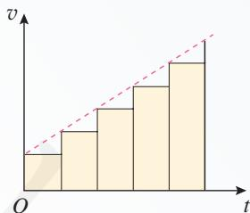  
乙

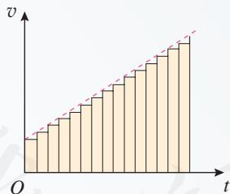  
丙

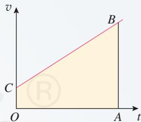  
丁  
图2.3-4 位移等于 $v - t$ 图线下面的面积

如果以这5个小矩形的面积之和算出的位移代表物体在整个过程中的位移，显然位移就少算了。为了精确一些，可以把运动过程划分为更多的小段，如图2.3-4丙所示，用所有这些小段的位移之和，近似代表物体在整个过程中的位移。小矩形越窄，多个小矩形的面积之和越接近物体的位移。

可以想象，如果把整个运动过程分割得非常非常细，很多很多小矩形的面积之和就能非常精确地代表物体的位移了。这时，很多很多小矩形顶端的“锯齿形”就看不出来了，这些小矩形合在一起成了一个梯形OABC（图2.3-4丁）。这个梯形的面积就代表做匀变速直线运动的物

体从开始（此时速度是 $v_{0}$ ）到 $t$ 时刻（此时速度是 $v$ ）这段时间间隔的位移。

上面这种分析问题的方法具有一般意义，原则上对于处理任意形状的 $v - t$ 图像都适用。对于图2.3-5所示的运动物体的位移，可用其 $v - t$ 图像着色部分图形的面积来表示。

在处理较复杂的变化量问题时，常常先把整个区间化为若干个小区间，认为每一小区间内研究的量不变，再求和。这是物理学中常用的一种方法。

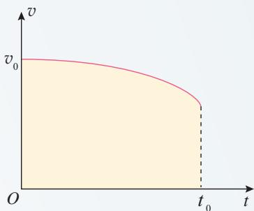  
图2.3-5 位移等于 $v - t$ 曲线下面的面积

  
图2.3-6

### 练习与应用

1. 以 $36 \mathrm{~km} / \mathrm{h}$ 的速度行驶的列车开始下坡，在坡路上的加速度等于 $0.2 \mathrm{~m} / \mathrm{s}^{2}$ ，经过 $30 \mathrm{~s}$ 到达坡底。求坡路的长度和列车到达坡底时的速度。  
2. 以 $18 \mathrm{~m} / \mathrm{s}$ 的速度行驶的汽车, 制动后做匀减速直线运动, 在 $3 \mathrm{~s}$ 内前进 $36 \mathrm{~m}$ 。求汽车的加速度及制动后 $5 \mathrm{~s}$ 内发生的位移。  
3. 速度、加速度的测量通常比位移的测量要复杂些，而有的时候我们只需比较两个物体运动的加速度大小，并不需要知道加速度的具体数值。例如，比较两辆汽车的加速性能就是这样。如果已知两个物体在相同时间内从静止开始匀加速直线运动的位移之比，怎样根据运动学的规律求出它们的加速度之比？  
4. 滑跃式起飞是一种航母舰载机的起飞方式。飞机跑道的前一部分是水平的，跑道尾段略微向上翘起（图2.3-6）。飞机在尾段翘起跑道上的运动虽然会使加速度略有减小，但能使飞机具有斜向上的速度，有利于飞机的起飞。假设某飞机滑跃式起飞过程是两段连续的匀加

速直线运动，前一段的加速度为 $7.8 \mathrm{~m} / \mathrm{s}^{2}$ ，位移为 $180 \mathrm{~m}$ ，后一段的加速度为 $5.2 \mathrm{~m} / \mathrm{s}^{2}$ ，位移为 $15 \mathrm{~m}$ ，求飞机离舰时的速度有多大？

5. 神舟五号载人飞船的返回舱距地面 $10 \mathrm{~km}$ 时开始启动降落伞装置，速度减至 $10 \mathrm{~m} / \mathrm{s}$ ，并以这个速度在大气中降落。在距地面 $1.2 \mathrm{~m}$ 时，返回舱的四台缓冲发动机开始向下喷气，舱体再次减速。设最后减速过程中返回舱做匀减速直线运动，并且到达地面时恰好速度为 0，求最后减速阶段的加速度。  
6. 一辆肇事汽车在紧急刹车后停了下来，路面上留下了一条车轮滑动的磨痕。警察为了判断汽车刹车时速度的大小，测出路面上车轮磨痕的长度为 $22.5 \mathrm{~m}$ 。根据对车轮和路面材料的分析可以知道，车轮在路面上滑动时汽车做匀减速直线运动的加速度大小是 $5.0 \mathrm{~m} / \mathrm{s}^{2}$ 。请你根据以上条件，计算汽车刚开始刹车时的速度是多少。

## 自由落体运动

### 问题

站在高层建筑物上，让轻重不同的两个物体从同一高度同时落下，你认为哪个物体下落得快？

在教室内拿两张同样大小的纸，将其中一张揉成一个团。让纸团和另一张纸在同样的高度落下，看看哪一个下落得快？

结合实验及生活中的经验，讨论：什么因素影响物体下落的快慢？

物体下落的运动是司空见惯的，但人类对它的认识却经历了差不多两千年的时间。最早研究这个问题的，大概要算古希腊学者亚里士多德了。

平常人们观察到的事实是，一块石头比一片树叶落得快些……亚里士多德认为物体下落的快慢跟它的轻重有关，重的物体下落得快。他的这一论断符合人们的常识，以至于其后两千年的时间里，大家都奉为经典。

### 自由落体运动

伽利略认为，根据亚里士多德“重的物体下落得快”的论断，会推出相互矛盾的结论。例如，假定一块大石头的下落速度为8，一块小石头的下落速度为4，当把两块石头捆在一起时，大石头会被小石头拖着而变慢，整个物体的下落速度应该小于8；但是，把两块石头捆在一起后，整个物体比大石头要重，因此整个物体下落的速度应该比8还要大。这种相互矛盾的结论，说明亚里士多德“重的物体下落得快”的看法是错误的。根据仔细的分析，伽利略认为物体下落的运动只有一种可能性：重的物体与轻的物体应该下落得同样快。

伽利略通过逻辑推理，首先指出亚里士多德对落体认识的问题，然后得出重物与轻物应该下落得同样快的结论，最后用实验证实了自己的结论。伽利略这种推理与实验相结合的方法，为物理学的研究奠定了基础。研究中所体现的批判精神是创新所必需的。

那么，轻重不同的物体下落的情况到底怎样？下面我们一起来做个比较精细的实验，仔细研究一下。

### 演示

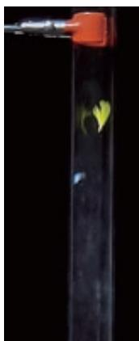  
甲 有空气

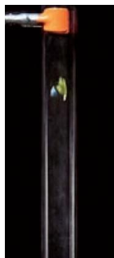  
乙 真空  
图2.4-1 玻璃管内的羽毛、铁片的下落

#### 轻重不同的物体下落快慢的研究

如图2.4-1甲，一个两端封闭的玻璃管（也称牛顿管），其中一端有一个开关，玻璃管可以与外界相通。把质量不相同的铁片和羽毛放到玻璃管中，玻璃管竖直放置，让铁片和羽毛从玻璃管上方同时开始下落，观察物体下落的情况。

如图2.4-1乙，把玻璃管里的空气抽出去，再次观察物体下落的情况。

由实验可以看到，将玻璃管里的空气抽出去后，没有了空气阻力的影响，轻的物体和重的物体下落得同样快。在现实生活中人们之所以看到物体下落的快慢不同，是因为空气阻力的影响。如果没有空气阻力，所有物体下落的快慢都一样。

物体只在重力作用下从静止开始下落的运动，叫作自由落体运动（free-fall motion）。这种运动只在真空中才能发生。在有空气的空间，如果空气阻力的作用比较小，可以忽略，物体的下落可以近似看作自由落体运动。

由上面的实验我们可以看到，自由落体运动是加速运动。那么，它的加速度在下落过程中是否变化呢？

### 实验

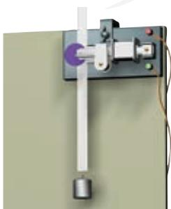  
图2.4-2 自由落体运动的实验装置

#### 研究自由落体运动的规律

如图2.4-2，固定打点计时器，纸带一端系着重物，另一端穿过计时器。用手捏住纸带上端，启动打点计时器，松手后重物自由下落，计时器在纸带上留下一串小点。

仿照前面对小车运动的研究，测量重物下落的加速度。改变重物的质量，重复上面的实验。

### 自由落体加速度

对不同物体进行的实验结果表明，在同一地点，一切物体自由下落的加速度都相同，这个加速度叫作自由落体加速度（free-fall acceleration），也叫作重力加速度（gravitational acceleration），通常用 $g$ 表示。

重力加速度的方向竖直向下，它的大小可以通过多种方法用实验测定。

精确的实验发现，在地球表面不同的地方， $g$ 的大小一般是不同的。在赤道的海平面处 $g$ 为 $9.780 \mathrm{~m} / \mathrm{s}^{2}$ ，在北京 $g$ 为 $9.801 \mathrm{~m} / \mathrm{s}^{2}$ 。在一般的计算中， $g$ 可以取 $9.8 \mathrm{~m} / \mathrm{s}^{2}$ 或 $10 \mathrm{~m} / \mathrm{s}^{2}$ 。①

下表列出了一些地点的重力加速度。

表 一些地点的重力加速度  

<table><tr><td colspan="3">标准值: g = 9.806 65 m/s²</td></tr><tr><td>地点</td><td>纬度</td><td>g/(m·s-2)</td></tr><tr><td>赤道海平面</td><td>0°</td><td>9.780</td></tr><tr><td>马尼拉</td><td>14° 35&#x27;</td><td>9.784</td></tr><tr><td>广州</td><td>23° 06&#x27;</td><td>9.788</td></tr><tr><td>武汉</td><td>30° 33&#x27;</td><td>9.794</td></tr><tr><td>上海</td><td>31° 12&#x27;</td><td>9.794</td></tr><tr><td>东京</td><td>35° 43&#x27;</td><td>9.798</td></tr><tr><td>北京</td><td>39° 56&#x27;</td><td>9.801</td></tr><tr><td>纽约</td><td>40° 40&#x27;</td><td>9.803</td></tr><tr><td>莫斯科</td><td>55° 45&#x27;</td><td>9.816</td></tr><tr><td>北极</td><td>90°</td><td>9.832</td></tr></table>

你从表中发现了什么规律吗？你能尝试解释这个规律吗？尝试解释就是作出猜想。

### 做一做

#### 用手机测自由落体加速度

很多智能手机都有加速度传感器。安装能显示加速度情况的应用程序，会看到白、绿、黄三条加速度图线，它们分别记录手机沿图2.4-3所示坐标轴方向的加速度变化情况。

把手机放在水平桌面上，让手机在桌面上沿 $x$ 轴或 $y$ 轴

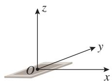  
图2.4-3

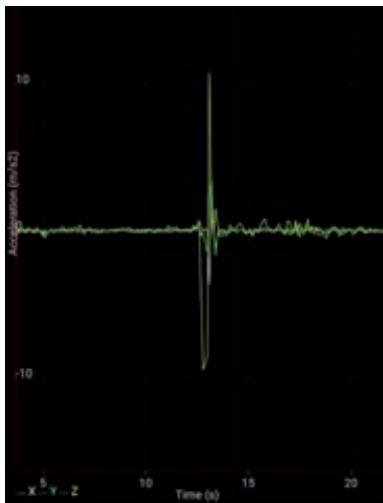  
图2.4-4 手机截屏

方向平移一下，可以看到屏幕上加速度图线的白线或绿线出现一个波峰；把手机平放在手掌上，让手机在竖直方向移动一下，可以看到黄色图线发生变化。黄色图线记录手机竖直方向的加速度，测自由落体加速度，就是看黄色图线。

用手托着手机，打开加速度传感器，手掌迅速向下运动，让手机脱离手掌而自由下落，然后接住手机，观察手机屏幕上加速度传感器的图线（图2.4-4）。从图中可以看到，黄色图线有一小段时间的数值是 $-10\mathrm{m / s}^2$ ，这就是自由落体的加速度，方向向下。

我们还能看到，自由落体之后有一个向上的波峰，这是用手接住手机时手机做减速运动的加速度，方向向上。

世界是物质的，物质的运动有多种形式，例如机械运动、热运动和电磁运动等。这些不同的运动形式有着不同的运动规律，我们将陆续学习。

自由落体运动是初速度为0的匀加速直线运动，所以匀变速直线运动的基本公式及其推论都适用于自由落体运动。

把初速度 $v_{0} = 0$ 和加速度 $a = g$ 分别代入匀变速直线运动的速度与时间的关系式和位移与时间的关系式, 可以得到自由落体的速度、位移与时间的关系式分别为

$$
v = g t, x = \frac {1}{2} g t ^ {2}
$$

### 科学漫步

#### 伽利略对自由落体运动的研究

利用逻辑推理说明了重物与轻物下落得同样快后，伽利略并没有就此止步，而是进一步通过实验研究了自由落体运动的规律。

伽利略首先面临的困难是概念上的。因为那时人们连速度的明确定义都没有，所以，对伽利略来说，必须首先建立描述运动所需的概念。此前我们所学的概念，诸如平均速度、瞬时速度以及加速度等，就是伽利略首先建立起来的。

伽利略相信，自然界的规律是简洁明了的。他从这个信念出发，猜想落体一定是一种最简单的变速运动，而最简单的变速运动，它的速度应该是均匀变化的。但是，速度的变化怎样才算“均匀”呢？他考虑了两种可能：一种是速度的变化对时间来说是均匀的，即 $v$ 与 $t$ 成正比，例如每过 $1 \mathrm{~s}$ ，速度的变化量都是 $2 \mathrm{~m} / \mathrm{s}$ ；另一种是速度的变化对位移来说是均匀的，即 $v$ 与 $x$ 成正比，例如每下落

$1 \mathrm{~m}$ , 速度的变化量都是 $2 \mathrm{~m} / \mathrm{s}$ 。后来他发现, 如果 $v$ 与 $x$ 成正比, 将会推导出十分荒谬的结果。

伽利略想办法用实验来检验 $v$ 与 $t$ 成正比的猜想是否是真实的。

伽利略所处的时代技术不够发达，无法直接测定瞬时速度，所以也就不能直接得到速度的变化规律。但是，伽利略通过数学运算得出结论：如果物体的初速度为0，而且速度随时间的变化是均匀的，即 $v \propto t$ ，它通过的位移就与所用时间的二次方成正比，即

$$
x ^ {\infty} t ^ {2}
$$

这样，只要测出物体通过不同位移所用的时间，就可以检验这个物体的速度是否随时间均匀变化。

但是，落体下落得很快，而当时只能靠滴水计时，这样的计时工具还是不能测量自由落体运动所用的时间。伽利略采用了一个巧妙的方法，用来“冲淡”重力。他让铜球沿阻力很小的斜面滚下（图2.4-5），而小球在斜面上运动的加速度要比它竖直下落的加速度小得多，所用时间长得多，所以容易测量。

伽利略做了上百次实验，结果表明，小球沿斜面滚下的运动的确是匀加速直线运动，换用不同质量的小球，从不同高度开始滚动，只要斜面的倾角一定，小球的加速度都是相同的。

伽利略将上述结果做了合理的外推：当斜面倾角很大时，小球的运动不是跟落体运动差不多了吗？如果斜面的倾角增大到 $90^{\circ}$ ，这时小球的运动不就是自由落体运动了吗（图2.4-6）？伽利略认为，这时小球仍然会保持匀加速运动的性质，而且所有物体下落时的加速度都是一样的！

伽利略的逻辑和实验自然使人钦佩，但是人们又疑惑地问道：为什么日常生活中常会见到，较

重的物体下落得比较快呢？伽利略把原因归之于空气阻力对不同物体的影响不同。他写道：“如果完全排除空气的阻力，那么，所有物体将下落得同样快。”这时，落体运动也就真正成为自由落体运动了。为此，伽利略特别指出，在科学研究中，懂得忽略什么，有时与懂得重视什么同等重要。

伽利略对运动的研究，不仅确立了许多用于描述运动的基本概念，而且创造了一套对近代科学的发展极为有益的科学方法。这些方法的核心是把实验和逻辑推理（包括数学演算）和谐地结合起来，从而发展了人类的科学思维方式和科学研究方法。

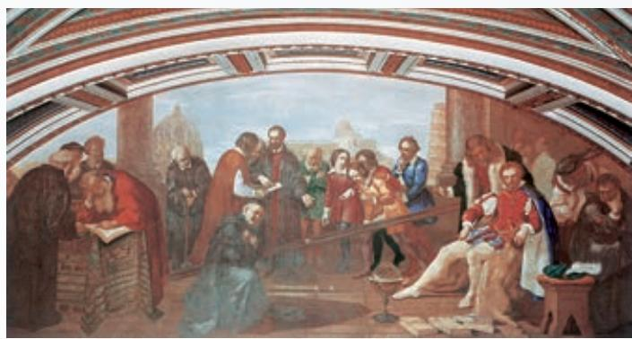  
图2.4-5 伽利略在做铜球沿斜面运动的实验（油画）

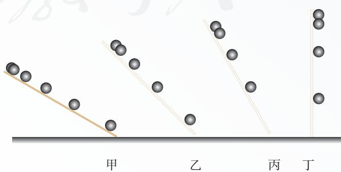  
图2.4-6

#### 从伽利略的一生看科学与社会

伽利略是伟大的物理学家和天文学家，意大利比萨大学和帕多瓦大学的教授，他融会贯通了当时的数学、物理学和天文学，在研究工作中开科学实验之先河，奠定了现代科学的基础。

在他所处的历史时代，文艺复兴绝不限于文学艺术的复兴，也是一次前所未有的科学振兴。文艺复兴的精神打破了束缚人们思想的桎梏，激发起人们对自然的兴趣和对自然的探索。活跃在人们心中的各种思想，终于得到了实在的结果。对于伽利略的成就和获得成就的方法，爱因斯坦的赞扬最具有代表性：“伽利略的发现以及他所应用的科学的推理方法，是人类思想史上最伟大的成就之一，而且标志着物理学的真正开端。”

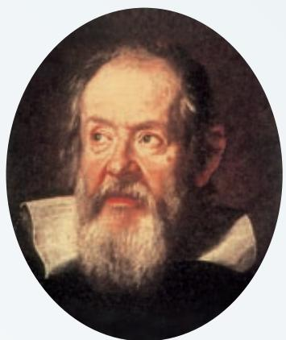  
伽利略（Galileo Galilei，1564—1642）

伽利略的科学生涯并不是一帆风顺的。他制作了天文望远镜（图2.4-7），并用它观测天空。观测结果支持了天文学的新学说——日心说。然而，日心说与《圣经》相抵触。伽利略不得不用《圣经》的语言来解释日心说，即便如此，仍然不能逃避教会对他的指控和迫害。《关于两个世界体系的对话》使日心说变成摧毁教会教义和传统“科学”框架的理论，因此立刻成为禁书。1633年伽利略被罗马宗教裁判所判处终身监禁。尽管如此，他仍坚持研究工作，并将自由落体等方面的研究成果转送荷兰，于1638年出版了《两种新科学的对话》。这部著作的出版，奠定了伽利略作为近代力学创始人的地位。

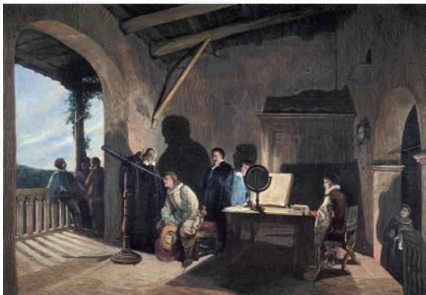  
图2.4-7 伽利略制作了天文望远镜

时隔359年，罗马教廷于1992年承认对伽利略的压制是错误的，并为他“恢复名誉”。但是教会对科学的干涉和对伽利略的迫害所造成的严重后果是无法挽回的。以前一直是人才辈出的意大利，在伽利略之后，它的科学活动很快衰落下去，在很长的一段时间里，没有再产生过重要的科学家。

1. 把一张纸片和一块橡皮同时释放下落，哪个落得快？再把纸片捏成一个很紧的小纸团，和橡皮同时释放，下落快慢有什么变化？怎样解释这个现象？  
2. 跳水运动员训练时从 $5 \mathrm{~m}$ 跳台双脚朝下自由落下，某同学利用手机的连拍功能，连拍了多张照片。测得其中两张连续的照片中运动员双脚离水面的高度分别为 $3.4 \mathrm{~m}$ 和 $1.8 \mathrm{~m}$ 。由此估算手机连拍时间间隔是多少？  
3. 为了测出井口到水面的距离，让一个小石块从井口自由落下，经过2.5s后听到石块击水的声音，估算井口到水面的距离。考虑到声音在空气中传播需要一定的时间，估算结果偏大还是偏小？  
4. 有一架照相机，其光圈（进光孔径）随被摄物体的亮度自动调节，而快门（曝光时间）是固定不变的。为估测这架照相机的曝光时间，实验者从某砖墙前的高处使一个石子自由落下，拍摄石子在空中的照片如图2.4-8所示。由于石子的运动，它在照片上留下了一条模糊的径迹。已知石子从地面以上 $2.5 \mathrm{~m}$ 的高度下落，每块砖的平均厚度为 $6 \mathrm{~cm}$ ，请估算这张照片的曝光时间。

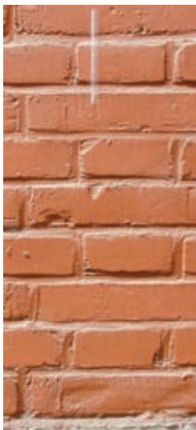  
图2.4-8

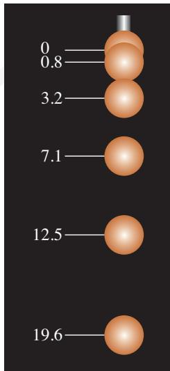  
图2.4-9

5. 频闪摄影是研究变速运动常用的实验手段。在暗室中，照相机的快门处于常开状态，频闪仪每隔一定时间发出一次短暂的强烈闪光，照亮运动的物体，于是胶片上记录了物体在几个闪光时刻的位置。图2.4-9是小球自由下落时的频闪照片示意图，频闪仪每隔0.04s闪光一次。如果要通过这幅照片测量自由落体的加速度，可以采用哪几种方法？试一试。

照片中的数字是小球落下的距离，单位是厘米。

6. 制作一把“人的反应时间测量尺”。

如图2.4-10甲，A同学用两个手指捏住直尺的顶端，B同学用一只手在直尺0刻度位置做捏住直尺的准备，但手不碰到直尺。在A同学放开手指让直尺下落时，B同学立刻捏住直尺。读出B同学捏住直尺的刻度，就是直尺下落的高度，根据自由落体运动公式算出直尺下落的时间，就是B同学的反应时间。

利用这种方法，你能不能把下面刻度尺的长度刻度，直接标注为时间刻度，使它变为“人的反应时间测量尺”？请尝试在图2.4-10乙的长度刻度旁标注时间刻度。

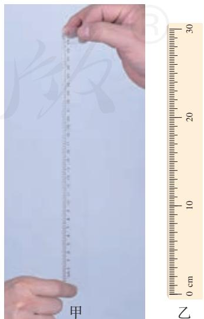  
图2.4-10

### A组

1. 某人骑自行车，在距离十字路口停车线 $30\mathrm{m}$ 处看到信号灯变红。此时自行车的速度为 $4\mathrm{m / s}$ 。已知该自行车在此路面依惯性滑行时做匀减速运动的加速度大小为 $0.2\mathrm{m / s}^2$

如果骑车人看到信号灯变红就停止用力，自行车仅靠滑行能停在停车线前吗？

2. 骑自行车的人以 $5 \mathrm{~m} / \mathrm{s}$ 的初速度沿足够长的斜坡向上做减速运动, 加速度大小是 $0.4 \mathrm{~m} / \mathrm{s}^{2}$ , 经过 $5 \mathrm{~s}$ , 他在斜坡上通过多长的距离?  
3. 钢球由静止开始做自由落体运动，不计空气阻力，落地时的速度为 $30 \mathrm{~m} / \mathrm{s}$ ， $g$ 取 $10 \mathrm{~m} / \mathrm{s}^{2}$ 。

（1）它下落的高度是多少？  
（2）它在前 $2\mathrm{s}$ 内的平均速度是多少？  
（3）它在最后1s内下落的高度是多少？

4. 某同学在“探究小车速度随时间变化的规律”实验中，选出了如图2-1所示的一条纸带（每两点间还有4个点没有画出来），纸带上方的数字为相邻两个计数点间的距离。打点计时器的电源频率为 $50\mathrm{Hz}$ 。

（1）根据纸带上的数据，计算打下 $A$ 、B、C、D、E点时小车的瞬时速度并填在表中。  
（2）在图2-2中画出小车的 $v - t$ 图像，并根据 $v - t$ 图像判断小车是否做匀变速直线运动。如果是，求出该匀变速直线运动的加速度。

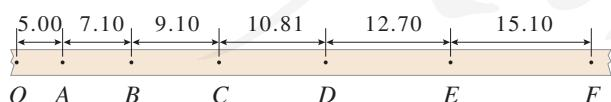  
单位：cm

图2-1  

<table><tr><td>位置</td><td>A</td><td>B</td><td>C</td><td>D</td><td>E</td></tr><tr><td>v/(m·s-1)</td><td></td><td></td><td></td><td></td><td></td></tr></table>

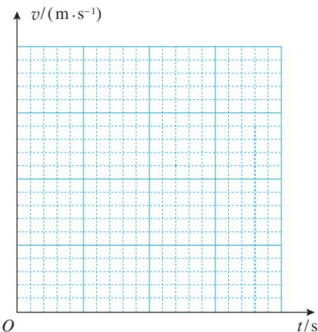  
图2-2

5. 某跳伞运动员做低空跳伞表演。他离开悬停的飞机后先做自由落体运动，当距离地面 $125 \mathrm{~m}$ 时开始打开降落伞，到达地面时速度减为 $5 \mathrm{~m} / \mathrm{s}$ 。如果认为开始打开降落伞直至落地前运动员在做匀减速运动，加速度为 $12 \mathrm{~m} / \mathrm{s}^{2}$ ， $g$ 取 $10 \mathrm{~m} / \mathrm{s}^{2}$ 。

（1）运动员打开降落伞时的速度是多少？  
（2）运动员离开飞机时距地面的高度为多少？  
（3）运动员离开飞机后，经过多长时间才能到达地面？

6. 已知一物体做初速度为 0、加速度为 $a$ 的匀加速直线运动。该物体在前 1s 内、前 2s 内、前 3s 内……的位移分别是 $x_{1}, x_{2}, x_{3}, \cdots$ 在第 1s 内、第 2s 内、第 3s 内……的位移分别是 $x_{\mathrm{I}}, x_{\mathrm{II}}, x_{\mathrm{III}}, \cdots$ 在各个连续相等的时间间隔 $T$ 内的位移分别是 $s_{1}, s_{2}, s_{3}, \cdots, s_{n}$ ，证明：

(1) $x_{1}: x_{2}: x_{3}: \cdots = 1: 4: 9: \cdots$   
(2) $x_{\mathrm{I}}: x_{\mathrm{II}}: x_{\mathrm{III}}: \cdots = 1: 3: 5: \cdots$   
(3) $\Delta s = s_{2} - s_{1} = s_{3} - s_{2} = \dots = s_{n} - s_{n-1} = aT^{2}$

### B组

1. 一辆汽车以 $36 \mathrm{~km} / \mathrm{h}$ 的速度在平直公路上匀速行驶，若汽车先以 $0.5 \mathrm{~m} / \mathrm{s}^{2}$ 的加速度匀加速 $10 \mathrm{~s}$ 后，再以 $3 \mathrm{~m} / \mathrm{s}^{2}$ 的加速度匀减速刹车，请作出汽车开始加速后 $18 \mathrm{~s}$ 内的 $v - t$ 图像。  
2. 公路上行驶的汽车，司机从发现前方异常情况到紧急刹车，汽车仍将前进一段距离才能停下来。要保持安全，这段距离内不能有车辆和行人，因此把它称为安全距离。通常情况下，人的反应时间和汽车系统的反应时间之和为 $1 \mathrm{~s}$ （这段时间汽车仍保持原速）。晴天汽车在干燥的路面上以 $108 \mathrm{~km} / \mathrm{h}$ 的速度行驶时，得到的安全距离为 $120 \mathrm{~m}$ 。设雨天汽车刹车时的加速度为晴天时的 $\frac{3}{5}$ ，若要求安全距离仍为 $120 \mathrm{~m}$ ，求汽车在雨天安全行驶的最大速度。  
3. 在平直的公路上，一辆小汽车前方 $26 \mathrm{~m}$ 处有一辆大客车正以 $12 \mathrm{~m} / \mathrm{s}$ 的速度匀速前进，这时小汽车从静止出发以 $1 \mathrm{~m} / \mathrm{s}^{2}$ 的加速度追赶。小汽车何时追上大客车？追上时小汽车的速度有多大？追上前小汽车与大客车之间的最远距离是多少？  
4. 某人在室内以窗户为背景摄影时，恰好把窗外从高处落下的一个小石子拍摄在照片中，已知本次摄影的曝光时间是 $0.01 \mathrm{~s}$ 。测得照片中石子运动痕迹的长度为 $0.8 \mathrm{~cm}$ ，实际长度为 $100 \mathrm{~cm}$ 的窗框在照片中的长度为 $4.0 \mathrm{~cm}$ 。  
（1）根据照片估算曝光时间内石子下落了多少距离。  
（2）估算曝光时刻石子运动的速度是多大。  
（3）估算这个石子大约是从距离窗户多高的地方落下的。 $g$ 取 $10\mathrm{m / s}^2$

5. 子弹垂直射入叠在一起的相同木板，穿过第20块木板后的速度变为0。可以把子弹视为质点，已知子弹在木板中运动的总时间是 $t$ ，认为子弹在各块木板中运动的加速度都相同。

（1）子弹穿过第1块木板所用的时间是多少？  
（2）子弹穿过前15块木板所用的时间是多少？  
（3）子弹穿过第15块木板所用的时间是多少？  
6. ETC是高速公路上不停车电子收费系统的简称。如图2-3，汽车以 $15\mathrm{m / s}$ 的速度行驶，如果过人工收费通道，需要在收费站中心线处减速至0，经过20s缴费后，再加速至 $15\mathrm{m / s}$ 行驶；如果过ETC通道，需要在中心线前方 $10\mathrm{m}$ 处减速至 $5\mathrm{m / s}$ ，匀速到达中心线后，再加速至 $15\mathrm{m / s}$ 行驶。设汽车加速和减速的加速度大小均为 $1\mathrm{m / s}^2$   
（1）汽车过人工收费通道，从收费前减速开始，到收费后加速结束，总共通过的路程和所需的时间是多少？  
（2）如果过ETC通道，汽车通过第（1）问路程所需要的时间是多少？汽车通过ETC通道比人工收费通道节约多长时间？

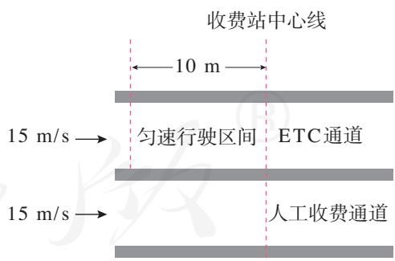  
图2-3