# 第四章

## 运动和力的关系

前面我们学习了怎样描述物体的运动，但是没有讨论物体为什么会做这种或那种运动。要讨论这个问题，必须知道运动和力的关系。在力学中，只研究物体怎样运动而不涉及运动和力的关系的分支，叫作运动学（kinematics）；研究运动和力的关系的分支，叫作动力学（dynamics）。

动力学知识在生产和科学研究中很重要，设计各种机器，控制交通工具，研究天体运动等，都离不开动力学知识。

牛顿是世界上从未有过的最伟大的科学家。

——阿西莫夫①

## 1 牛顿第一定律

### 问题

初中我们学习了牛顿第一定律的基本内容，你能说说它揭示了物体运动遵循怎样的规律吗？滑冰运动员如果不用力，他会慢慢停下来。这是否与牛顿第一定律矛盾呢？

爱因斯坦曾把一代代科学家探索自然奥秘的努力，比作侦探小说中警员破案的过程。在侦探小说中，有时候明显可见的线索却把人们引到错误的判断上去。

长期以来，在研究物体运动原因的过程中，人们的经验是：要使一个物体运动，必须推它或拉它。因此，人们直觉地认为，物体的运动是与推、拉等行为相联系的，如果不再推、拉，原来运动的物体便会停止下来。根据这类经验，亚里士多德得出结论：必须有力作用在物体上，物体才能运动；没有力的作用，物体就要静止在某个地方。然而，在探究运动原因的“侦探小说”里，这正是由明显的线索引出错误判断的案例，而且这个“错案”维持了很久。直至近四百年前，伽利略才创造了有效的“侦察”方法，发现了正确的线索，揭示了事物现象的本质，成为物理学中的“神探”。

无论是亚里士多德，还是伽利略和笛卡儿，都没有提出力的概念。牛顿的高明之处在于，他将物体间复杂多样的相互作用抽象为“力”。本书为了表述方便，在陈述亚里士多德等人的思想时，借用了力的概念。

### 理想实验的魅力

伽利略认为，将人们引入歧途的是摩擦，而物体在通常情况下运动时，摩擦又是难以避免的。

伽利略注意到，当一个球沿斜面向下滚动时，它的速度增大；向上滚动时，速度减小。他由此猜想：当球沿水平面滚动时，它的速度应该不增不减。然而，实际情况却是，即使沿水平面滚动，球也会越滚越慢，最后停了下来。伽利略认为这是摩擦作用的结果。若没有摩擦，球将永远运动下去。

为了阐明自己的观点，伽利略设计了如图4.1-1所示的实验：让一个小球沿斜面从静止状态开始运动，小球将“冲”上另一个斜面。如果没有摩擦，小球将到达原来的高度。如果第二个斜面倾角减小，小球仍将到达原来的高度，但是运动的距离更长。由此可以推断，当斜面最终变为水平面时，小球要到达原有高度将永远运动下去。这说明，力不是维持物体运动的原因。

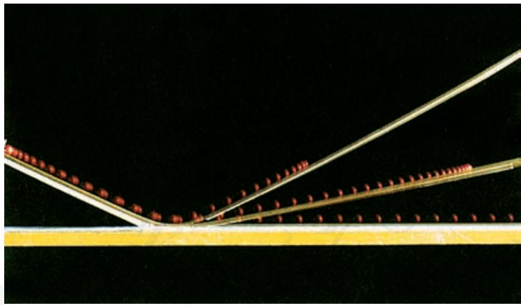  
图4.1-1 现代人所做伽利略斜面实验的频闪照片（组合图）

伽利略理想实验的本质是想象着把实际中存在、影响物体运动的摩擦力去掉，抓住事物的本质。这种依据逻辑推理把实际实验理想化的思想也是研究物理问题的重要方法之一。

我们知道，阻力不可能完全消除，第二个斜面也不可能做得无限长，所以，伽利略的实验是一个“理想实验”。虽然这个实验无法实现，但是，伽利略在实验基础上进一步推理的方法，帮助我们找到了解决运动和力的关系问题的方法。

伽利略同时代的法国科学家笛卡儿也研究了这个问题。他认为，如果运动中的物体没有受到力的作用，它将继续以同一速度沿同一直线运动，既不会停下来，也不会偏离原来的方向。他还认为，这应该成为一个原理，是人类整个自然观的基石。

### 牛顿第一定律

在伽利略和笛卡儿工作的基础上，在隔了一代人以后，英国科学家牛顿提出了动力学的一条基本定律：一切物体总保持匀速直线运动状态或静止状态，除非作用在它上面的力迫使它改变这种状态。这就是牛顿第一定律（Newton's first law）。物体这种保持原来匀速直线运动状态或静止状态的性质叫作惯性（inertia）。牛顿第一定律也叫作惯性定律。

任何物体都和周围的物体有相互作用，不受力作用的物体是不存在的。所以，牛顿第一定律所描述的状态是一种理想状态。它是利用逻辑思维进行分析的产物，不可能用实验直接验证。

牛顿第一定律揭示了运动和力的关系：力不是维持物体运动状态的原因，而是改变物体运动状态的原因。保持静止或匀速直线运动状态是物体的固有属性，这一属性称为惯性。惯性不是外界强加给它的，是物体固有的，一切物体都具有惯性。牛顿第一定律为力学的发展奠定了坚实的基础。①

### 惯性与质量

牛顿第一定律涉及两个重要的物理概念：力和惯性。有关力的内容我们在上一章已经有所认识，下面我们进一步来讨论惯性。

如果一个物体由静止变为运动或由运动变为静止，我们说它的运动状态发生了改变。

如果一个物体的速度大小或方向改变了，我们也说它的运动状态发生了改变。

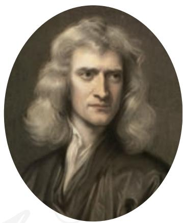  
牛顿（Isaac Newton，1643—1727）

从牛顿第一定律得知，物体都要保持它们原有的匀速直线运动状态或静止状态。也可以说，它们都具有抵抗运动状态变化的“能力”，即都具有惯性。那么，怎样描述惯性的大小呢？

我们在改变物体运动状态时，会体验到物体惯性大小的不同。例如，以相同的方式抛掷质量不同的两个石块，让它们获得同样的速度，需要的力就不同。质量大的石块需要的力大。再比如，让摆动的大沙袋停下来就比让摆动的小球停下来费力得多。

在初中，我们把质量理解为物体所含物质的多少；现在，又从物体惯性的角度认识质量。我们对于科学概念的认识就是这样一步一步深入的。

大量事例说明，不同质量的物体，惯性的大小是不一样的。也就是说，不同物体维持其原有运动状态的“能力”不同，质量大的物体惯性大。描述物体惯性的物理量是它的质量（mass）。

质量只有大小，没有方向，是标量。在国际单位制中，质量的单位是千克，符号为 $\mathrm{kg}$ 。

### 拓展学习

#### 惯性参考系

在桌面上放置一张纸和一个小钢球，小钢球静止在纸面上（图4.1-2）。如果突然迅速拉动纸的一边，虽然小钢球相对桌面的位置几乎不变，但是如果只关注纸面及其上的小钢球时，你会发现小钢球相对于纸面向相反的方向运动。

当纸相对于桌面加速运动时，如果以这张纸为参考系来观察，小钢球相对于纸面的运动状态在改变。按照牛顿第一定律，小钢球的运动状

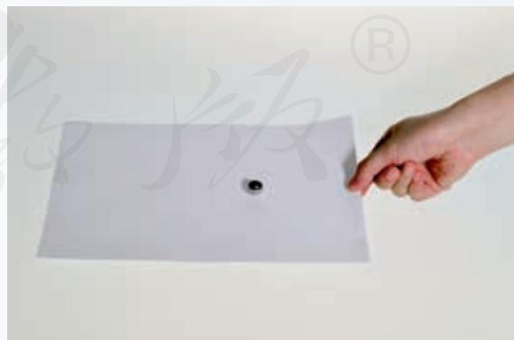  
图4.1-2

态发生改变，说明小钢球在水平方向上应该受到力的作用。但实际上，小钢球只受到竖直方向的重力和支持力，水平方向几乎不受力，这不是和牛顿第一定律相矛盾吗？

若以地面为参考系，上述矛盾则不会存在。因为，在纸加速运动的过程中，尽管小钢球相对于纸面的运动状态在改变，但它相对于地面的位置并没有变化，因而仍然保持静止状态。这与用牛顿第一定律分析得到的结论是一致的。对于同一个物体的运动，为何会得到两种不同的分析结果呢？

这是由于我们观察物体的运动时所选择的参考系不同。牛顿第一定律是否成立与选择什么参考系有关。如果在一个参考系中，一个不受力的物体会保持匀速直线运动状态或静止状态，这样的参考系叫作惯性参考系，简称惯性系。以加速运动的纸为参考系，牛顿第一定律并不成立，这样的参考系叫作非惯性系。

### 练习与应用

1. 回答下列问题。

（1）飞机投弹时，如果当目标在飞机的正下方时投下炸弹，能击中目标吗？为什么？  
(2) 地球由西向东自转, 你向上跳起来以后, 为什么还落在原地, 而不落到原地的西边?  
（3）我国道路交通安全法规定，在各种小型车辆里乘坐的人必须系好安全带。为什么要有这样的规定？  
（4）一位同学说，向上抛出的物体，在空中向上运动时，肯定受到了向上的作用力，否则它不可能向上运动。这个结论错在哪里？

2. 伽利略在理想斜面实验中提出了以下结论：如果另一个斜面的倾角减小至 $0^{\circ}$ ，小球为达到原来的高度，将永远运动下去。

请你说明他得到这个结论的理由。

3. 下列关于物体惯性的说法中，哪些是正确的？哪些是错误的？

（1）汽车速度越大，刹车后越难停下来，表明物体的速度越大，其惯性越大。  
(2) 汽车转弯后前进方向发生了改变, 表明物体速度方向改变, 其惯性也随之改变。  
（3）被抛出的小球，尽管速度的大小和方向都改变了，但惯性不变。  
（4）要使速度相同的沙袋在相同时间内停下来，对大沙袋用力比对小沙袋用力大，表明质量大的物体惯性大。

针对以上事例，请你总结一下对惯性大小的认识。

## 2 实验：探究加速度与力、质量的关系

速度是描述物体运动状态的物理量，加速度是描述速度变化快慢的物理量。因此也可以说，加速度是描述物体运动状态变化快慢的物理量。由前面的学习我们知道，力是改变物体运动状态的原因，质量大的物体运动状态不容易改变。这说明，加速度与力、质量之间必然存在一定的关系。下面我们来探究加速度与力、质量之间的定量关系。

### ■ 实验思路

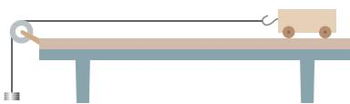  
图4.2-1 槽码牵引小车运动

你认为应该如何完成这个探究实验？比如，研究什么物体？如何测量该物体受到的力？如何测量该物体的加速度？怎样分析数据？请说出你的设计思路并和同学们讨论确定实验探究方案。

用图4.2-1所示的装置可以完成这个探究实验。将小车置于水平木板上，通过滑轮与槽码相连。小车可以在槽码的牵引下运动。

可证明这两个力只是近似相等，条件是槽码的质量要比小车的质量小很多。  
从实验的角度，同时研究某个物理量与另外两个或多个物理量之间的定量关系是非常困难的。面对这样的问题，我们通常采用控制变量的方法进行研究。

加速度与力的关系 保持小车质量不变，通过改变槽码的个数改变小车所受的拉力。小车所受的拉力可认为与槽码所受的重力相等。测得不同拉力下小车运动的加速度，分析加速度与拉力的变化情况，找出二者之间的定量关系。

加速度与质量的关系 保持小车所受的拉力不变，通过在小车上增加重物改变小车的质量。测得不同质量的小车在这个拉力下运动的加速度，分析加速度与质量的变化情况，找出二者之间的定量关系。

### 物理量的测量

本实验需要测量的物理量有三个：物体的质量、物体所受的作用力和物体运动的加速度。

质量的测量可以用天平测量质量。为了改变小车的质量，可以在小车中增减砝码的数量。

加速度的测量 方法1 小车做初速度为0的匀加速直线运动，则测量小车加速度最直接的办法就是用刻度尺测量小车移动的位移 $x$ ，并用秒表测量发生这段位移所用的时间 $t$ ，然后由

$$
a = \frac {2 x}{t ^ {2}} \tag {1}
$$

计算出加速度 $a$ 。

方法2 将打点计时器的纸带连在小车上，根据纸带上打出的点来测量加速度（参考第一章的实验方法）。

方法3 在这个实验中也可以不测量加速度的具体数值。这是因为我们探究的是加速度与其他物理量之间的比例关系，因此测量不同情况下物体加速度的比值即可。

如果能做到让两个做初速度为0的匀加速直线运动的物体的运动时间 $t$ 相等，那么由（1）式可知，它们的位移之比就等于加速度之比，即

$$
\frac {x _ {1}}{x _ {2}} = \frac {a _ {1}}{a _ {2}} \tag {2}
$$

这样，测量加速度就转换成测量位移了。

力的测量 现实中，仅受一个力作用的物体几乎不存在。然而，一个单独的力的作用效果与跟它大小、方向都相同的合力的作用效果是相同的。因此，实验中作用力 $F$ 的含义可以是物体所受的合力。

如何为运动的物体提供一个恒定的合力，如何测出这个合力是本实验的关键，有很多可行的方法。下面参考案例中的方法可供选用，也可以设计其他方法。

在此实验中，通过测力计用手直接给小车施加一个恒力是否可行？

### 参考案例1

#### 用阻力补偿法探究加速度与力、质量的关系

实验装置如图4.2-2所示。把木板的一侧垫高，以补偿打点计时器对小车的阻力及其他阻力。调节木板的倾斜度，使小车在不受牵引时能拖动纸带沿木板匀速运动。将槽码、小车、打点计时器、纸带安装好。通过改变槽码的个数可以成倍地改变小车所受的拉力，与此相对应，处理纸带上打出的点来测量加速度。

保持小车受的拉力不变，通过增减小车中的重物改变小车的质量。处理纸带上打出的点来测量加速度。

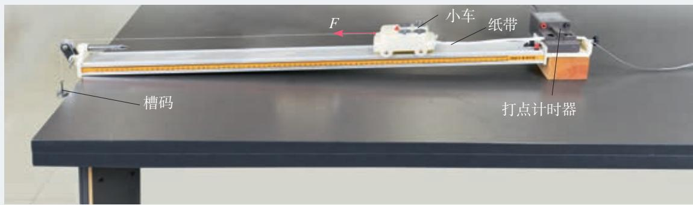  
图4.2-2 实验装置

### 参考案例2

#### 通过位移之比测量加速度之比

将两辆相同的小车放在水平木板上，前端各系一条细线，线的另一端跨过定滑轮各挂一个小盘，盘中可以放不同的重物。把木板一端垫高，采用参考案例1的方法补偿阻力的影响。

两辆小车后端各系一条细线，用一个物体，例如黑板擦，把两条细线同时按压在木板上（图4.2-3）。抬起黑板擦，两辆小车同时开始运动，按下黑板擦，两辆小车同时停下来。用刻度尺测出两辆小车移动的位移 $x_{1}$ 、

  
图4.2-3 用黑板擦控制小车的动与停

$x_{2}$ 。由于两辆小车运动时间 $t$ 相同，从它们的位移之比就可以得出加速度之比。

在盘中重物相同的情况下，通过增减小车中的重物改变小车的质量。

### 进行实验

调试实验装置进行实验。

加速度与力的关系 设计表格，把测得的同一个小车在不同拉力 $F$ 作用下的加速度 $a$ 填在表1中。

表 1 小车质量一定  

<table><tr><td>拉力F</td><td></td><td></td><td></td><td></td><td></td></tr><tr><td>加速度a</td><td></td><td></td><td></td><td></td><td></td></tr></table>

加速度与质量的关系 设计表格，把测得的不同质量的小车在相同拉力作用下的加速度 $a$ 填在表2中。

表2 小车所受的拉力一定  

<table><tr><td>质量m</td><td></td><td></td><td></td><td></td><td></td></tr><tr><td>加速度a</td><td></td><td></td><td></td><td></td><td></td></tr></table>

### ■数据分析

为了更直观地判断加速度 $a$ 与拉力 $F$ 的定量关系，我们以 $a$ 为纵坐标、 $F$ 为横坐标建立直角坐标系。根据各组实验数据在坐标纸上描点。如果这些点在一条过原点的直线附近，说明加速度 $a$ 与拉力 $F$ 成正比。如果不是这样，则需进一步分析。

为了分析加速度 $a$ 与质量 $m$ 的定量关系，我们同样需要建立直角坐标系。经验告诉我们，在相同拉力作用下，质量 $m$ 越大，加速度 $a$ 越小。这可能是“ $a$ 与 $m$ 成反比”，但也可能是“ $a$ 与 $m^2$ 成反比”，甚至是更复杂的关系。我们从最简单的情况入手，检验是否“ $a$ 与 $m$ 成反比”。

实验结果如图4.2-4所示，我们很难直观看出图线是否为双曲线，如何解决这个问题呢？

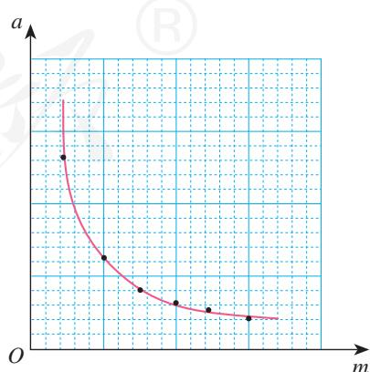  
图4.2-4 双曲线

如果 $a - m$ 图像是双曲线， $a$ 与 $m$ 成反比，也就是 $a$ 与 $\frac{1}{m}$ 成正比。作 $a - \frac{1}{m}$ 图像进行检验（图4.2-5）。如果检验的结果是过原点的直线，就可以判断加速度 $a$ 与质量 $m$ 是成反比的。

上述探究实验也可以用参考案例2进行。

这里我们已经假设加速度与质量成反比；如果当初假设加速度与质量的二次方成反比，最好作哪两个量之间关系的图像？

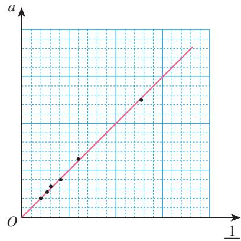  
图4.2-5 过原点的直线

### 科学方法

#### 控制变量

控制变量的方法是指在研究和解决问题的过程中，对影响事物变化规律的独立因素加以人为控制，使其中只有一个因素按照特定的要求发生变化，而其他因素保持不变，以利于寻找事物发展变化的规律的方法。例如，在研究某个物理量 $y$ 与另外两个变量 $x_{1} 、 x_{2}$ 的关系时，先固定一个变量 $x_{2}$ 不变，研究 $y$ 与另一个变量 $x_{1}$ 之间的定量关系；然后再固定变量 $x_{1}$ 不变，研究 $y$ 与 $x_{2}$ 之间的关系。

本节在探究加速度与力、质量之间的关系时，就采用了控制变量的方法。以后在研究涉及多个变量的规律时，还会用到控制变量的方法，它是科学研究中常用的一种方法。

### 练习与应用

1. 某同学在做“探究加速度与力的关系”和“探究加速度与质量的关系”实验时，把两个实验的数据都记录在表3中。数据是按加速度的大小排列的，两个实验的数据混在一起，

而且有两个加速度数据模糊不清（表3中空格）。请你把这些数据分析填入表4和表5中，如果模糊的加速度数据是正确的，其数值应该是多少？请填在表3中。

表3 实验记录  

<table><tr><td>F/N</td><td>m/kg</td><td>a/(m·s-2)</td></tr><tr><td>0.29</td><td>0.86</td><td>0.34</td></tr><tr><td>0.14</td><td>0.36</td><td>0.39</td></tr><tr><td>0.29</td><td>0.61</td><td>0.48</td></tr><tr><td>0.19</td><td>0.36</td><td>0.53</td></tr><tr><td>0.24</td><td>0.36</td><td></td></tr><tr><td>0.29</td><td>0.41</td><td>0.71</td></tr><tr><td>0.29</td><td>0.36</td><td>0.81</td></tr><tr><td>0.29</td><td>0.31</td><td></td></tr><tr><td>0.34</td><td>0.36</td><td>0.94</td></tr></table>

表4 探究加速度与力的关系（条件： $m =$ ）  

<table><tr><td>F/N</td><td></td><td></td><td></td><td></td><td></td></tr><tr><td>a/(m·s-2)</td><td></td><td></td><td></td><td></td><td></td></tr></table>

表 5 探究加速度与质量的关系 (条件: $F =$ )  

<table><tr><td>m/kg</td><td></td><td></td><td></td><td></td><td></td></tr><tr><td>a/(m·s-2)</td><td></td><td></td><td></td><td></td><td></td></tr></table>

2. 某同学用图4.2-2所示的实验装置探究小车的加速度 $a$ 与质量 $m$ 的关系。所用交变电流的频率为 $50\mathrm{Hz}$

表6 实验记录  

<table><tr><td>次数</td><td>1</td><td>2</td><td>3</td><td>4</td><td>5</td><td>6</td><td>7</td><td>8</td></tr><tr><td>质量m/kg</td><td>0.25</td><td>0.29</td><td>0.33</td><td>0.40</td><td>0.50</td><td>0.71</td><td>1.00</td><td>1.67</td></tr><tr><td>加速度a/(m·s-2)</td><td>0.618</td><td>0.557</td><td>0.482</td><td>0.403</td><td>0.317</td><td>0.235</td><td>0.152</td><td>0.086</td></tr><tr><td>质量倒数1/m/kg-1</td><td>4.00</td><td>3.45</td><td>3.03</td><td>2.50</td><td>2.00</td><td>1.41</td><td>1.00</td><td>0.60</td></tr></table>

（1）图4.2-6是他某次实验得到的纸带，每两个计数点间有四个点未画出，部分实验数据如图所示。求小车的加速度是多少。

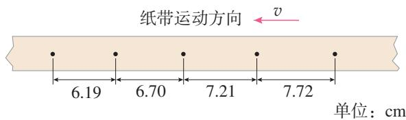  
图4.2-6

（2）保持小车所受的拉力不变，改变小车质量 $m$ ，分别测得不同质量时小车加速度 $a$ 的数据如表6所示。

请在图4.2-7的坐标纸中作出 $a - \frac{1}{m}$ 图像。根据 $a - \frac{1}{m}$ 图像可以得到什么实验结论？

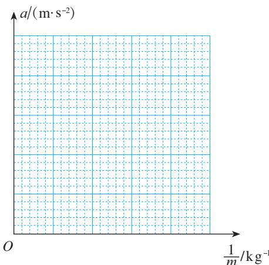  
图4.2-7

## 牛顿第二定律

### 问题

赛车质量小、动力大，容易在短时间内获得较大的速度，也就是说，赛车的加速度大。物体的加速度 $a$ 与它所受的作用力 $F$ 以及自身的质量 $m$ 之间存在什么样的定量关系呢？通过上节的探究实验，你找到了吗？

### 牛顿第二定律的表达式

上节课的实验结果表明，小车的加速度 $a$ 与它所受的作用力 $F$ 成正比，与它的质量 $m$ 成反比。那么，对于任何物体都是这样的吗？

如果我们多做几次类似的实验，每次实验的点都可以拟合成直线，而这些直线与坐标轴的交点又都十分接近原点（图4.3-1），那么，实际规律很可能就是这样的。

$\triangleright$ 科学研究人员做实验时，都要对偏差作出定量的分析，以确认这些偏差与实验规律的关系。这样，下结论时的把握就大多了。

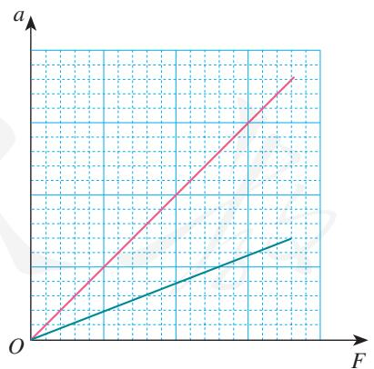  
甲 猜想中的 $a - F$ 图像

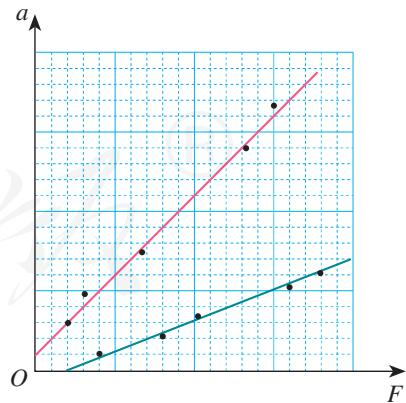  
乙 根据实际数据作出的 $a - F$ 图像  
图4.3-1

到此为止，我们的结论仍然带有猜想和推断的性质。只有根据这些结论推导出的很多新结果都与事实一致时，这样的结论才能成为“定律”。

由此看来，科学前辈们在根据有限的实验事实宣布某个定律时，既需要谨慎，也需要勇气。

大量的实验和观察到的事实都可以得出与上节课实验同样的结论，由此可以总结出一般性的规律：物体加速度的大小跟它受到的作用力成正比，跟它的质量成反比，加速度的方向跟作用力的方向相同。这就是牛顿第二定律（Newton's second law）。

牛顿第二定律可表述为

$$
a \propto \frac {F}{m}
$$

也可以写成等式

$$
F = k m a
$$

实际物体所受的力往往不止一个，式中 $F$ 指的是物体所受的合力。

其中 $k$ 是比例系数。

牛顿第二定律不仅阐述了力、质量和加速度三者数量间的关系，还明确了加速度的方向与力的方向一致。

### 思考与讨论

取质量的单位是千克 $(\mathrm{kg})$ , 加速度的单位是米每二次方秒 $(\mathrm{m} / \mathrm{s}^{2})$ , 根据上述牛顿第二定律中加速度与力、质量的关系, 我们应该怎样确定力的单位?

### 力的单位

$F = kma$ 中 $k$ 的数值取决于 $F$ 、 $m$ 、 $a$ 的单位的选取。

当 $k = 1$ 时，质量为 $1\mathrm{kg}$ 的物体在某力的作用下获得 $1\mathrm{m / s}^2$ 的加速度，则这个力

$$
F = m a = 1 \mathrm {k g} \cdot \mathrm {m / s ^ {2}}
$$

如果我们把这个力叫作“一个单位”的力的话，力 $F$ 的单位就是千克米每二次方秒。后人为了纪念牛顿，把它称作“牛顿”，用符号 $\mathrm{N}$ 表示。

在质量的单位取千克（ $\mathrm{kg}$ ），加速度的单位取米每二次方秒（ $\mathrm{m/s}^2$ ），力的单位取牛顿（ $\mathrm{N}$ ）时，牛顿第二定律可以表述为

$$
F = m a
$$

我们在初中已经学过，在国际单位制中，力的单位是牛顿（N）。但是当时并不知道“牛顿”这个单位是怎样定义的。学过牛顿第二定律之后，这个问题就清楚了。

### 【例题1】

在平直路面上，质量为 $1100 \mathrm{~kg}$ 的汽车在进行研发的测试，当速度达到 $100 \mathrm{~km} / \mathrm{h}$ 时取消动力，经过 $70 \mathrm{~s}$ 停了下来。汽车受到的阻力是多少？重新起步加速时牵引力为 $2000 \mathrm{~N}$ ，产生的加速度是多少？假定试车过程中汽车受到的阻力不变。

分析 如图4.3-2，取消动力后，汽车在平直路面上只受阻力的作用。由于阻力不变，根据牛顿第二定律，汽车在平直路面上运动的加速度将保持不变。由加速度可以求出汽车受到的阻力。

如图4.3-3，重新起步后，汽车在平直路面上受到牵引力和阻力。由于二者大小都不变，所以汽车的加速度恒定不变。根据牛顿第二定律可以求出汽车运动的加速度。

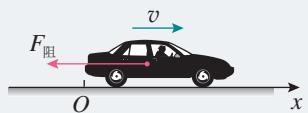  
图4.3-2

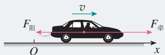  
图4.3-3

解 以汽车为研究对象。设汽车运动方向为 $x$ 轴正方向，建立一维坐标系。取消动力后，汽车做匀减速直线运动。初速度 $v_{0} = 100 \mathrm{~km/h} = 27.8 \mathrm{~m/s}$ ，末速度为 0，滑行时间 $t = 70 \mathrm{~s}$ 。

根据匀变速直线运动速度与时间的关系式，加速度为

$$
a _ {1} = \frac {0 - v _ {0}}{t} = - \frac {v _ {0}}{t}
$$

汽车受到的阻力为

$$
F _ {\text {阻}} = m a _ {1} = - \frac {m v _ {0}}{t} = - \frac {1 1 0 0 \mathrm {k g} \times 2 7 . 8 \mathrm {m / s}}{7 0 \mathrm {s}} = - 4 3 7 \mathrm {N}
$$

汽车受到的阻力是 $437 \mathrm{~N}$ , 方向与运动方向相反。

重新起步后，汽车所受的合力为

$$
F _ {\text {合}} = 2 0 0 0 \mathrm {N} - 4 3 7 \mathrm {N} = 1 5 6 3 \mathrm {N}
$$

由牛顿第二定律可以得到汽车的加速度

$$
a _ {2} = \frac {F _ {\text {合}}}{m} = \frac {1 5 6 3 \mathrm {N}}{1 1 0 0 \mathrm {k g}} = 1. 4 2 \mathrm {m / s ^ {2}}
$$

重新起步产生的加速度是 $1.42 \mathrm{~m} / \mathrm{s}^{2}$ , 方向与运动方向相同。

### 【例题2】

某同学在列车车厢的顶部用细线悬挂一个小球，在列车以某一加速度渐渐启动的过程中，细线就会偏过一定角度并相对车厢保持静止，通过测定偏角的大小就能确定列车的加速度（图4.3-4）。在某次测定中，悬线与竖直方向的夹角为 $\theta$ ，求列车的加速度。

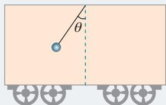  
图4.3-4

分析 列车在加速行驶的过程中，小球始终与列车保持相对静止状态，所以，小球的加速度与列车的加速度相同。

对小球进行受力分析，根据力的合成法则求解合力。再根据牛顿第二定律，求出小球的加速度，从而获得列车的加速度。

解 方法1 选择小球为研究对象。设小球的质量为 $m$ ，小球在竖直平面内受到重力 $G$ 、绳的拉力 $F_{\mathrm{T}}$ （图4.3-5）。在这两个力的作用下，小球产生水平方向的加速度 $a$ 。这表明， $F_{\mathrm{T}}$ 与 $G$ 的合力方向水平向右，且

$$
F = G \tan \theta = m g \tan \theta
$$

根据牛顿第二定律，小球具有的加速度为

$$
a = \frac {F}{m} = g \tan \theta
$$

方法2 小球在水平方向上做匀加速直线运动，在竖直方向上处于平衡状态。建立图4.3-6所示的直角坐标系。将小球所受的拉力 $F_{\mathrm{T}}$ 分解为水平方向的 $F_{x}$ 和竖直方向的 $F_{y}$ 。

在竖直方向有

$$
\begin{array}{l} F _ {y} - m g = 0, F _ {y} = F _ {\mathrm {T}} \cos \theta \\ F _ {\mathrm {T}} \cos \theta = m g \tag {1} \\ \end{array}
$$

在水平方向有

$$
F _ {x} = F _ {\mathrm {T}} \sin \theta
$$

$$
F _ {\mathrm {T}} \sin \theta = m a \tag {2}
$$

(1) (2) 式联立, 可以求得小球的加速度为

$$
a = g \tan \theta
$$

列车的加速度与小球相同，大小为 $g \tan \theta$ ，方向水平向右。

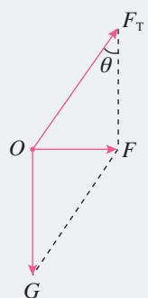  
图4.3-5

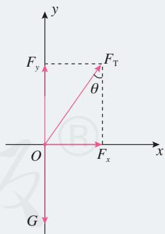  
图4.3-6

### 用动力学方法测质量

大家知道，质量可以用天平来测量。但是在太空，物体完全失重，用天平无法测量质量，那么应该如何测量呢？

由牛顿第二定律 $F = ma$ 可知，如果给物体施加一个已知的力，并测得物体在这个力作用下的加速度，就可以求出物体的质量。这就是动力学测量质量的方法。

北京时间2013年6月20日上午10时，我国航天员在天宫一号目标飞行器进行了太空授课，演示了包括质量的测量在内的一系列实验。

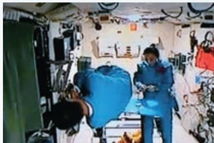  
图4.3-7 太空中质量的测量

质量的测量是通过舱壁上打开的一个支架形状的质量测量仪完成的。测量时，航天员把自己固定在支架的一端，另外一名航天员将支架拉开到指定的位置。松手后，支架拉着航天员从静止返回到舱壁（图4.3-7）。支架能够产生一个恒定的拉力 $F$ ；用光栅测速装置能够测量出支架复位的速度 $v$ 和时间 $t$ ，从而计算出加速度 $a$ 。这样，就能够计算出航天员的质量 $m$ 。

你能设计出一种在太空中测量质量的方法吗？

### 练习与应用

1. 从牛顿第二定律知道，无论怎样小的力都可以使物体产生加速度。可是，我们用力提一个很重的箱子，却提不动它。这跟牛顿第二定律有没有矛盾？应该怎样解释这个现象？  
2. 甲、乙两辆小车放在水平桌面上，在相同拉力的作用下，甲车产生的加速度为 $1.5 \mathrm{~m} / \mathrm{s}^{2}$ ，乙车产生的加速度为 $4.5 \mathrm{~m} / \mathrm{s}^{2}$ ，甲车的质量是乙车的几倍？（不考虑阻力）  
3. 一个物体受到的合力是 $4 \mathrm{~N}$ 时，产生的加速度为 $2 \mathrm{~m} / \mathrm{s}^{2}$ 。若该物体的加速度为 $6 \mathrm{~m} / \mathrm{s}^{2}$ ，它受到的合力是多大？  
4. 光滑水平桌面上有一个质量是 $2 \mathrm{~kg}$ 的物体，它在水平方向上受到互成 $90^{\circ}$ 的两个力的作用，这两个力的大小都是 $14 \mathrm{~N}$ 。这个物体加速度的大小是多少？沿什么方向？

5. 平直路面上质量是 $30 \mathrm{~kg}$ 的手推车，在受到 $60 \mathrm{~N}$ 的水平推力时做加速度为 $1.5 \mathrm{~m} / \mathrm{s}^{2}$ 的匀加速直线运动。如果撤去推力，车的加速度大小是多少？方向如何？  
6. 如图4.3-8，一辆装满石块的货车在平直道路上以加速度 $a$ 向前加速运动。货箱中石块B的质量为 $m$ ，求石块B周围与它接触的物体对石块B作用力的合力。

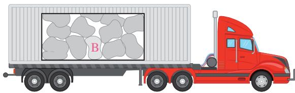  
图4.3-8

## 4 力学单位制

### 问题

计量一头大象的质量时常用吨（t）做单位，但在计量人的质量时却用千克（kg）做单位。自由落体加速度 $g$ 的单位是米每二次方秒（ $\mathrm{m/s}^2$ ），在初中学习时， $g$ 的单位曾用牛顿每千克（ $\mathrm{N/kg}$ ）。这些单位的使用有什么规则吗？

### 基本单位

由位移和时间求速度时，所用的关系式为

$$
v = \frac {\Delta x}{\Delta t}
$$

如果位移的单位用米（m），时间的单位用秒（s），得出的速度单位就是米每秒（m/s）。

已知速度的变化量和发生这个变化所用的时间，要求加速度时，所用的关系式为

$$
a = \frac {\Delta v}{\Delta t}
$$

如果速度的单位用米每秒（ $\mathrm{m/s}$ ），时间的单位用秒（s），得出的加速度的单位就是米每二次方秒（ $\mathrm{m/s}^2$ ）。

由此可见，物理学的关系式在确定了物理量之间的关系时，也确定了物理量的单位之间的关系。

在物理学中，只要选定几个物理量的单位，就能够利用物理量之间的关系推导出其他物理量的单位。这些被选定的物理量叫作基本量，它们相应的单位叫作基本单位。

在上面的例子中，长度、时间就是基本量，它们相应

$\triangleright$ 物理量具有明确的定义和物理意义，可以用不同的方法测量，测量的结果用数值和相应的单位来表示。

的单位（米、秒）就是基本单位。由基本量根据物理关系推导出来的其他物理量叫作导出量，推导出来的相应单位叫作导出单位，例如速度、加速度的单位。

基本单位和导出单位一起就组成了一个单位制（system of units）。

### 国际单位制

如果采用不同的物理量作为基本量，或者虽然采用相同的基本量，但采用的基本单位不同，导出单位自然随之不同，从而产生不同的单位制。不同的地区使用不同的单位制，不方便交流。1960年第11届国际计量大会制订了一种国际通用的、包括一切计量领域的单位制，叫作国际单位制（Le Système International d'Unités，法文），简称SI。

在力学范围内，规定长度、质量、时间为三个基本量，对热学、电磁学、光学等学科，除了上述三个基本量和相应的基本单位外，还要加上另外四个基本量和它们的基本单位，才能导出其他物理量的单位。

表 国际单位制的基本单位  

<table><tr><td>物理量名称</td><td>物理量符号</td><td>单位名称</td><td>单位符号</td></tr><tr><td>长度</td><td>l</td><td>米</td><td>m</td></tr><tr><td>质量</td><td>m</td><td>千克(公斤)</td><td>kg</td></tr><tr><td>时间</td><td>t</td><td>秒</td><td>s</td></tr><tr><td>电流</td><td>I</td><td>安[培]①</td><td>A</td></tr><tr><td>热力学温度</td><td>T</td><td>开[尔文]</td><td>K</td></tr><tr><td>物质的量</td><td>n,(v)</td><td>摩[尔]</td><td>mol</td></tr><tr><td>发光强度</td><td>I,(Iv)</td><td>坎[德拉]</td><td>cd</td></tr></table>

### 【例题】

光滑水平桌面上有一个静止的物体，质量是 $700\mathrm{g}$ ，在 $1.4\mathrm{N}$ 的水平恒力作用下开始运动（图4.4-1）。那么，5s末物体的速度是多少？5s内它的位移是多少？

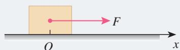  
图4.4-1

分析 由于物体在竖直方向上所受的重力与桌面的支持力平衡，水平方向上的作用力为恒力，所以物体沿水平方向做初速度为0的匀加速直线运动。

由牛顿第二定律求出物体的加速度，再根据匀变速直线运动的速度与时间的关系式、位移与时间的关系式，就可以求出速度和位移。

在国际单位制中运用牛顿第二定律 $F = ma$ 时，质量的单位必须用千克（ $\mathrm{kg}$ ），所以需要对质量的单位进行换算。

解 以静止的物体为研究对象。物体的质量 $m = 700\mathrm{g} = 0.7\mathrm{kg}$ 。

根据牛顿第二定律，有

$$
a = \frac {F}{m} = \frac {1 . 4 \mathrm {N}}{0 . 7 \mathrm {k g}} = 2 \mathrm {N} / \mathrm {k g} = 2 \mathrm {m} / \mathrm {s} ^ {2}
$$

初速度 $v_{0} = 0$ , 根据匀加速直线运动的速度与时间的关系式, 有

$$
v = a t = 2 \mathrm {m} / \mathrm {s} ^ {2} \times 5 \mathrm {s} = 1 0 \mathrm {m} / \mathrm {s}
$$

根据匀变速直线运动的位移与时间的关系式，有

$$
x = \frac {1}{2} a t ^ {2} = \frac {1}{2} \times 2 \mathrm {m} / \mathrm {s} ^ {2} \times 2 5 \mathrm {s} ^ {2} = 2 5 \mathrm {m}
$$

5s末物体的速度是 $10\mathrm{m / s}$ ，方向与恒力的方向相同；5s内它的位移是 $25\mathrm{m}$ ，方向与运动方向相同。

我们看到，题中的已知量的单位都用国际单位制表示时，计算的结果也是用国际单位制表示的。既然如此，在统一已知量的单位后，计算过程中就不必写出各量后面的单位，只在数字计算式后面写出正确的单位就可以了。这样，上面的计算过程就可以写成

$$
a = \frac {F}{m} = \frac {1 . 4}{0 . 7} \mathrm {m / s ^ {2}} = 2 \mathrm {m / s ^ {2}}
$$

$$
v = a t = 2 \times 5 \mathrm {m} / \mathrm {s} = 1 0 \mathrm {m} / \mathrm {s}
$$

$$
x = \frac {1}{2} a t ^ {2} = \frac {1}{2} \times 2 \times 2 5 \mathrm {m} = 2 5 \mathrm {m}
$$

### 思考与讨论

小刚在课余制作中需要计算圆锥的体积，他从一本书中查得圆锥体积的计算公式为 $V = \frac{1}{3} \pi R^{3} h$ 。小红说，从单位关系上看，这个公式肯定是错误的。她的根据是什么？

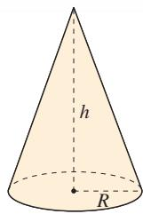  
图4.4-2 圆锥的高度 $h$ 和底面半径 $R$

### 拓展学习

#### 基本单位的定义

秒的定义 铯-133原子基态的两个超精细能级之间跃迁所对应的辐射的9192631770个周期的持续时间为 $1\mathrm{s}$ 。现在测量时间的最精准仪器是原子钟。图4.4-3为某原子钟的照片。

米的定义 米是光在真空中 $\frac{1}{299792458}$ s 时间间隔所经路径的长度。

以上米的定义是1983年国际计量大会上批准的。

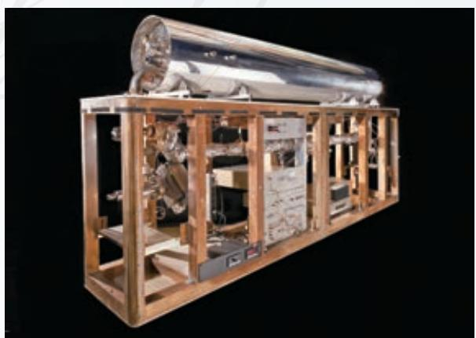  
图4.4-3 原子钟

千克的定义 国际千克原器的质量为 $1\mathrm{kg}$ 。

国际千克原器是1889年第1届国际计量大会批准制造的，它是一个用铂铱合金制成的圆柱体，高度和直径均为 $39\mathrm{mm}$ 。原型保存在巴黎国际计量局。

2018年11月16日，第26届国际计量大会决定，千克由普朗克常量 $h$ 及米和秒定义。即

$$
1 \mathrm {k g} = \frac {h}{6 . 6 2 6 0 7 0 1 5 \times 1 0 ^ {- 3 4} \mathrm {m} ^ {2} \cdot \mathrm {s} ^ {- 1}}
$$

该决定已于2019年5月20日起生效。此次标准实施后，SI单位中的7个基本单位将全部建立在不变的自然常数基础上，保证了SI单位的长期稳定性和通用性。

### 练习与应用

1. 一辆速度为 $4 \mathrm{~m} / \mathrm{s}$ 的自行车，在水平公路上匀减速地滑行 $40 \mathrm{~m}$ 后停止。如果自行车和人的总质量是 $100 \mathrm{~kg}$ ，自行车受到的阻力是多少？  
2. 一辆以 $10 \mathrm{~m} / \mathrm{s}$ 的速度行驶的汽车，刹车后经 $2 \mathrm{~s}$ 停下来。已知汽车的质量为 $4 \mathrm{t}$ ，汽车所受的阻力是多少？  
3. 一艘在太空飞行的宇宙飞船，开动推进器后，受到的推力是 $900 \mathrm{~N}$ ，开动 $3 \mathrm{~s}$ 的时间，速度增加了 $0.9 \mathrm{~m} / \mathrm{s}$ ，飞船的质量是多少？

4. 一辆质量是 $2 \mathrm{t}$ 的汽车，在水平公路上以 $54 \mathrm{~km} / \mathrm{h}$ 的速度匀速行驶。根据测试，这辆车在这种路面上紧急刹车时，汽车所受的制动力为 $1.2 \times 10^{4} \mathrm{~N}$ 。汽车要滑行多远的距离才能停下来？  
5. 在初中已经学过，如果一个物体在力 $F$ 的作用下沿着力的方向移动了一段距离 $l$ ，这个力对物体做的功 $W = Fl$ 。我们还学过，功的单位是焦耳（J）。请由此导出焦耳与基本单位米（m）、千克（kg）、秒（s）之间的关系。

## (5) 牛顿运动定律的应用

### 问题

为了尽量缩短停车时间，旅客按照站台上标注的车门位置候车。列车进站时总能准确地停靠在对应车门的位置。这是如何做到的呢？

牛顿第二定律确定了运动和力的关系，使我们能够把物体的运动情况与受力情况联系起来。因此，它在许多基础科学和工程技术中都有广泛的应用。中学物理中我们只研究一些简单的实例。

### 从受力确定1运动情况

如果已知物体的受力情况，可以由牛顿第二定律求出物体的加速度，再通过运动学的规律确定物体的运动情况。

### 【例题1】

运动员把冰壶沿水平冰面投出，让冰壶在冰面上自由滑行，在不与其他冰壶碰撞的情况下，最终停在远处的某个位置。按比赛规则，投掷冰壶运动员的队友，可以用毛刷在冰壶滑行前方来回摩擦冰面，减小冰面的动摩擦因数以调节冰壶的运动。

(1) 运动员以 $3.4 \mathrm{~m} / \mathrm{s}$ 的速度投掷冰壶, 若冰壶和冰面的动摩擦因数为 0.02 ,

  
图4.5-1

冰壶能在冰面上滑行多远？ $g$ 取 $10\mathrm{m / s^2}$

(2) 若运动员仍以 $3.4 \mathrm{~m} / \mathrm{s}$ 的速度将冰壶投出, 其队友在冰壶自由滑行 $10 \mathrm{~m}$ 后开始在其滑行前方摩擦冰面, 冰壶和冰面的动摩擦因数变为原来的 $90 \%$ , 冰壶多滑行了多少距离?  
分析（1）对物体进行受力分析后，根据牛顿第二定律可以求得冰壶滑行时的加速度，再结合冰壶做匀减速直线运动的规律求得冰壶滑行的距离。  
(2) 冰壶在滑行 $10 \mathrm{~m}$ 后进入冰刷摩擦后的冰面, 动摩擦因数变化了, 所受的摩擦力发生了变化, 加速度也会变化。前一段滑行 $10 \mathrm{~m}$ 的末速度等于后一段运动的初速度 (图4.5-2)。根据牛顿第二定律求出后一段运动的加速度, 并通过运动学规律求出冰壶在后一段过程的滑行距离, 就能求得比第一次多滑行的距离。

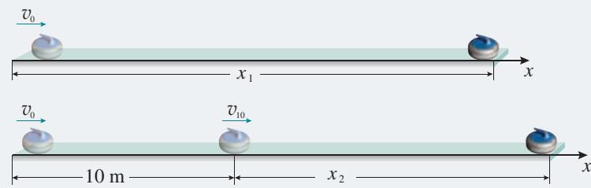  
图4.5-2

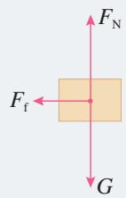  
图4.5-3

解（1）选择滑行的冰壶为研究对象。冰壶所受的合力等于滑动摩擦力 $F_{\mathrm{f}}$ （图4.5-3）。设冰壶的质量为 $m$ ，以冰壶运动方向为正方向建立一维坐标系，滑动摩擦力 $F_{\mathrm{f}}$ 的方向与运动方向相反，则

$$
F _ {\mathrm {f}} = - \mu_ {1} F _ {\mathrm {N}} = - \mu_ {1} m g
$$

根据牛顿第二定律，冰壶的加速度为

$$
a _ {1} = \frac {F _ {\mathrm {f}}}{m} = - \frac {\mu_ {1} m g}{m} = - \mu_ {1} g = - 0. 0 2 \times 1 0 \mathrm {m} / \mathrm {s} ^ {2} = - 0. 2 \mathrm {m} / \mathrm {s} ^ {2}
$$

加速度为负值，方向跟 $x$ 轴正方向相反。

将 $v_{0} = 3.4 \mathrm{~m} / \mathrm{s}, v = 0$ 代入 $v^{2} - v_{0}^{2} = 2 a_{1} x_{1}$ , 得冰壶的滑行距离为

$$
x _ {1} = - \frac {v _ {0} ^ {2}}{2 a _ {1}} = - \frac {3 . 4 ^ {2}}{2 \times (- 0 . 2)} \mathrm {m} = 2 8. 9 \mathrm {m}
$$

冰壶滑行了 $28.9 \mathrm{~m}$ 。

(2) 设冰壶滑行 $10 \mathrm{~m}$ 后的速度为 $v_{10}$ , 则对冰壶的前一段运动有

$$
v _ {1 0} ^ {2} = v _ {0} ^ {2} + 2 a _ {1} x _ {1 0}
$$

冰壶后一段运动的加速度为

$$
a _ {2} = - \mu_ {2} g = - 0. 0 2 \times 0. 9 \times 1 0 \mathrm {m} / \mathrm {s} ^ {2} = - 0. 1 8 \mathrm {m} / \mathrm {s} ^ {2}
$$

滑行 $10 \mathrm{~m}$ 后为匀减速直线运动, 由 $v^{2} - v_{10}^{2} = 2 a_{2} x_{2}, v = 0$ , 得

$$
x _ {2} = - \frac {v _ {1 0} ^ {2}}{2 a _ {2}} = - \frac {v _ {0} ^ {2} + 2 a _ {1} x _ {1 0}}{2 a _ {2}} = - \frac {3 . 4 ^ {2} + 2 \times (- 0 . 2 \times 1 0)}{2 \times (- 0 . 1 8)} \mathrm {m} = 2 1 \mathrm {m}
$$

第二次比第一次多滑行了

$$
(1 0 + 2 1 - 2 8. 9) \mathrm {m} = 2. 1 \mathrm {m}
$$

第二次比第一次多滑行了 $2.1 \mathrm{~m}$ 。

### 从运动情况确定受力

如果已知物体的运动情况，可以根据运动学规律求出物体的加速度，结合受力分析，再根据牛顿第二定律求出力。这是力学所要解决的又一方面的问题。

### 【例题2】

如图4.5-4，一位滑雪者，人与装备的总质量为 $75 \mathrm{~kg}$ ，以 $2 \mathrm{~m} / \mathrm{s}$ 的初速度沿山坡匀加速直线滑下，山坡倾角为 $30^{\circ}$ ，在 $5 \mathrm{~s}$ 的时间内滑下的路程为 $60 \mathrm{~m}$ 。求滑雪者对雪面的压力及滑雪者受到的阻力（包括摩擦和空气阻力）， $g$ 取 $10 \mathrm{~m} / \mathrm{s}^{2}$ 。

分析 由于不知道动摩擦因数及空气阻力与速度的关系，不能直接求滑雪者受到的阻力。应根据匀变速直线运动的位移和时间的关系式求出滑雪者的加速度，然后，

图4.5-4

对滑雪者进行受力分析。滑雪者在下滑过程中，受到重力 $mg$ 、山坡的支持力 $F_{\mathrm{N}}$ 以及阻力 $F_{\mathrm{f}}$ 的共同作用。通过牛顿第二定律可以求得滑雪者受到的阻力。

解 以滑雪者为研究对象。建立如图4.5-5所示的直角坐标系。滑雪者沿山坡向下做匀加速直线运动。

根据匀变速直线运动规律，有

$$
x = v _ {0} t + \frac {1}{2} a t ^ {2}
$$

其中 $v_{0} = 2 \mathrm{~m} / \mathrm{s}, t = 5 \mathrm{~s}, x = 60 \mathrm{~m}$ ，则有

$$
a = \frac {2 (x - v _ {0} t)}{t ^ {2}} = \frac {2 \times (6 0 - 2 \times 5)}{5 ^ {2}} \mathrm {m / s ^ {2}} = 4 \mathrm {m / s ^ {2}}
$$

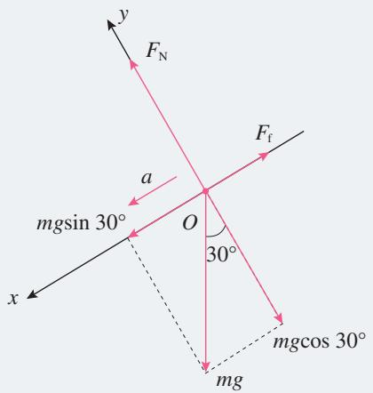  
图4.5-5

根据牛顿第二定律，有

$y$ 方向 $F_{\mathrm{N}} - mg\cos \theta = 0$

$x$ 方向 $mg\sin \theta -F_{\mathrm{f}} = ma$

得 $F_{\mathrm{N}} = mg\cos \theta$

$$
F _ {\mathrm {f}} = m (g \sin \theta - a)
$$

其中， $m = 75\mathrm{kg}, \theta = 30^{\circ}$ ，则有

$$
F _ {\mathrm {f}} = 7 5 \mathrm {N}, F _ {\mathrm {N}} = 6 5 0 \mathrm {N}
$$

根据牛顿第三定律，滑雪者对雪面的压力大小等于雪面对滑雪者的支持力大小，为 $650\mathrm{N}$ ，方向垂直斜面向下。滑雪者受到的阻力大小为 $75\mathrm{N}$ ，方向沿山坡向上。

### 练习与应用

1. 质量为 $20 \mathrm{~kg}$ 的物体静止在光滑水平面上。如果给这个物体施加两个大小都是 $50 \mathrm{~N}$ 且互成 $60^{\circ}$ 角的水平力（图4.5-6），那么，3s末它的速度是多少？3s内它的位移是多少？

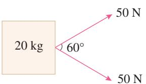  
图4.5-6

2. 民航客机都有紧急出口，发生意外情况的飞机紧急着陆后，打开紧急出口，狭长的气囊会自动充气，生成一条连接出口与地面的斜面，人员可沿斜面滑行到地面（图4.5-7）。若机舱口下沿距地面 $3.2 \mathrm{~m}$ ，气囊所构成的斜面长度为 $6.5 \mathrm{~m}$ ，一个质量为 $60 \mathrm{~kg}$ 的人沿气囊滑下时所受的阻力是 $240 \mathrm{~N}$ ，那么，人滑至气囊底端时的速度是多少？ $g$ 取 $10 \mathrm{~m} / \mathrm{s}^{2}$ 。

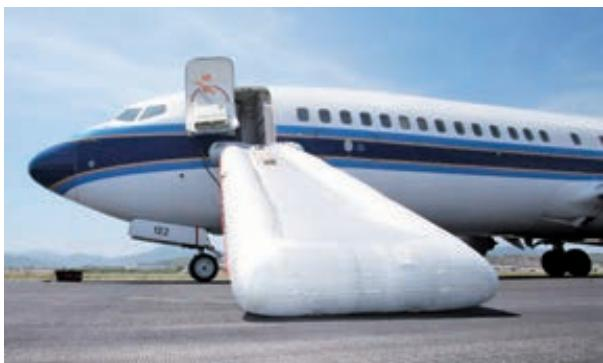  
图4.5-7

3. 汽车轮胎与公路路面之间必须要有足够大的动摩擦因数，才能保证汽车安全行驶。为检测某公路路面与汽车轮胎之间的动摩擦因数，需要测试刹车的车痕。测试汽车在该公路水平直道上以

54 km/h的速度行驶时，突然紧急刹车，车轮被抱死后在路面上滑动，直至停下来。量得车轮在公路上摩擦的痕迹长度是 $17.2 \mathrm{~m}$ ，则路面和轮胎之间的动摩擦因数是多少？ $g$ 取 $10 \mathrm{~m} / \mathrm{s}^{2}$ 。

4. 一辆货车运载着圆柱形光滑的空油桶。在车厢底，一层油桶平整排列，相互紧贴并被牢牢固定，上一层只有一只桶C，自由地摆放在桶A、B之间，没有用绳索固定（图4.5-8）。桶C受到桶A和桶B的支持，和汽车一起保持静止。

（1）当汽车以某一加速度向左加速时，A对C和B对C的支持力大小会增大还是减小？请说明理由。  
（2）当汽车向左运动的加速度增大到一定值时，桶C就脱离A而运动到B的右边，这个加速度有多大？

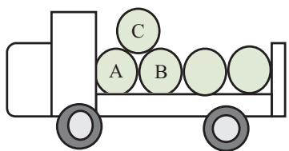  
图4.5-8

## 6 超重和失重

### 问题

站在体重计上向下蹲，你会发现，在下蹲的过程中，体重计的示数先变小，后变大，再变小。当人静止后，保持某一数值不变。这是为什么呢？

### 重力的测量

在地球表面附近，物体由于地球的吸引而受到重力。测量重力常用两种方法：一种方法是，先测量物体做自由落体运动的加速度 $g$ ，再用天平测量物体的质量，利用牛顿第二定律可得

$$
G = m g
$$

另一种方法是，利用力的平衡条件对重力进行测量。将待测物体悬挂或放置在测力计上，使它处于静止状态。这时物体所受的重力和测力计对物体的拉力或支持力的大小相等，测力计的示数反映了物体所受的重力大小。这是测量重力最常用的方法。

### 超重和失重

人站在体重计上向下蹲的过程中，为什么体重计的示数会变化呢？

体重计的示数称为视重，反映了人对体重计的压力。根据牛顿第三定律，人对体重计的压力与体重计对人的支持力 $F_{\mathrm{N}}$ 大小相等，方向相反。

如图4.6-1，选取人为研究对象。人体受到重力 $mg$ 和体重计对人的支持力 $F_{\mathrm{N}}$ ，这两个力的共同作用使人在下蹲的过程中，先后经历加速、减速和静止三个阶段。

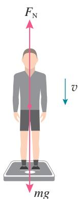  
图4.6-1

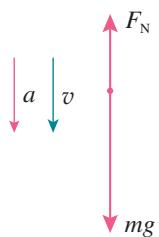  
图4.6-2

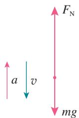  
图4.6-3

设竖直向下方向为坐标轴正方向。

人加速向下运动的过程中（图4.6-2），根据牛顿第二定律，有

$$
m g - F _ {\mathrm {N}} = m a
$$

$$
F _ {\mathrm {N}} = m (g - a) <   m g
$$

即体重计的示数所反映的视重（力）小于人所受的重力。

物体对支持物的压力（或对悬挂物的拉力）小于物体所受重力的现象，叫作失重（weightlessness）现象。

同理，人减速向下运动的过程中（图4.6-3），加速度方向与运动方向相反，有

$$
m g - F _ {\mathrm {N}} = - m a
$$

$$
F _ {\mathrm {N}} = m (g + a) > m g
$$

此时，体重计的示数大于人受到的重力。

物体对支持物的压力（或对悬挂物的拉力）大于物体所受重力的现象，叫作超重（overweight）现象。

当人相对于体重计静止不动时，有

$$
F _ {\mathrm {N}} = m g
$$

### 思考与讨论

人站在力传感器上完成下蹲动作。观察计算机采集的图线。图4.6-4呈现的是某人下蹲过程中力传感器的示数随时间变化的情况。

很明显，图线直观地描绘了人在下蹲过程中力传感器的示数先变小，后变大，再变小，最后保持某一数值不变的全过程。

如图4.6-5，图线显示的是某人站在力传感器上，先“下蹲”后“站起”过程中力传感器的示数随时间的变化情况。

请你分析力传感器上的人“站起”过程中超重和失重的情况。

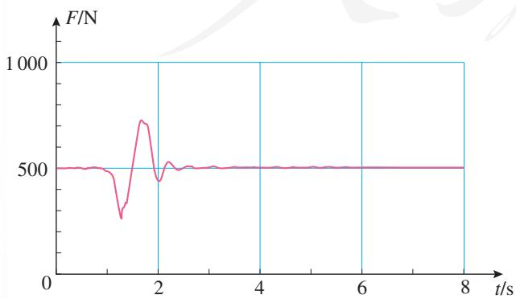  
图4.6-4 下蹲过程

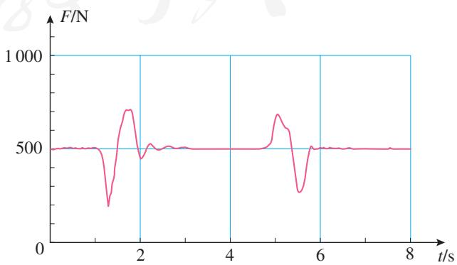  
图4.6-5 下蹲、站起两个过程

可见，人的运动状态对体重计上显示出的结果是有影响的。那么，如果站在体重计上的人既不蹲下，也不站起，体重计上的示数就不会变吗？

### 做一做

在电梯地板上放一台体重计。站在体重计上，观察电梯启动、制动和运行过程中体重计示数的变化。

### 【例题】

设某人的质量为 $60\mathrm{kg}$ ，站在电梯内的水平地板上，当电梯以 $0.25\mathrm{m/s}^2$ 的加速度匀加速上升时，求人对电梯的压力。

分析 人站在电梯内的水平地板上，随电梯上升过程中受到两个力的作用：重力 $mg$ 和地板的支持力 $F_{\mathrm{N}}$ ，受力分析如图4.6-6所示。

解 设竖直向上方向为坐标轴正方向。

根据牛顿第二定律，有

$$
F _ {\mathrm {N}} - m g = m a
$$

$$
F _ {\mathrm {N}} = m (g + a) = 6 0 \times (9. 8 + 0. 2 5) \mathrm {N} = 6 0 3 \mathrm {N}
$$

根据牛顿第三定律，人对电梯地板的压力 $F_{\mathrm{N}}'$ 为

$$
F _ {\mathrm {N}} ^ {\prime} = - F _ {\mathrm {N}} = - 6 0 3 \mathrm {N}
$$

人对电梯的压力大小为 $603 \mathrm{~N}$ , 方向竖直向下。

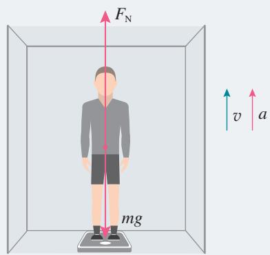  
图4.6-6

这个结果说明，当人与电梯共同向上加速或向下减速运动时， $F_{\mathrm{N}}^{\prime} > G$ ，人对电梯的压力大于人所受的重力，出现超重现象。

同理，如果电梯加速下降（或减速上升）， $F_{\mathrm{N}}' < G$ ，人对电梯的压力小于人的重力，出现失重现象。

如果人在加速下降的过程中加速度 $a = g$ ，那么，体重计的示数为0。这时物体对支持物（或悬挂物）完全没有作用力，这种现象叫作完全失重状态。

  
图4.6-7 航天员在天宫一号目标飞行器上展示水球的实验

实际中有许多领域涉及超重和失重现象。例如，火箭发射时向上的加速度很大，火箭底部所承受的压力要比静止时大得多。如果是载人航天，在火箭发射阶段，航天员要承受数倍于自身体重的压力。只有很好地研究材料、机械结构、人体自身所能承受的压力问题，才能使火箭成功发射、航天员顺利飞向太空。

航天器在太空轨道上绕地球或其他天体运行时，航天器内的物体将处于完全失重状态。完全失重时，物体将飘浮在空中，液滴呈球形（图4.6-7），气泡在液体中将不会上浮，走路时稍有不慎，将会“上不着天，下不着地”……

超重和失重现象在实际中还有许多，请你通过读书、上网、请教专业人员等多种途径进一步学习和了解。

### 练习与应用

1. 当在盛水的塑料瓶壁上扎一个小孔时，水会从小孔喷出，但释放水瓶，让水瓶自由下落，水却不会从小孔流出。这是为什么？  
2. 蹦极是一项极限体育项目。运动员从高处跳下，在弹性绳被拉直前做自由落体运动；当弹性绳被拉直后，在弹性绳的缓冲作用下，运动员下降速度先增加再减小逐渐减为0。下降过程中，运动员在什么阶段分别处于超重、失重状态？  
3. 火箭发射时，航天员要承受超重的考验。某火箭发射的过程中，有一段时间的加速度达到 $3.5 g$ ，平时重力为 $10 \mathrm{~N}$ 的体内脏器，在该超重过程中需要的支持力有多大？  
4. 一种巨型娱乐器械可以使人体验超重和失重状态。一个可乘坐二十多个人的环形座舱套装在竖直柱子上，由升降机送上几十米的高处，然后让座舱自由落下。落到一定位置时，制动系统启动，到地面时刚好停下。已知座舱开始下落

时的高度为 $76 \mathrm{~m}$ , 当落到离地面 $28 \mathrm{~m}$ 的位置时开始制动, 座舱做匀减速运动。若座舱中某人的质量为 $50 \mathrm{~kg}$ , 当座舱落到离地面 $50 \mathrm{~m}$ 的位置时,人对座舱的压力是多少? 当座舱落到离地面 $15 \mathrm{~m}$ 的位置时, 人对座舱的压力是多少?  
5. 小明住的楼房中有一部电梯，小明用了两种方法估测电梯在加速和减速过程中的加速度。

方法1 用测力计悬吊一个重物，保持测力计相对电梯静止，测得电梯上升加速时测力计读数为 $G_{1}$ ，减速时为 $G_{2}$ 。小明了解到该电梯加速和减速过程的加速度大小是相同的。由此，请估算电梯变速运动时加速度有多大。

方法2 用手机的加速度传感器测量电梯上升中由起动到停止的加速度。请描述此过程电梯的 $a - t$ 图像是怎样的。再用手机实地测一下看是怎样的。

### A组

1. 在公路上，一辆汽车以较大的速度行驶，紧急刹车的制动时间大于以较小速度行驶时的制动时间。这是因为速度越大，车的惯性越大吗？如果不是，上述现象该如何解释？  
2. 质量为 $0.5 \mathrm{~kg}$ 的物体，受到方向相反的两个力作用，获得 $3 \mathrm{~m} / \mathrm{s}^{2}$ 的加速度。若将其中一个力加倍，物体的加速度大小变为 $8 \mathrm{~m} / \mathrm{s}^{2}$ ，求另一个力的大小。  
3. 以 $6 \mathrm{~m} / \mathrm{s}$ 的速度匀速上升的气球，当升到离地面 $14.5 \mathrm{~m}$ 高时，从气球上落下一小球，小球的质量为 $0.5 \mathrm{~kg}$ 。假设小球在运动过程中所受的阻力大小总等于 $1 \mathrm{~N}$ ，小球经多长时间到达地面？ $g$ 取 $10 \mathrm{~m} / \mathrm{s}^{2}$ 。  
4. 图4-1是采用动力学方法测量空间站质量的原理图。若已知飞船质量为 $3.0 \times 10^{3} \mathrm{~kg}$ , 其推进器的平均推力 $F$ 为 $900 \mathrm{~N}$ , 在飞船与空间站对接后, 推进器工作 $5 \mathrm{~s}$ 内, 测出飞船和空间站的速度变化是 $0.05 \mathrm{~m} / \mathrm{s}$ , 求空间站的质量。

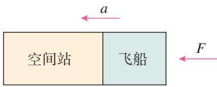  
图4-1

5. 在解答一道已知量完全由字母表达结果的计算题时，一个同学解得某物体位移 $x = \frac{F}{2m} (t_1 + t_2)$ ，请你用单位制的知识检查，说明这一结果是否可能正确。  
6. 如图4-2，在倾角 $37^{\circ}$ 足够长的斜面上有一个质量为 $1\mathrm{kg}$ 的物体，物体与斜面之间的动摩擦因数为0.3。物体在拉力 $F$ 的作用下由静止开始运动， $F$ 的大小为 $10\mathrm{N}$ ，方向沿斜面向上。加速一段时间后撤去 $F$ ，让物体在斜面上运动。

$g$ 取 $10\mathrm{m / s^2}$

（1）物体从静止开始一共经历了哪几个匀变速直线运动过程？  
（2）这几个匀变速直线运动的加速度的大小和方向如何？

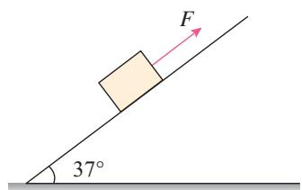  
图4-2

7. 某小组通过测量两辆小车在相同时间内通过的位移来比较它们的加速度，进而探究加速度与力的关系，实验装置如图4-3所示。将轨道分上下双层排列，两小车尾部的刹车线由后面的刹车系统同时控制，能使小车同时立即停下来。通过改变槽码盘中的槽码来改变拉力的大小。

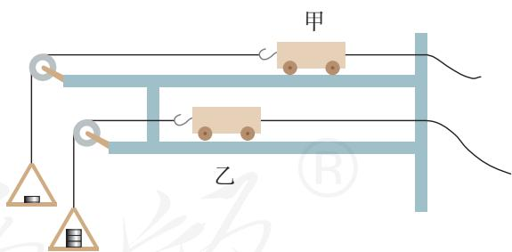  
图4-3

（1）通过比较两小车的位移来比较两小车的加速度大小，你认为可行吗？请说明理由。  
（2）已知两小车质量均为 $500\mathrm{g}$ ，实验数据如表1中所示。

分析表中数据，你能得到什么结论？说出你的分析过程。

表1  

<table><tr><td>实验次数</td><td>小车</td><td>拉力F/N</td><td>位移x/cm</td></tr><tr><td rowspan="2">1</td><td>甲</td><td>0.1</td><td>22.3</td></tr><tr><td>乙</td><td>0.2</td><td>43.5</td></tr><tr><td rowspan="2">2</td><td>甲</td><td>0.2</td><td>29.0</td></tr><tr><td>乙</td><td>0.3</td><td>43.0</td></tr><tr><td rowspan="2">3</td><td>甲</td><td>0.3</td><td>41.0</td></tr><tr><td>乙</td><td>0.4</td><td>55.4</td></tr></table>

（3）如果还要利用上述装置进行“探究加速度与质量的关系”实验，应该怎样调整实验条件？

8. 某同学为研究雨滴下落的规律查阅资料，了解到：较大的雨滴是从大约 $1000 \mathrm{~m}$ 的高空形成并下落的，到达地面的速度大约为 $4 \mathrm{~m} / \mathrm{s}$ 。根据以上信息，可以把雨滴的运动模型看成是 $1000 \mathrm{~m}$ 高空的物体在有空气阻力的空间中由静止开始下落的运动，雨滴所受空气阻力随速度的增大而增大。请你分析雨滴下落的运动过程，描述雨滴下落过程中速度和加速度的变化，并

定性作出雨滴下落的 $v - t$ 图像。

9. 某同学制作了一个“竖直加速度测量仪”，可以用来测量竖直上下电梯运行时的加速度，其构造如图4-4所示。把一根轻弹簧上端固定在小木板上，下端悬吊 $0.9 \mathrm{~N}$ 重物时，弹簧下端的指针指木板上刻度为 $C$ 的位置，把悬吊 $1.0 \mathrm{~N}$ 重物时指针位置的刻度标记为0，以后该重物就固定在弹簧上，和小木板上的刻度构成了一个“竖直加速度测量仪”。

（1）请在图中除0以外的6根长刻度线旁，标注加速度的大小，示数的单位用 $\mathrm{m / s^2}$ 表示，加速度的方向向上为正、向下为负。说明这样标注的原理。

（2）仿照以上装置，设计一个“水平加速度测量仪”。要求：画出它的装置图；说明它的构造；介绍加速度刻度的标注原理。 $g$ 取 $10\mathrm{m / s^2}$

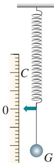  
单位： $\mathrm{m / s^2}$   
图4-4

### B组

1. 如图4-5，两个质量相同的小球A和B之间用轻弹簧连接，然后用细绳悬挂起来，剪断细绳的瞬间，A和B的加速度分别是多少？  
2. 如图4-6，质量为 $0.5\mathrm{kg}$ 的物块A放在一个

纵剖面为矩形的静止木箱内，A和木箱水平底面之间的动摩擦因数为0.3。A的右边被一根轻弹簧用 $1.2 \mathrm{~N}$ 的水平拉力向右拉着而保持静止。现在要使弹簧能拉动A相对木箱底面向右

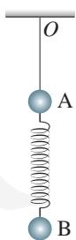  
图4-5

② 移动。设最大静摩擦力等于滑动摩擦力， $g$ 取 $10 \mathrm{~m} / \mathrm{s}^{2}$ 。

(1) 如果让木箱在竖直方向上运动, 其加速度应满足什么条件?  
(2) 如果让木箱在水平方向上运动, 其加速度应满足什么条件?

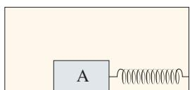  
图4-6

3. 为了安全，在公路上行驶的汽车之间应保持必要的距离。如果一辆汽车在高速公路上

行驶的速度为 $120 \mathrm{~km} / \mathrm{h}$ , 通常人的反应时间为 $0.3 \sim 0.6 \mathrm{~s}$ , 结合表2提供的资料, 请通过计算说明不同路况下的安全距离。 $g$ 取 $10 \mathrm{~m} / \mathrm{s}^{2}$ 。

表2 各种路面与轮胎之间的动摩擦因数  

<table><tr><td>路面</td><td>动摩擦因数</td></tr><tr><td>干沥青与混凝土路面</td><td>0.7 ~ 0.8</td></tr><tr><td>干碎石路面</td><td>0.6 ~ 0.7</td></tr><tr><td>湿沥青与混凝土路面</td><td>0.32 ~ 0.4</td></tr></table>

4. 在民航机场和火车站可以看到用于对行李进行安全检查的水平传送带。旅客把行李放到传送带上时，传送带对行李的滑动摩擦力使行李开始运动，随后它们保持相对静止，行李随传送带一起前进。若传送带匀速前进的速度 $v$ 为 $0.25 \mathrm{~m} / \mathrm{s}$ ，某木箱与传送带之间的动摩擦因数 $\mu$ 为 0.4， $g$ 取 $10 \mathrm{~m} / \mathrm{s}^{2}$ 。问：该木箱放在传送带上后，传送带上将留下一段多长的摩擦痕迹？

5. 某人想测量地铁启动过程中的加速度，他把一根细绳的下端绑着一支圆珠笔，细绳的上端用电工胶布临时固定在地铁的竖直扶手上。在地铁起动后的某段加速过程中，细绳偏离了竖直方向，他用手机拍摄了当时情景的照片（图4-7），拍摄方向跟地铁前进方向垂直。根据这张照片估算此时地铁的加速度是多少。加速

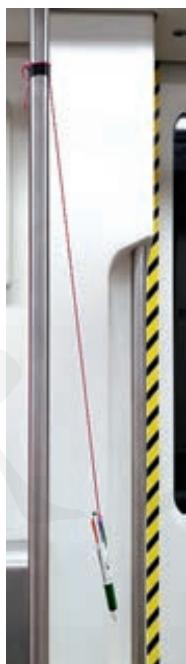  
图4-7

度方向指向照片的哪个方向？请写明测量步骤、数据、计算过程和结果。

6. 如图4-8，A、B两个物体相互接触，但并不黏合，放置在水平面上，水平面与物体间的摩擦力可忽略，两个物体的质量 $m_{\mathrm{A}}$ 为 $4\mathrm{kg}$ $m_{\mathrm{B}}$ 为 $6\mathrm{kg}$ 。从 $t = 0$ 开始，推力 $F_{\mathrm{A}}$ 和拉力 $F_{\mathrm{B}}$ 分别作用于A、B上， $F_{\mathrm{A}}, F_{\mathrm{B}}$ 随时间的变化规律为

$$
F _ {\mathrm {A}} = (8 - 2 t) (\mathrm {N})
$$

$$
F _ {\mathrm {B}} = (2 + 2 t) (\mathrm {N})
$$

问：8s内物体B运动的加速度如何变化？

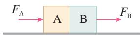  
图4-8

7. 如图4-9，质量为 $2.5 \mathrm{~kg}$ 的一只长方体形空铁箱在水平拉力 $F$ 作用下沿水平面向右匀加速运动，铁箱与水平面间的动摩擦因数 $\mu_{1}$ 为0.3。这时铁箱内一个质量为 $0.5 \mathrm{~kg}$ 的木块恰好能静止在后壁上。木块与铁箱内壁间的动摩擦因数 $\mu_{2}$ 为0.25。设最大静摩擦力等于滑动摩擦力， $g$ 取 $10 \mathrm{~m} / \mathrm{s}^{2}$ 。

（1）求木块对铁箱压力的大小。  
（2）求水平拉力 $F$ 的大小。  
（3）减小拉力 $F$ ，经过一段时间，木块沿铁箱左侧壁落到底部且不反弹，当铁箱的速度为 $6 \mathrm{~m} / \mathrm{s}$ 时撤去拉力，又经 $1 \mathrm{~s}$ 时间木块从左侧到达右侧，则此时木块相对铁箱运动的距离是多少？

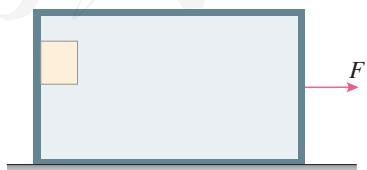  
图4-9

## 课题研究

科技和经济的迅速发展，要求我们具有更强的科研素养和创造能力。我们在课堂上经历过猜想、设计、分析、概括等学习过程，这些活动就是在培养我们的研究能力。

课堂上的学习是一种学习方式。在老师的引导下，按照教科书的安排，我们对书中的问题进行了探究。其实，我们还需要根据对周围事物的观察和质疑，发现和提出自己值得研究的问题。老师和教科书引导我们按照一定的思路去设计实验、进行实验并得到实验结论。其实，我们也还需要对一个研究课题经历自主构思、深入分析、完整研究和系统表达的过程，研究内容不受教科书的约束，研究时间不受学时的限制。这样就能跟课堂上的学习活动实现优势互补，进一步提升我们的科研素养和创造能力。本书的课题研究栏目就是为了达到这个目的而设置的。

本栏目中提供了一个“研究样例”和一个“参考选题”。

通过阅读样例，大致了解应该如何进行课题研究，包括：课题研究的选题是怎样提出的，研究的证据是怎样收集的，怎样通过对证据的解释形成研究结论，如何撰写课题研究报告等。

在学习样例后，同学们要自己选择一个课题进行研究，写出研究报告。后面所列的参考选题，只是作为选题的参考和启示，同学们可以根据平时的观察和发现，选择你感兴趣的课题进行研究。

课外的课题研究更强调自己提出研究课题，强调完整、深入、自主地参与研究过程。将来我们在实际工作中遇到的问题，多数会以这种研究方式来解决。

### 研究样例

#### 球形物体空气阻力大小与速率关系的研究

#### 问题的提出

人们散步时并不觉得空气有阻力，但跑步时就会明显感觉迎面有风阻挡。当人站在高速行驶的敞篷车上时，会感到迎面阻挡的风力很大。这些经验说明，空气阻力的大小跟物体在空气中运动的速率有关。

鸟在飞行中受到的阻力是很小的。几乎所有鸟的身体都有类似的形状，这说明空气阻力还跟运动物体的形状有关。另外，“树大招风”的成语提示我们，空气阻力的大小跟物体的大小可能也是有关系的。因此，在研究物体所受空气阻力的大小跟速率关系的时候，必须对其他的条件作出限定。

本课题以气球为实验对象，并保持同一气球的体积不变，探究球形物体在空气中运动时空气阻力的大小跟速率的定量关系。

#### ■ 实验设计

本实验需要测量两个物理量：气球所受空气阻力的大小和气球运动的速率。

如果气球下落时的空气阻力恰好等于重力，气球将做匀速运动。根据这个道理，可以测量气球所受空气阻力的大小。为此，在气球下悬吊重物，称出气球和重物所受的总重力。让气球从空中下落，随着下落速率的增大，气球所受的空气阻力也增大，当空气阻力增大到跟重力相等时，气球便做匀速运动。如果判断气球下落一段高度后已在做匀速运动，则此时空气阻力的大小就等于气球和重物所受的总重力（因重物的体积很小，作用在重物上的空气阻力可以忽略不计）。

气球的速率可以用数码相机测量。在气球下落轨迹旁边固定一把刻度尺，用数码相机拍摄气球运动的视频，得到分帧照片，根据相邻照片气球的位置间隔可以判断气球是否在做匀速运动，由分帧照片的周期和气球位置在刻度

$\triangleright$ 课题研究的成果通常用研究报告来表达。这里的样例就是一个简单的研究报告。它的内容包含了三个要素：问题、证据、解释（数据分析和结论）。

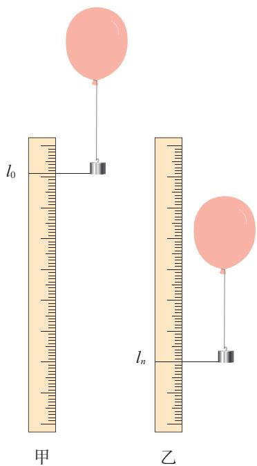  
图研-1

尺上的具体读数就可以计算气球的速率。

#### ■实验过程和数据

如图研-1，在气球的气嘴上绑定一根硬铁丝，下面悬吊一个重物，使气球下落时能大致保持竖直方向，以保证能用刻度尺测量到重物的位置。

测出气球连同铁丝和重物所受的总重力 $G$ 。之后，请一名同学在刻度尺的上方释放气球，另一名同学用数码相机在刻度尺前拍摄气球下落的视频，并得到分帧照片。在确认相邻两帧照片之间重物下落的距离基本相等的情况下，读出某帧照片上重物位置在刻度尺上的读数 $l_{0}$ （图研-1甲）和再经过 $n$ 帧照片后的读数 $l_{n}$ （图研-1乙），则可以得到相邻两帧照片之间重物下落位移的平均值为

$$
l = \frac {l _ {n} - l _ {0}}{n}
$$

把上述实验中气球和重物所受的总重力 $G$ 和相邻两帧照片之间重物下落的位移 $l$ 作为实验的第1组数据填在表格中。改变重物的质量，仍然用原气球重复实验，得到各组不同的 $G$ 和 $l$ 的数据，填在同一表格中。

<table><tr><td>次数</td><td>1</td><td>2</td><td>3</td><td>4</td><td>5</td><td>6</td><td>7</td></tr><tr><td>气球和重物所受的总重力G/(10-2N)</td><td>4.5</td><td>5.5</td><td>6.5</td><td>7.5</td><td>8.5</td><td>9.5</td><td>10.5</td></tr><tr><td>相邻两帧照片重物下落的位移l/(10-2m)</td><td>13.6</td><td>16.3</td><td>19.8</td><td>23.8</td><td>26.6</td><td>28.8</td><td>32.8</td></tr></table>

#### 数据处理和结论

建立直角坐标系。纵坐标轴为气球所受空气阻力 $F_{\mathrm{f}}$ ，大小等于气球和重物所受的总重力 $G$ ；横坐标轴为气球匀速运动时的速率 $v$ ，设相邻两帧照片之间的时间间隔为 $T$ （单位为 $\mathrm{s}$ ），则 $v = \frac{l}{T}$ 。若以 $10^{-2} \mathrm{~m} \cdot \mathrm{s}^{-1}$ 为单位， $v$ 的数值跟 $l$ 相同。

因此，可以用上表中的实验数据在 $F_{\mathrm{f}} - v$ 图像中描点。从这些点的分布可以看出， $F_{\mathrm{f}} - v$ 图像基本上是一条过坐标原点的直线（图研-2）。由此可以得出：气球在空气中运

动时所受阻力的大小跟气球运动的速率成正比。因而可以猜测，球形物体所受空气阻力的大小跟它运动的速率成正比。我们可以进一步设计实验研究这个问题。

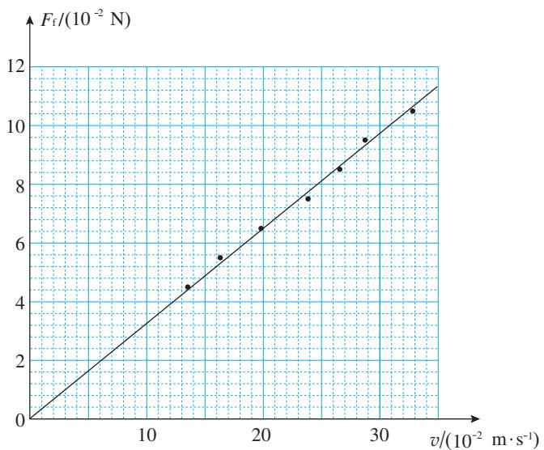  
图研-2

我们还可以利用具有连拍功能的照相机或手机完成上述测量。图研-3是用照相机连续拍摄的照片，每张照片间隔为 $0.1 \mathrm{~s}$ 。

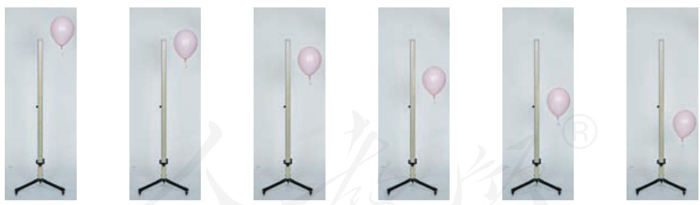  
图研-3

为了提示同学们可以开展哪些研究，教科书在下面又提供了一个供参考的选题。同学们不必受到这些课题的约束，可以选择自己更感兴趣、更能体现自己特长，或者根据自己的发现所构思的课题，并尽量把这些课题的研究跟所学知识结合起来，完成自己的课题研究。

### 参考选题

#### 橡皮筋弹力与伸长量关系的研究

#### 研究内容

橡皮筋具有类似弹簧的力学性质，日常生活中常常用橡皮筋来代替弹簧。在弹性限度内，弹簧弹力与弹簧形变量是成正比的。现在的问题是，橡皮筋拉力与橡皮筋伸长量成正比吗？橡皮筋拉力 $F$ 与橡皮筋伸长量 $x$ 的 $F - x$ 图像是一条直线吗？

我们知道，弹簧的劲度系数等于 $F - x$ 图像的斜率，如果橡皮筋的 $F - x$ 图像不是直线，那么应该怎样表述橡皮筋的劲度系数呢？

另外，还应该思考下面的问题。

1. 橡皮筋会不会“疲劳”？  
2. 同一橡皮筋每次实验的 $F - x$ 图像是不是都相同？  
3. 在橡皮筋拉力 $F$ 逐渐增加时记录数据, 随后在 $F$ 逐渐减小时记录数据, 两次作出的 $F - x$ 图像会重合吗?

所有这些问题，只有通过实验研究橡皮筋拉力与橡皮筋伸长量的关系，才能形成结论。

## 学生实验

实验在中学物理中占有非常重要的地位，这是因为在物理学中，概念的形成、规律的发现和理论的建立，许多都是以实验为基础的。实验或者引发了理论的建立，或者对新建立的理论进行检验。总之，物理学离不开实验，要学好物理就要做好实验。

### 实验推动了物理学的发展

在本书第二章，我们学习了伽利略研究自由落体运动的有关内容，知道是伽利略开科学实验之先河，把实验的方法引入科学研究中。

在电磁学研究中，法拉第在10年中坚持实验，为电磁感应定律的建立打下了基础。麦克斯韦在此基础上，对这个规律和其他电磁学实验成果进行分析，加上自己的假设，为其谱上了数学的“乐曲”，于1864年建立了完整的电磁场理论，并预言了电磁波。赫兹用实验证明了电磁波的存在。在20世纪中叶，以麦克斯韦电磁理论和其他科学成果为基础的无线电电子学，以前所未有的速度和规模改变了我们的生活。

研究质子、中子、电子及其他各种粒子的物理学分支叫作粒子物理学。在粒子物理学中有一个物理量叫作宇称。物理学

家们曾经认为粒子经历的各种过程中宇称都是守恒的。1956年，杨振宁和李政道通过对一些现象的分析，认为一个过程中如果只有强相互作用和电磁相互作用，宇称的确守恒；但是，如果是弱相互作用的过程，例如发射β射线的过程，宇称并不守恒。这个论断引起了物理学家们的广泛注意。1956年后期至1957年年初，吴健雄和她的同事们一起设计实验（图实-1），通过统计钴60同位素在β衰变时向各个方向发射的电子数，证明了这个过程中宇称真的不守恒。她除了用实验证实宇称不守恒外，还用实验证实了电磁相互作用与弱相互作用的密切关系，对后来电、弱统一理论的提出起了重要作用。

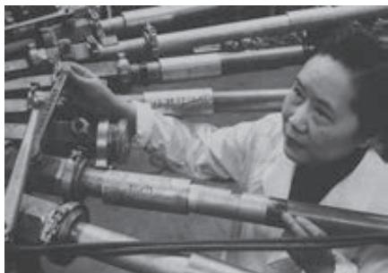  
图实-1 吴健雄在实验中

今天，物理学中的许多学说还在等待实验的证实或否定。

物体与物体之间有万有引力。如果一个物体振动或者旋转，或者有规律地变形，会不会有引力波传播出去？这是一个很自然的想法。实际上，早在1916年，

爱因斯坦就根据他的广义相对论认为应该存在引力波。后来，物理学家们又进行了理论研究，对引力波的性质作了预言。这些预言要成为科学真理，必须有充分的实验证据。然而，引力波非常微弱，又很难接收，验证起来十分困难。

20世纪70年代初，韦伯首创用铝棒做“天线”接收天体辐射的引力波。为了提高灵敏度，“天线”重达数吨，为了排除干扰，“天线”置于- $270^{\circ} \mathrm{C}$ 左右的超低温环境中。当时参加工作的有十几个小组，但只有韦伯宣称观测到了可能是来自其他天体的引力波信号。其后不断有人重复这个实验，但都没有肯定的结果。

20世纪70年代末，泰勒等人观测围绕共同质心高速转动的双星，发现转动的周期在慢慢地变化，推测这可能是它们辐射引力波时失去了能量造成的。

直到2016年，科学家用激光干涉仪代替铝棒作为“天线”，建成了引力波激光干涉仪探测装置，才首次探测到了来自于双黑洞合并的引力波的信号。

我们常说“实验是物理学的基础”，这话有两方面的意思：一方面，实验和观测不断向物理学提出新的问题；另一方面，物理学的假说、理论最终要接受实验和观测的检验。

### 怎样做好物理实验

做物理实验不是一种只动手的技艺，它需要手脑并用。下面是做实验大致要涉及的几个方面。

明确实验目的 这个实验要我们做什

么？是探究某个未知的规律，还是验证某个已知的规律，或者是测量某个物理量？

理解实验原理 做实验有利于透彻理解物理知识。不论做哪一类物理实验，都要搞清楚实验所根据的物理知识。

同时，实验器材的工作原理也需要了解。通常在实验操作前要认真阅读课文或实验器材说明卡，结合实物弄清它的结构、各部分的功能、使用注意事项等。

制订实验计划 本书的学生实验都没有给出具体的操作步骤，这就要求同学们在操作前作出实验计划，想好先做什么、后做什么，必要时把实验步骤设计出来。实验中可能出现什么问题？可能是什么原因引起的？应该怎样防止？如果出现问题应该怎样解决？……这些问题都应该事先有所考虑。

安全操作 操作中要注意安全，这是第一位的。

首先，要保证人身安全。凡涉及用电的器材要小心处理。要注意保护眼睛，凡在高速转动、可能出现爆炸、可能有液体溅出的场合，最好戴上护目眼镜。

其次，要保证器材的安全。各种仪器都必须按照要求使用。对于不熟悉的仪器，要先弄清它的使用要领，要学会借助说明书了解仪器的原理、使用方法。

再次，养成操作前进行安全检查的习惯。保证安全的一条重要原则是，做事之前尽量估计可能出现的所有意外：转身时会不会把器材碰到地上？加热时烧杯里的液体会不会溅出来？牵引小车的重物会不会在落地之前就把小车拖到地上？……

最后，操作要谨慎。任何粗心大意

都会使精心准备的实验归于失败。实验的每一阶段之后都要对其进行评估，也就是回想刚才的操作有没有什么问题，可能引起什么误差，等等。

记录原始数据 实验来不得半点粗心和虚假。实验数据从来不以人的意志而改变。要获得正确的实验结果，离不开严谨、求真的态度。实验中观察到的现象、测量的数据、得出的结论，很可能跟预期的不一样，这时我们要实事求是，尊重事实。不能随意更改记录去“凑数”。检查一下，实验设计是不是有问题？操作是否有失误？……

撰写实验报告 实验后要仔细分析数据，从中得出结论。认真写出实验报告。发表自己的成果和见解，与他人交流成果是当代科学研究的重要组成部分。把自己的实验成果告诉别人，听取别人的批评和质疑，同时，从别人的成果中受到启发。在这个过程中，实验报告是很好的媒介。

### 误差和有效数字

任何测量结果都不可能绝对准确。测量值跟被测物理量的真实值之间总会有差异，这种差异叫作误差（error）。

由仪器直接读出的数据叫作直接测量结果。直接测量结果的误差来源于两方面。一是仪器本身的缺陷，例如刻度尺的刻度不够准确、天平两臂不严格等长；二是实验人员操作和读数的不准确，例如用停表计时，按下按钮的时刻总会稍有滞后或提前。又如，中学实验室中温度计的分

度值为 $1^{\circ} \mathrm{C}$ , 靠目测只能估计到分度值的 $\frac{1}{10}$ , 肯定会有误差。

通过改进仪器和谨慎操作，可以减小误差，但任何仪器的测量都不能完全消灭误差。

偶然误差和系统误差 人读仪表时，眼睛的位置可能稍向左偏或稍向右偏，电表指针由于轴上的摩擦，停下来的位置可能一次偏大、一次偏小。这些误差是由偶然因素造成的，叫作偶然误差（accidentalerror）。偶然误差的特点是，当多次重复测量时，偏大和偏小的机会比较接近，可以用取平均值的方法来减小偶然误差。系统误差（systematic error）是由仪器结构缺陷、实验方法不完善造成的。例如，天平两臂不完全等长会造成系统误差；测量重力加速度时由于没有消除空气阻力等影响也会引起系统误差。系统误差的特点是，多次重复测量的结果总是大于（或小于）被测量的真实值，呈现单一倾向。

绝对误差和相对误差 假设用分度值为 $1 \mathrm{~mm}$ 的刻度尺测一段铜丝的直径，读数为 $1.3 \mathrm{~mm}$ 。限于刻度尺的精确度，测量有一定的误差。若被测量铜丝直径的真实值为 $1.2 \mathrm{~mm}$ ，那么测量值与真实值之差则为

$$
1. 3 \mathrm {m m} - 1. 2 \mathrm {m m} = 0. 1 \mathrm {m m}
$$

物理学中把测量值与真实值之差，叫作绝对误差（absolute error）。

除绝对误差之外，人们通常要考虑这个绝对误差是在测量多大的测量值时产生的，如果绝对误差相同，但测量值大，这个绝对误差在整个测量中所占的比例

就小。物理学中把绝对误差与测量值之比，叫作相对误差（relative error），即

$$
\text {相 对 误 差} = \frac {\text {绝 对 误 差}}{\text {测 量 值}}
$$

相对误差是一个比值，没有单位，通常用百分数表示。在上面的例子中，被测铜丝直径的相对误差是

$$
\frac {0 . 1 \mathrm {mm}}{1 . 3 \mathrm {mm}} = 8 \%
$$

如果把铜丝密绕在木棒上，测量10圈铜丝的直径之和，由于用的是同一刻度尺，绝对误差可以认为还是 $0.1 \mathrm{~mm}$ 。但是，所测10圈铜丝直径的测量值已增大到 $13.0 \mathrm{~mm}$ 。此时的相对误差为

$$
\frac {0.1 \mathrm {mm}}{13.0 \mathrm {mm}} = 0.8 \%
$$

可见，在绝对误差相同的情况下，测量值越大，相对误差就越小。

有效数字 在图实-2中，根据刻度尺的刻度可以读出点 $A$ 的位置 $x_{A}$ 。从图中看出，使用分度值为 $1\mathrm{mm}$ 的尺，并且估读到毫米数的下一位，得到 $x_{A} = 13.3\mathrm{mm}$ 。其中的末位数3是估读的、不可靠的， $x_{A}$ 的真实值在 $13\mathrm{mm}$ 和 $14\mathrm{mm}$ 之间。但是这个不可靠的数字3还是有用的，仍要写出来，因为它表示点A在 $13\mathrm{mm}$ 和 $14\mathrm{mm}$ 两条刻度线之间，靠近中点但离 $13\mathrm{mm}$ 刻度线稍近一些的位置。

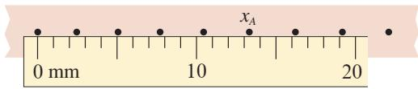  
图实-2 读数时可以读出一位估读的数字

这种带有一位不可靠数字的近似数字叫作有效数字（significant figure）。例如， $13.3 \mathrm{~mm}$ 是三位有效数字，改写成 $1.33 \mathrm{~cm}$ 或 $0.0133 \mathrm{~m}$ 仍然是三位有效数字。

如果仍用这把刻度尺测量另一点 $B$ 的位置，点 $B$ 的中心恰好与 $19 \mathrm{~mm}$ 的刻度线正对（图实-3），这种情况应当怎样处理呢？

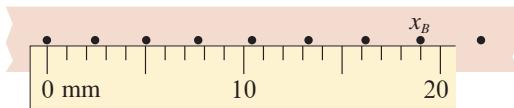  
图实-3 估读时的数字应该是0

正确的记录是 $x_{B} = 19.0 \mathrm{~mm}$ ，而不应写成 $19 \mathrm{~mm}$ 。这种情况下，1、9都是可靠的，但若写成 $19 \mathrm{~mm}$ ，就意味着数字9是不可靠的，显然与事实上测量仪器的准确度不相符。由此可以知道，最末一位非零数字后面的数字0是有意义的，不能随意舍去或添加。小数中最前一位非零数字前面的0是表示小数点的位置的，不是有效数字。例如 $0.92 \mathrm{~s}, 0.085 \mathrm{~kg}, 0.0063 \mathrm{~m}$ ，都是两位有效数字。为了正确表述有效数字，特别大或特别小的数字都要用科学记数法，例如月球到地球的平均距离为 $3.84 \times 10^{5} \mathrm{~km}$ ，钨原子的半径为 $1.37 \times 10^{-10} \mathrm{~m}$ 。

实验的结果往往是由若干直接测量值经过运算得到的，每一个直接测量值的误差都对最后结果产生影响，应当按一定的数学方法来确定运算结果的有效数字。但是这种处理方法比较复杂，中学阶段不做要求，运算结果一般取两位或三位有效数字就可以了。

## 索引

(名词后面的数字是该名词中、英文第一次出现的页码)

### B

标量 75

### C

参考系 14

超重 110

### D

单位制 100

动力学 82

动摩擦因数 63

### F

反作用力 68

分力 72

### G

惯性 85

国际单位制 100

### J

机械运动 10

加速度 27

劲度系数 61

静摩擦力 65

绝对误差 123

### H

合力 72

胡克定律 61

滑动摩擦力 63

### L

力 56

力的分解 73

力的合成 73

力学 10

路程 16

### N

牛顿第二定律 95

牛顿第三定律 69

牛顿第一定律 85

### 0

偶然误差 123

### P

平均速度 22

平行四边形定则 73

### S

失重 110

矢量 75

瞬时速度 22

速度 21

速率 22

### T

弹力 59

弹性限度 60

弹性形变 60

### W

位移 16

误差 123

### X

系统误差 123

相对误差 124

形变 59

### Y

有效数字 124

运动学 82

### Z

质点 12

质量 86

重力 57

重力加速度 49

重心 58

自由落体加速度 49

自由落体运动 48

作用力 68

坐标系 15

人教

## 后记

本册教科书是人民教育出版社课程教材研究所物理课程教材研究开发中心依据教育部《普通高中物理课程标准（2017年版）》编写的，经国家教材委员会2019年审查通过。

本册教科书的编写，集中反映了我国十余年来普通高中课程改革的成果，吸取了2004年版《普通高中课程标准实验教科书物理》的编写经验，凝聚了参与课改实验的教育专家、学科专家、教材编写专家、教研人员和一线教师，以及教材设计装帧专家的集体智慧。孙昌璞院士对本套书的编写提出了指导性的意见并亲自撰写了序言。本册教科书的执笔者还有邢红军、陈继明、钟俊敏。为本书绘制插图的是张傲冰，为本书摄影或提供照片的有朱京、东方IC和中国新闻图片网等。

北京市、浙江省、武汉市、昆明市、大连市的部分师生参与了编写研讨或试教。

我们感谢所有对教科书的编写、出版、试教等提供过帮助与支持的同人和社会各界朋友。

本册教科书出版之前，我们通过多种渠道与教科书选用作品（包括照片、画作）的作者进行了联系，得到了他们的大力支持。对此，我们表示衷心的感谢！

我们真诚地希望广大教师、学生及家长在使用本册教科书的过程中提出宝贵意见。我们将集思广益，不断修订，使教科书趋于完善。

联系方式

电话：010-58758866

电子邮箱：jcfk@pep.com.cn

人民教育出版社 课程教材研究所

物理课程教材研究开发中心

2019年4月

人教

PUTONG GAOZHONG JIAOKESHU

WULI