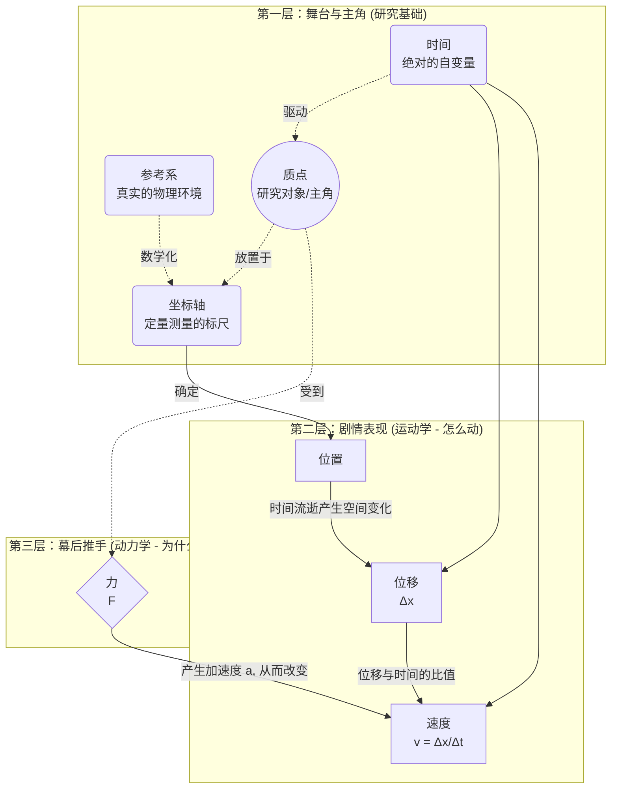

要把握这些概念的关系，我们可以把物理学研究物体运动的过程，想象成**拍一部电影**。下面这张图展示了它们之间的核心逻辑链条：

## 核心关系示意图

_(注：现在你应该能看到渲染出的流程图了。为了更直观，下面为你保留了文字版的逻辑结构。)_

## 概念关系深度拆解 (文字结构版)

### 1. 搭建舞台与主角入场（建模与定位）

- **【参考系】（真实舞台）**：你要研究运动，首先得找个“参照物”（比如地面、行驶的汽车）。没有参考系，运动就无从谈起。
    
- **【坐标轴】（测量工具）**：参考系是物理概念，为了进行数学计算，我们在参考系上建立**坐标轴**（一维 $x$ 轴，或二维 $x-y$ 轴），把空间“数字化”。
    
- **【质点】（主角）**：我们将复杂的真实物体剥离形状和大小，只保留**质量**，把它变成一个可以放在坐标轴上的“几何点”。
    
    - _关系：**质点**在**参考系**中，通过**坐标轴**获得了精确的“位置坐标”。_
        

### 2. 剧情展开：运动的描述（运动学）

- **【时间】（导演/时间轴）**：时间是独立流逝的自变量。一切物理过程都在时间轴上展开。
    
- **【位移】（空间跨度）**：随着**时间**推移，**质点**在**坐标轴**上的位置发生了变化，起点指向终点的有向线段就是**位移**。
    
- **【速度】（变化快慢）**：**位移**除以发生这段位移所用的**时间**（$\Delta x / \Delta t$），就得到了**速度**。速度不仅告诉你质点跑了多远，还告诉你跑得多快、往哪个方向跑。
    
    - _关系：位置随**时间**变化产生**位移**，**位移**随时间的变化率就是**速度**。这三个概念完美回答了“物体是怎么动的”。_
        

### 3. 幕后推手：运动的原因（动力学）

- **【力】（动力源泉）**：是什么让物体的**速度**发生改变（从静止到运动，或从慢变快）？答案是**力**。
    
    - _关系：**力**作用在**质点**上，打破了它的惯性，改变了它的**速度**（严格来说是产生了加速度，由牛顿第二定律_ $F=ma$ _桥接）。力回答了“物体为什么会这样动”。_
        

## 总结：一条清晰的因果链

你可以用这样一句话把它们全部串起来：

> 在选定的**【参考系】**和建立的**【坐标轴】**中，作为研究对象的**【质点】**，随着**【时间】**的推移产生了**【位移】**；位移随时间的变化率被称为**【速度】**；而质点受到外部的**【力】**，则是导致其**【速度】**发生改变的根本原因。

掌握了这张网，你就真正跨越了高中物理的第一道门槛，把“运动学”（描述现象）和“动力学”（探究本质）彻底打通了！